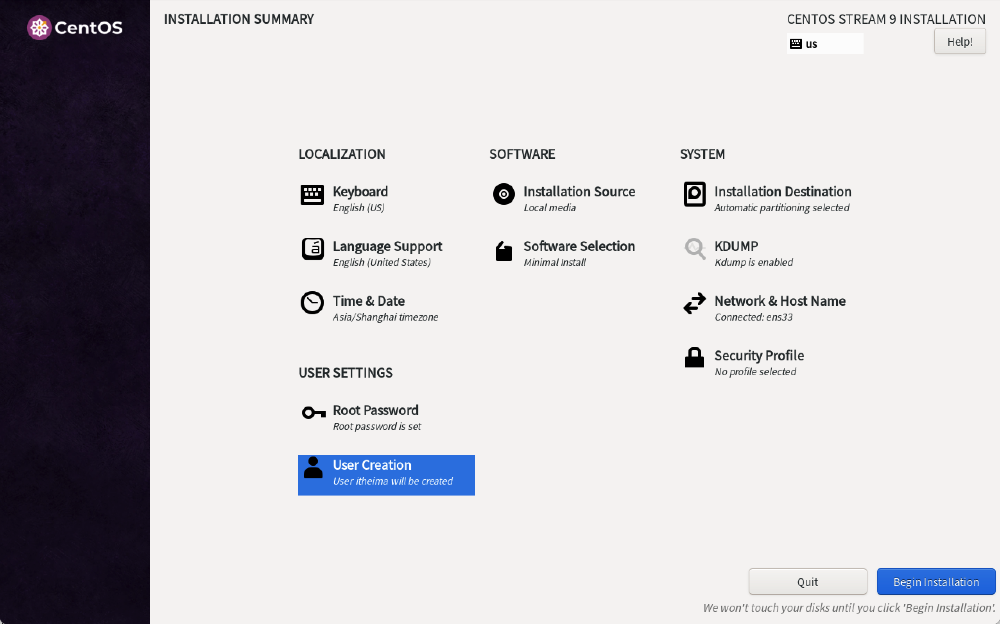

# CentOS 9 实战（1）：系统简介与安装

欢迎来到《CentOS 9 实战速查手册》专栏的第 1 篇文章。在这里，我们将开始学习 **CentOS 9** 的**基本知识**和**安装步骤**。作为一款社区支持的企业级 **Linux** 发行版，**CentOS** 在服务器管理和企业应用中有着广泛的应用。无论你是刚接触 **Linux** 的新手，还是已经有一些经验的系统管理员，这篇文章将为你提供一个良好的起点。

## 1. CentOS 9 简介

**CentOS** (Community ENTerprise Operating System) 是一个免费的、开源的、社区驱动的 **Linux** 发行版，基于 **Red Hat Enterprise Linux** (RHEL) 的源代码构建。**CentOS 9** 是最新的主要版本，提供了许多新的功能和改进，主要面向企业级应用。

### 1.1 CentOS 的历史

**CentOS** 项目成立于 2004 年，旨在提供一个稳定、免费且开源的企业级操作系统。与 **RHEL** 相比，**CentOS** 删除了所有的 **Red Hat** 品牌和商标，但保持了二进制兼容性。这意味着运行在 **RHEL** 上的软件同样可以在 **CentOS** 上运行。

### 1.2 CentOS 9 的新特性

- **最新的软件包和技术**：**CentOS 9** 包含了最新版本的内核、编译器、工具和库，提供了更好的性能和安全性。
- **改进的安全功能**：包括 **SELinux** 的增强和新的安全模块，确保系统的安全性。
- **更好的容器支持**：**CentOS 9** 提供了对容器技术（如 **Docker** 和 **Podman**）的更好支持，简化了容器化应用的开发和部署。

### 1.3 CentOS 各版本的使用率及趋势

- **CentOS 6**：发布于 2011 年，已于 2020 年停止维护。尽管如此，仍有部分老旧系统在使用，但逐渐减少。
- **CentOS 7**：发布于 2014 年，至今仍广泛使用，特别是在企业级应用中。预计在 2024 年停止维护，因此使用率会逐渐下降。
- **CentOS 8**：发布于 2019 年，原计划支持至 2029 年，但由于 **CentOS** 项目的战略调整，支持已于 2021 年结束。用户逐渐迁移至 **CentOS Stream** 或其他发行版。
- **CentOS 9**：作为最新版本，越来越多的新项目和系统选择使用 **CentOS 9**，其使用率正在稳步上升。

## 2. CentOS 9 的下载与安装

接下来，我们将学习如何下载并安装 **CentOS 9**。

### 2.1 下载 CentOS 9

1. 打开 **CentOS** 官网 [centos.org](https://www.centos.org)。
2. 进入下载页面，选择合适的镜像文件（通常选择 **DVD ISO**）。
3. 下载镜像文件到本地计算机。

### 2.2 在虚拟机中的安装步骤

1. **从光盘或映像中安装**：在虚拟机中选择**从光盘或映像安装**，然后选择刚刚下载好的 **ISO** 文件。
2. **选择安装语言**：选择安装**语言**和**键盘布局**为 **`English(US)`**。
3. **安装目标**：选择**安装目标硬盘**，配置分区（自动或手动）。
4. **网络配置**：配置**网络连接**，确保安装过程中能访问互联网。
5. **安装软件包**：选择要安装的软件包组，可以选择**最小安装（`Minimal Install`）**。
6. **设置用户**：设置 **root 密码**并**创建一个普通用户**。
7. **开始安装**：确认所有设置后，点击 **`Begin Installation`**。
8. **完成安装**：安装完成后，重启系统。



## 3. 安装后的基本配置

在完成安装并启动系统后，我们需要进行一些基本配置，以确保系统正常运行。

### 3.1 更新系统

使用以下命令更新系统中的所有软件包：

```sh
# 更新所有系统软件包
sudo dnf update -y
```

### 3.2 设置防火墙

启用并配置防火墙，以保护系统免受网络攻击：

```sh
# 查看防火墙状态
sudo systemctl status firewalld
# 启动 firewalld 服务
sudo systemctl start firewalld  
# 设置 firewalld 服务开机自启
sudo systemctl enable firewalld  
# 添加 SSH 服务到防火墙规则
sudo firewall-cmd --permanent --add-service=ssh  
# 重新加载防火墙规则
sudo firewall-cmd --reload  
```

### 3.3 安装常用工具

根据需要安装常用的命令行工具和软件包：

```sh
# 安装 vim, wget, curl, git 和 net-tools
sudo dnf install -y vim wget curl git net-tools  
```

### 3.4 dnf 与 yum 的区别

**CentOS 8** 引入了 **`dnf`** 作为默认的包管理器，取代了之前的 **`yum`**。**`dnf`** 具备更快的依赖解析、更好的性能和更丰富的插件支持。以下是 **`dnf`** 和 **`yum`** 的一些主要区别：

- **依赖解析**：**`dnf`** 使用 **`libsolv`** 库进行依赖解析，速度更快，准确性更高。
- **性能**：**`dnf`** 在处理大量软件包和元数据时，性能明显优于 **`yum`**。
- **插件支持**：**`dnf`** 提供了更丰富和灵活的插件支持，便于扩展和定制功能。
- **命令兼容**：大部分 **`yum`** 的命令和选项在 **`dnf`** 中仍然适用，便于用户迁移和使用。

## 4. 总结

在这篇文章中，我们介绍了 **CentOS 9** 的基本概念、历史背景及各版本的使用率和趋势，并学习了如何下载和安装系统。通过这些步骤，我们已经为后续的系统配置和管理打下了基础。希望这篇文章能帮助你顺利安装和配置 **CentOS 9**。在接下来的文章中，我们将进一步探索 **CentOS 9 系统配置与基础命令**，敬请期待。
