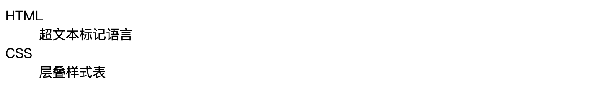

# 前端学习日志（1）：探索 HTML

欢迎来到《前端学习日志》专栏的第 1 篇文章。在本篇文章中，我们将正式开始前端开发的旅程，探索 HTML 的基础知识，并学习如何创建一个简单的网页。

## 1. 什么是 HTML？

HTML（HyperText Markup Language，**超文本标记语言**）是构建网页的基础语言。它通过使用**标签**来描述网页的**结构**和**内容**。无论是文本、图片还是链接，都是通过 HTML 标签来定义和展示的。

### 1.1 HTML 文档的基本结构

一个完整的 HTML 文档通常包含以下几个部分：

- `<!DOCTYPE html>`：声明文档类型为 HTML5。
- `<html>`：根标签，包含整个 HTML 文档。
- `<head>`：头部标签，包含网页基础数据，如文档的标题、字符编码等。
- `<body>`：主体标签，包含网页的主要内容。

### 1.2 示例代码

```html
<!DOCTYPE html>
<html>

<head>
  <meta charset="UTF-8">
  <title>我的第一个网页</title>
</head>

<body>
  <h1>欢迎来到我的网站</h1>
  <p>这是我的第一个 HTML 页面。</p>
</body>

</html>
```


这段代码展示了一个简单的 HTML 文档，包含一个标题和一个段落。通过这个例子，我们可以初步了解 HTML 文档的基本结构和内容。

### 1.3 使用 VS Code 快速创建页面结构

在 VS Code 中，有一个非常方便的快捷方式，可以帮助我们快速创建基本的 HTML 文档结构。以下是步骤：

1. 打开 VS Code，并创建一个新的 HTML 文件，例如 `02-vscode-骨架页面.html`。
2. 在文件中输入 `!` 并按下 `Tab` 键或者 `Enter` 键，VS Code 会自动生成一个基本的 HTML 文档结构。

```html
<!DOCTYPE html>
<html lang="en">

<head>
  <meta charset="UTF-8">
  <meta name="viewport" content="width=device-width, initial-scale=1.0">
  <title>Document</title>
</head>

<body>

</body>

</html>
```


通过这个快捷方式，我们可以快速开始创建和编辑 HTML 页面，而无需手动输入每个标签。这个功能极大地提高了开发效率，特别是对于初学者来说，非常实用。

**提示**：VS Code 快速创建的文档结构中有些**标签**和**属性**会在后续专栏文章中介绍，大家先保持不动就行。

### 1.4 HTML 注释

在编写 HTML 代码时，我们有时需要添加注释，以**帮助理解和维护代码**。**注释不会显示在网页中，仅供开发者查看**。HTML 注释的语法如下：

```html
<!-- 这是一个注释 -->
<p>这段文字会显示在网页中。</p>
<!-- 这段文字不会显示在网页中 -->
```


注释可以用来解释代码、标记需要注意的部分或临时隐藏部分代码。养成良好的注释习惯，有助于提高代码的可读性和可维护性。

**提示**：在 VS Code 中使用快捷键 `CTRL + /` 可以快速生成注释，我们只需要在中间输入注释内容即可。

## 2. 常用的 HTML 标签

在开始介绍常用 HTML 标签之前，我们先来了解一下 HTML 的基本语法规则：

- HTML 标签用尖括号包围，例如 `<tagname>`。
- 大多数 HTML 标签都是成对出现的，例如 `<p>` 和 `</p>`，第一个标签是**开始标签**，第二个标签是**结束标签**。
- 有些 HTML 标签是**自闭合**的，例如 `` 和 `<br>`，它们**不需要结束标签**。
- HTML 标签可以包含属性，**属性在开始标签中定义**，用于**提供有关元素的附加信息**，例如 ``。

### 2.1 标题标签

HTML 提供了六级标题标签，分别是 `<h1>` 到 `<h6>`，`<h1>` 是最高级标题，`<h6>` 是最低级标题。

```html
<h1>这是一级标题</h1>
<h2>这是二级标题</h2>
<h3>这是三级标题</h3>
<h4>这是四级标题</h4>
<h5>这是五级标题</h5>
<h6>这是六级标题</h6>
```


### 2.2 段落标签

**段落**标签 `<p>` 用于定义一个段落。段落是文本的基本单位，每个段落之间会有默认的间距。

```html
<p>这是一个段落。</p>
```

### 2.3 换行标签

**换行**标签 `<br>` 用于在文本中插入换行符，适合用于需要手动控制换行的位置。

```html
<p>这是第一行。<br>这是第二行。</p>
```

### 2.4 水平线标签

**水平线**标签 `<hr>` 用于插入一条水平分割线，常用于分隔不同的内容部分。

```html
<p>段落上方的分割线。</p>
<hr>
<p>段落下方的分割线。</p>
```

### 2.5 链接标签

**链接**标签 `<a>` 用于创建超链接，`href` 属性指定链接目标。超链接是网页的重要组成部分，**允许用户在不同页面之间导航**。

```html
<a href="https://www.example.com">访问示例网站</a>
```

### 2.6 图像标签

**图像**标签 `` 用于在网页中嵌入图像，`src` 属性指定图像路径，`alt` 属性提供图像的替代文本。

```html

```

### 2.7 列表标签

**无序列表**使用 `<ul>` 和 `<li>` 标签，**有序列表**使用 `<ol>` 和 `<li>` 标签。列表是展示信息的一种常见方式。

```html
<ul>
  <li>列表项1</li>
  <li>列表项2</li>
</ul>
<ol>
  <li>列表项1</li>
  <li>列表项2</li>
</ol>
```


### 2.8 定义列表标签

**定义列表**使用 `<dl>`、`<dt>` 和 `<dd>` 标签，`<dl>` 表示定义列表，`<dt>` 表示定义项，`<dd>` 表示定义描述。

```html
<dl>
  <dt>HTML</dt>
  <dd>超文本标记语言</dd>
  <dt>CSS</dt>
  <dd>层叠样式表</dd>
</dl>
```



### 2.9 表格标签

表格使用 `<table>`、`<thead>`、`<tbody>`、`<tfoot>`、`<tr>`、`<th>` 和 `<td>` 标签。表格用于显示结构化的数据，其中：

- `<table>`：定义一个表格。
- `<thead>`：定义表格的表头部分。
- `<tbody>`：定义表格的主体部分。
- `<tfoot>`：定义表格的表尾部分。
- `<tr>`：定义表格中的一行。
- `<th>`：定义表头单元格。
- `<td>`：定义表格单元格。

```html
<table border="1">
  <thead>
    <tr>
      <th>名称</th>
      <th>年龄</th>
    </tr>
  </thead>
  <tbody>
    <tr>
      <td>张三</td>
      <td>28</td>
    </tr>
    <tr>
      <td>李四</td>
      <td>32</td>
    </tr>
  </tbody>
  <tfoot>
    <tr>
      <td colspan="2">总计</td>
    </tr>
  </tfoot>
</table>
```


**提示**：使用 `colspan` 属性可以设置单元格**跨列合并（横向）**，使用 `rowspan` 属性可以设置单元格**跨行合并（纵向）**。

### 2.10 分区和内联标签

- `<div>`：用于定义文档中的分区或节，通常用于布局和样式。
- `<span>`：用于定义文档中的小块文本，

常用于样式和布局。

```html
<div>
  <h2>这是一个分区</h2>
  <p>这是一个段落，位于一个分区中。</p>
</div>
<p>这是一个<span style="color: red;">红色</span>的文本。</p>
```


### 2.11 文本格式标签

- `<strong>` 和 `<b>`：用于加粗文本，`<strong>` 表示语义上的重要性，`<b>` 仅用于视觉上的加粗。
- `<em>` 和 `<i>`：用于斜体文本，`<em>` 表示语义上的强调，`<i>` 仅用于视觉上的斜体。
- `<del>` 和 `<s>`：用于表示删除的文本，`<del>` 表示内容已被删除，`<s>` 表示不再正确或相关的文本。
- `<ins>`：用于表示插入的文本。
- `<u>`：用于表示下划线文本。

```html
<p>这是一个<strong>重要</strong>的段落。</p>
<p>这是一个<b>加粗</b>的段落。</p>
<p>这是一个<em>强调</em>的段落。</p>
<p>这是一个<i>斜体</i>的段落。</p>
<p>这是一个<del>删除</del>的文本。</p>
<p>这是一个<s>不再相关</s>的文本。</p>
<p>这是一个<ins>插入</ins>的文本。</p>
<p>这是一个<u>下划线</u>的文本。</p>
```


### 2.12 表单标签

表单使用 `<form>`、`<input>`、`<label>`、`<textarea>`、`<button>`、`<select>` 和 `<option>` 标签。表单用于收集用户输入。

```html
<form>
  <label for="name">姓名：</label>
  <input type="text" id="name" name="name">
  <br>
  <label for="message">留言：</label>
  <textarea id="message" name="message"></textarea>
  <br>
  <label for="gender">性别：</label>
  <select id="gender" name="gender">
    <option value="male">男</option>
    <option value="female">女</option>
  </select>
  <br>
  <button type="submit">提交</button>
</form>
```


### 2.13 媒体标签

HTML 提供了 `<audio>` 和 `<video>` 标签用于在网页中嵌入音频和视频。

#### 2.13.1 音频标签

**音频**标签 `<audio>` 用于在网页中嵌入音频，`src` 属性指定音频文件路径，`controls` 属性提供播放控件。

```html
<audio controls>
  <source src="audiofile.mp3" type="audio/mp3">
  您的浏览器不支持 audio 标签。
</audio>
```


#### 2.13.2 视频标签

**视频**标签 `<video>` 用于在网页中嵌入视频，`src` 属性指定视频文件路径，`controls` 属性提供播放控件。

```html
<video width="320" height="240" controls>
  <source src="videofile.mp4" type="video/mp4">
  您的浏览器不支持 video 标签。
</video>
```


### 2.14 HTML5 语义化标签

HTML5 提供了一些新的标签，用于更好地定义文档结构和语义：

- `<header>`：定义文档或节的头部。
- `<nav>`：定义导航链接的部分。
- `<main>`：定义文档的主要内容。
- `<section>`：定义文档中的节。
- `<article>`：定义独立的内容区域。
- `<aside>`：定义侧边栏内容。
- `<footer>`：定义文档或节的页脚。

```html
<header>
  <h1>我的网站</h1>
  <nav>
    <ul>
      <li><a href="#home">首页</a></li>
      <li><a href="#about">关于</a></li>
      <li><a href="#contact">联系</a></li>
    </ul>
  </nav>
</header>
<main>
  <article>
    <h2>文章标题</h2>
    <p>这是文章内容。</p>
  </article>
  <aside>
    <h2>相关内容</h2>
    <p>这是侧边栏内容。</p>
  </aside>
</main>
<footer>
  <p>版权所有 © 2024</p>
</footer>
```


### 2.15 HTML 文件之间的 include

在**大型网站或项目**中，我们经常需要在不同的 HTML 文件之间**共享相同的头部或底部**等内容。通过 HTML 的 `include` 技术，可以实现这种内容复用，减少重复代码。

使用 `include` 技术，可以**将常用的内容提取到单独的文件中**，并**在需要的地方进行引用**。例如，我们可以将导航栏提取到 `navbar.html` 文件中，并在主文件中进行引用。通过这种方式，我们可以有效地管理和复用代码，提高开发效率。

```html
<!-- navbar.html -->
<nav>
  <ul>
    <li><a href="#home">首页</a></li>
    <li><a href="#about">关于</a></li>
    <li><a href="#contact">联系</a></li>
  </ul>
</nav>
```

在主文件中引用：

```html
<!-- index.html -->
<!DOCTYPE html>
<html lang="zh-CN">

<head>
  <meta charset="UTF-8">
  <meta name="viewport" content="width=device-width, initial-scale=1.0">
  <title>我的商业网站</title>
</head>

<body>
  <!-- 引用导航栏 -->
  <!--#include file="navbar.html" -->
  <main>
    <h1>欢迎来到我的网站</h1>
    <p>这是一个包含引用文件的示例页面。</p>
  </main>
</body>

</html>
```


**提示**：如果要看到 HTML 文件之间的 `include` 的运行效果，可以使用 **Nginx** 或 **Apache** 服务器的 **SSI**（`Server Side Includes`）功能，相关内容本文不再展开介绍，感兴趣的朋友可以自行百度。

## 3. 实战练习：创建一个简单的网页

接下来，我们将通过一个实战练习来巩固所学知识，创建一个包含**标题**、**段落**、**图片**和**链接**的简单网页。这个网页的结构尽量符合商业网站的逻辑，包括**导航栏**、**主内容区**、**侧边栏**和**页脚**。

### 3.1 创建 HTML 文件

在 VS Code 中，新建一个 HTML 文件 `05-html-案例.html`，输入以下代码：

```html
<!DOCTYPE html>
<html lang="zh-CN">

<head>
  <meta charset="UTF-8">
  <meta name="viewport" content="width=device-width, initial-scale=1.0">
  <title>我的商业网站</title>
  <style>
    body {
      font-family: Arial, sans-serif;
    }

    header,
    nav,
    main,
    aside,
    footer {
      margin: 10px;
      padding: 10px;
      border: 1px solid #ccc;
    }

    header {
      background-color: #f4f4f4;
    }

    nav ul {
      list-style-type: none;
      padding: 0;
    }

    nav ul li {
      display: inline;
      margin-right: 10px;
    }

    main {
      display: flex;
    }

    article {
      flex: 3;
    }

    aside {
      flex: 1;
      margin-left: 10px;
    }

    footer {
      text-align: center;
      background-color: #f4f4f4;
    }
  </style>
</head>

<body>
  <header>
    <h1>我的商业网站</h1>
    <nav>
      <ul>
        <li><a href="#home">首页</a></li>
        <li><a href="#about">关于</a></li>
        <li><a href="#services">服务</a></li>
        <li><a href="#contact">联系</a></li>
      </ul>
    </nav>
  </header>
  <main>
    <article>
      <h2>欢迎来到我的网站</h2>
      <p>这是一个商业网站的示例页面，包含多个常见的 HTML 标签。</p>
      
      <p>访问 <a href="https://www.example.com">示例网站</a> 获取更多信息。</p>
      <hr>
      <h3>我们的服务</h3>
      <ul>
        <li>服务1</li>
        <li>服务2</li>
        <li>服务3</li>
      </ul>
      <h3>联系我们</h3>
      <form action="/submit" method="post">
        <label for="name">姓名：</label>
        <input type="text" id="name" name="name">
        <br>
        <label for="message">留言：</label>
        <textarea id="message" name="message"></textarea>
        <br>
        <label for="gender">性别：</label>
        <select id="gender" name="gender">
          <option value="male">男</option>
          <option value="female">女</option>
        </select>
        <br>
        <button type="submit">提交</button>
      </form>
    </article>
    <aside>
      <h2>侧边栏</h2>
      <p>这是侧边栏内容，可以放置广告、链接等。</p>
      <audio controls>
        <source src="audiofile.mp3" type="audio/mp3">
        您的浏览器不支持 audio 标签。
      </audio>
      <video width="320" height="240" controls>
        <source src="videofile.mp4" type="video/mp4">
        您的浏览器不支持 video 标签。
      </video>
    </aside>
  </main>
  <footer>
    <p>版权所有 © 2024</p>
  </footer>
</body>

</html>
```


**提示**：实战案例增加了一些 CSS，这样可以方便大家看到效果，从而可能会对 HTML 的语义化标签更有感觉，有关 CSS 相关的内容，会在后续专栏中更新。

## 4. 结语

通过这篇文章，我们了解了 HTML 的基本概念和语法，以及常用的标签和元素。掌握这些基础知识是进行前端开发的第一步。在接下来的文章中，我们将进一步探索 CSS 和 JavaScript，逐步构建起对前端开发的全面理解，敬请期待。

> - 本专栏文档及配套代码的 GitHub 地址：[壹刀流的技术人生](https://github.com/IdEvEbI/idevebi.github.io)。
> - **HTML 标签参考手册**：[HTML 标签参考手册](https://www.runoob.com/tags/html-reference.html)。

**提示**：不建议死记硬背标签，用多了就记住了，想不起来可以随时查手册。
