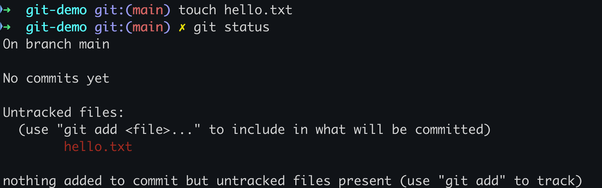
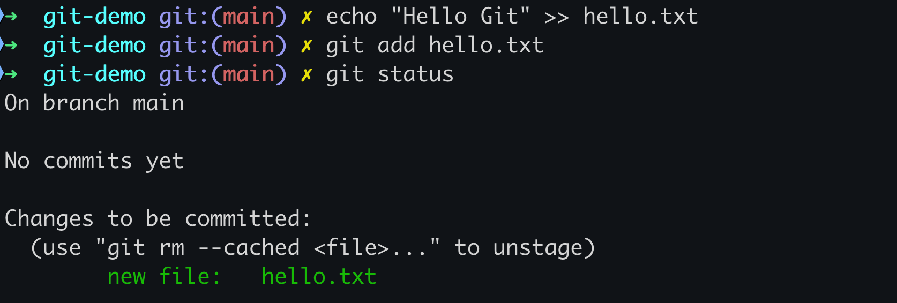
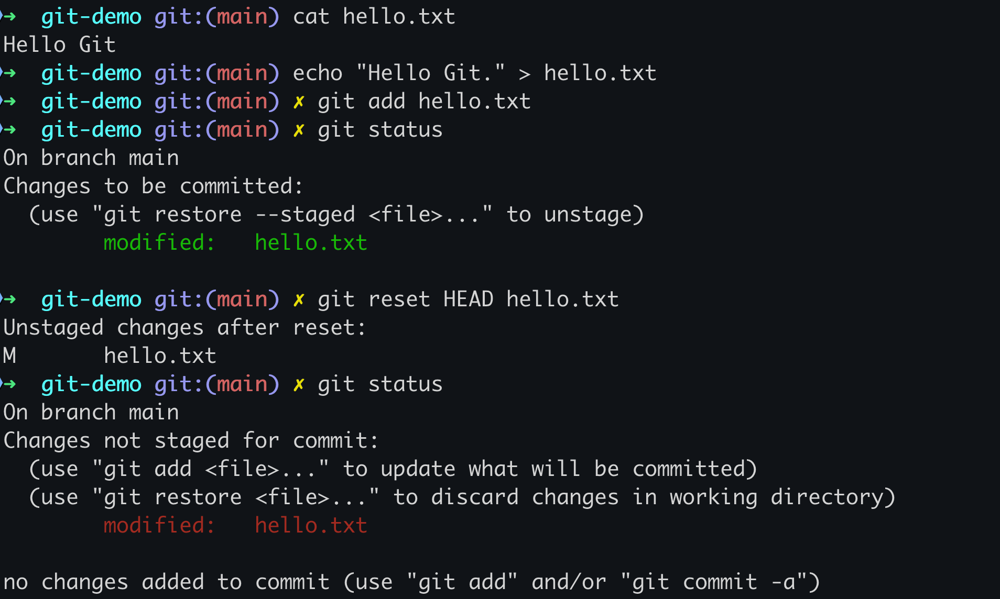
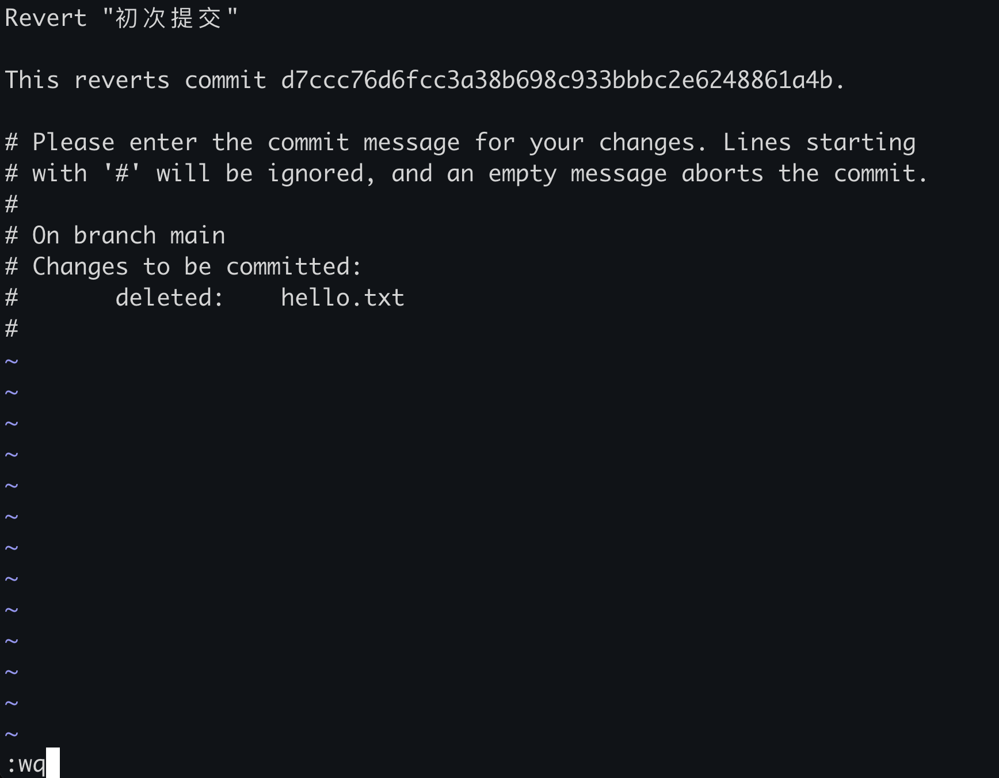

# Git 实战（1）：基础入门

## 1. 引言

欢迎来到《Git 实战之九阴真经》的第一篇文章。在这里，我将总结个人开发经验，与程序员朋友们分享如何系统地学习和使用 Git 的基本概念和操作。无论你是刚接触版本控制的新手，还是有一定经验的开发者，希望在阅读这篇文章后，都能够快速上手 Git，为后续的进阶内容打下坚实基础。

### 1.1 为什么要使用版本控制？

版本控制系统（Version Control System, VCS）是软件开发过程中不可或缺的工具。它能够帮助开发者：

- 追踪和记录代码的历史变更。
- 协作开发，合并多个开发者的代码。
- 管理不同版本的代码，支持回滚和恢复。
- 提高代码的质量和开发效率。

### 1.2 Git 的优势

Git 是目前最流行的分布式版本控制系统，相比于其他 VCS（如 SVN、Mercurial），它具有以下优势：

- **分布式**：每个开发者都拥有完整的代码库，不依赖单一服务器。
- **性能高效**：快速的分支管理和合并操作。
- **强大的社区支持**：丰富的文档和工具生态。

## 2. Git 的安装与配置

在开始使用 Git 之前，首先需要在计算机上安装 Git 并进行基本配置。

### 2.1 安装 Git

#### 2.1.1 Windows

访问 Git 官方网站 [https://git-scm.com](https://git-scm.com) 下载适用于 Windows 的安装包。双击安装包并按照提示完成安装。完成后，打开命令提示符（Command Prompt）或 Git Bash，输入 `git --version` 检查安装是否成功。

#### 2.1.2 macOS

打开终端（Terminal），输入以下命令安装 Git：

```bash
brew install git
```

安装完成后，输入 `git --version` 检查安装是否成功。

#### 2.1.3 Linux

打开终端，根据你的发行版使用以下命令安装 Git：

##### Ubuntu/Debian

```bash
sudo apt-get install git
```

##### Fedora

```bash
sudo dnf install git
```

###### CentOS

```bash
sudo yum install git
```

安装完成后，输入 `git --version` 检查安装是否成功。

### 2.2 配置 Git

安装完成后，需要进行一些基本配置，如设置用户名和邮箱。这些信息将用于记录提交（commit）的作者信息。

使用以下命令配置用户名和邮箱：

```bash
git config --global user.name "你的名字"
git config --global user.email "你的邮箱"
```

使用以下命令查看所有的配置项：

```bash
git config --list
```

## 3. Git 基本概念

在开始实际操作之前，了解一些 Git 的基本概念是非常重要的。

- **仓库（Repository）**：一个 Git 项目代码的存储空间，可以在本地或远程。
- **工作区（Working Directory）**：当前正在工作的项目目录。
- **暂存区（Staging Area）**：一个临时存放改动的区域，用于记录将要提交的修改。
- **本地仓库（Local Repository）**：存放在本地计算机上的仓库。
- **远程仓库（Remote Repository）**：存放在服务器上的仓库，可以与本地仓库进行交互。

以下是一个关于 **Git 工作区**、**暂存区**、**本地仓库**和**远程仓库**关系的示意图：


## 4. 基本操作

### 4.1 创建与初始化仓库

要开始使用 Git，首先需要创建一个新的 Git 仓库或克隆一个已有的远程仓库。

#### 4.1.1 初始化本地仓库

在想要进行版本控制的项目目录下运行以下命令：

```bash
git init
```


> **扩展阅读**
>
> `git init` 命令会在当前目录下创建一个名为 `.git` 的子目录，这个目录是 Git 仓库的核心部分，包含了所有 Git 需要用来记录版本历史和管理项目的文件和数据。以下是 `.git` 目录的主要组成部分及其作用：
>
> 1. **HEAD**：一个指向当前分支引用的文件，通常指向 `refs/heads/main` 或其他当前分支的文件。它表示当前检出的分支。
>
> 2. **config**：一个文本文件，存储了该 Git 仓库的配置选项，包括用户信息、远程仓库地址等。
>
> 3. **description**：一个用于描述项目的文本文件，主要用于 Gitweb（Git 的一个网页界面），但对命令行 Git 操作没有影响。
>
> 4. **hooks**：一个目录，包含了一些脚本模板。这些脚本会在特定的 Git 操作（如提交、合并等）发生时自动运行，可以用来执行自定义的自动化任务。
>
> 5. **info**：一个目录，包含了一个 `exclude` 文件，可以在这里配置忽略规则，功能类似 `.gitignore` 文件，但作用范围仅限于本地仓库。
>
> 6. **objects**：一个目录，存储了所有的数据对象，包括提交对象、树对象和块对象。这些对象使用 SHA-1 哈希值作为文件名，确保唯一性和数据完整性。
>
> 7. **refs**：一个目录，包含了指向分支（heads）、标签（tags）和远程分支（remotes）的引用文件。这些文件记录了各个引用所指向的对象哈希值。
>
> 8. **logs**：一个目录，包含了所有引用的历史变更记录。每当分支或引用发生变化时，Git 会记录下变更的详细信息，以便以后追踪和回溯。
>
> 9. **index**：一个二进制文件，存储了暂存区的信息。每次使用 `git add` 命令时，Git 会更新这个文件，以便记录哪些文件准备提交到下一个版本。
>
> 10. **packed-refs**：一个文件，包含了所有已经打包的引用。随着项目历史的增长，Git 会定期将引用打包，以提高性能。
>
> 这些文件和目录共同构成了 Git 的工作机制，确保了项目的版本控制和管理功能。通过理解 `.git` 目录的结构和作用，可以更深入地了解 Git 的工作原理和使用技巧。

#### 4.1.2 克隆远程仓库

使用 `git clone` 命令可以将远程仓库克隆到本地：

```bash
git clone <远程仓库地址>
```

### 4.2 基本命令

#### 4.2.1 检查仓库状态

使用 `git status` 命令可以查看当前工作区的状态，包括已修改但未暂存的文件和未跟踪的文件。

```bash
git status
```

**实战练习：**

1. 创建一个新的项目目录并初始化 Git 仓库。
2. 在项目目录中创建一个新文件 `hello.txt`，然后使用 `git status` 命令查看状态。



#### 4.2.2 添加文件到暂存区

使用 `git add` 命令可以将修改添加到暂存区，以便下一次提交。

```bash
git add <文件名>
```

**实战练习：**

1. 在 `hello.txt` 文件中写入一些文本内容。
2. 使用 `git add hello.txt` 将其添加到暂存区，然后使用 `git status` 检查状态。



#### 4.2.3 提交修改

使用 `git commit` 命令可以将暂存区的修改提交到本地仓库。提交时需要添加提交信息（commit message）以描述本次修改的内容。

```bash
git commit -m "描述此次提交的内容"
```

**实战练习：**

1. 使用 `git commit -m "初次提交"` 提交 `hello.txt` 的修改。

#### 4.2.4 查看提交历史

使用 `git log` 命令可以查看仓库的提交历史。

```bash
git log
```

**实战练习：**

1. 使用 `git log` 命令查看之前的提交记录。


### 4.3 撤销修改与恢复文件

在开发过程中，有时需要撤销一些修改或恢复文件到之前的状态。

#### 4.3.1 撤销未暂存的修改

使用 `git checkout` 可以撤销**未暂存**的修改，将文件恢复到上一次提交的状态。

```bash
git checkout -- <文件名>
```

**实战练习：**

1. 修改 `hello.txt` 文件但不添加到暂存区。
2. 使用 `git checkout -- hello.txt` 撤销修改。


#### 4.3.2 撤销已暂存的修改

使用 `git reset` 可以将已暂存的修改撤销回工作区。

```bash
git reset HEAD <文件名>
```

> 提示：
>
> - `reset` 是把 `add` 之后的文件，从暂存区恢复回工作区。
> - `checkout` 是把在工作区修改过的文件恢复到上一次提交的状态。

**实战练习：**

1. 修改 `hello.txt` 文件并添加到暂存区。
2. 使用 `git reset HEAD hello.txt` 撤销已暂存的修改。



#### 4.3.3 回滚提交

使用 `git revert` 可以创建一个新的提交，用于撤销指定的历史提交。

```bash
git revert <提交哈希>
```

> 提示：**哈希值**通常复制粘贴前 `7~8` 位即可，Git 可以根据**哈希值**精准定位到对应的提交记录。

**实战练习：**

1. 使用 `git log` 找到之前的提交哈希。
2. 使用 `git revert <提交哈希>` 撤销该提交。


输入 `git revert <提交哈希>` 回车之后，会自动弹出一个窗口，输入 `:wq` 回车，保存回滚提交信息即可，如下图所示：



## 5. 结语

在本篇文章中总结了个人使用 Git 的基础经验，包括基本概念和基本操作，并通过实战练习帮助你更好地理解和掌握这些命令的使用。掌握了这些内容，已经可以开始使用 Git 进行版本控制了。在接下来的文章中，我们将深入探讨 Git 的**分支管理和协作开发**，期待与你继续交流。
