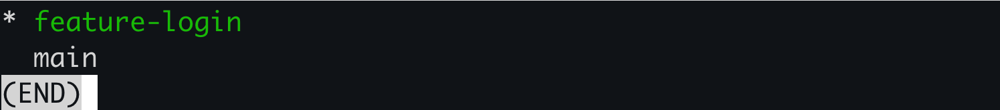
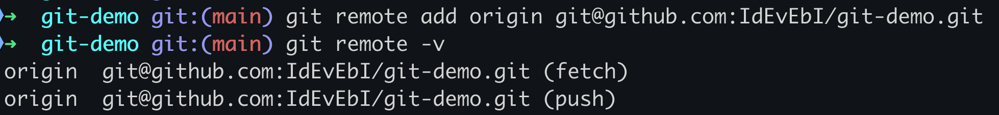
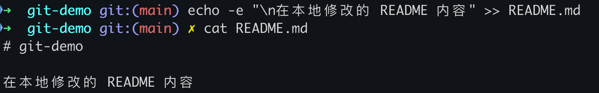
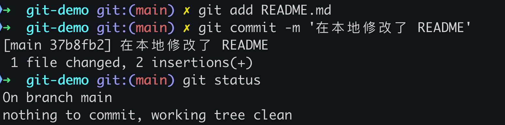
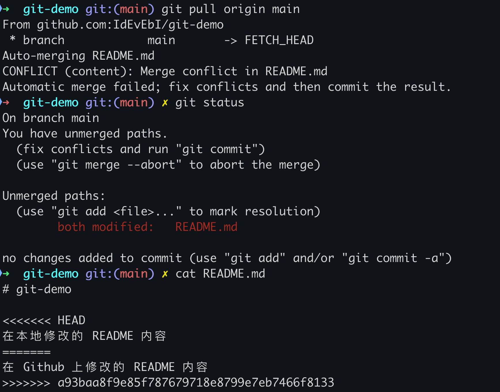
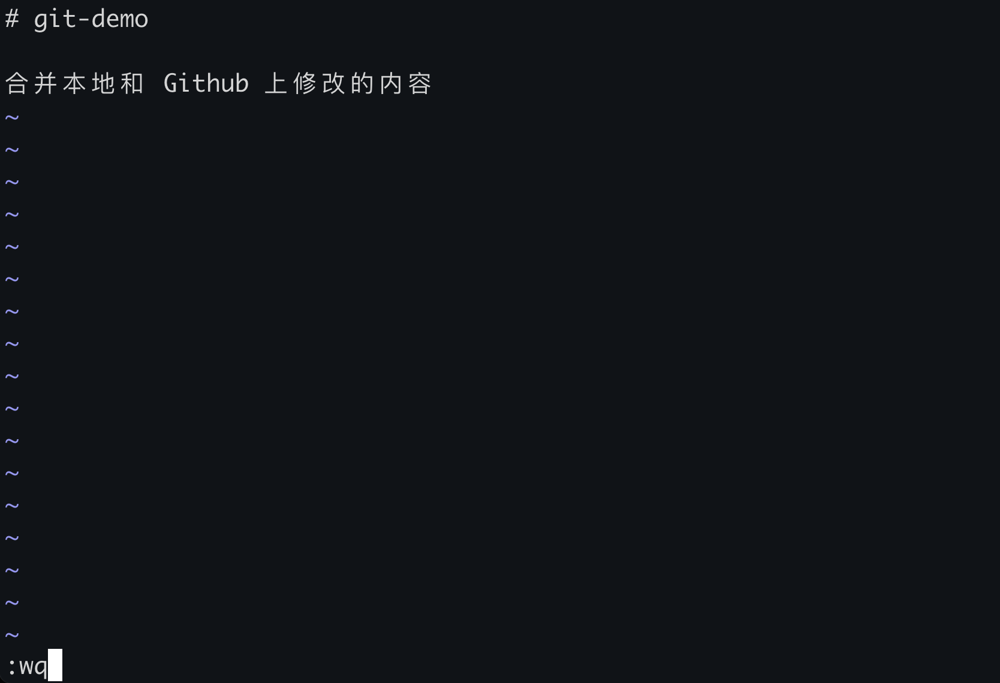

# Git 实战（2）：分支管理和协作开发

## 1. 引言

欢迎来到《Git 实战之九阴真经》的第二篇文章。在这一篇文章中，将继续与程序员朋友们分享如何在 Git 中进行**分支管理**和**协作开发**的个人经验。**分支**是 Git 的强大特性之一，可以在**不影响主线代码**的情况下进行**并行开发**。希望通过这篇文章的学习，你能更好地掌握 Git 分支管理的技巧，并提高团队协作效率。

### 1.1 为什么要使用分支？

在软件开发过程中，常常需要**同时进行多个功能的开发和 bug 修复**。如果直接在主线代码上进行这些操作，很容易导致代码混乱和不稳定。**分支**的使用可以让你：

- 在不同的分支上并行开发多个功能或修复多个问题。
- 保持主线代码的稳定性和清晰性。
- 方便地切换和合并不同的开发工作。

### 1.2 Git 分支的优势

相比于其他版本控制系统，Git 的分支管理具有以下优势：

- **轻量级**：创建和切换分支非常快速，占用的资源很少。
- **便捷性**：Git 提供了丰富的分支管理命令，操作简便。
- **灵活性**：可以在任何时候创建、合并和删除分支，适应不同的开发需求。

## 2. 创建与管理分支

在开始分支操作之前，先了解一些常用的分支管理命令。

### 2.1 创建分支

使用 `git branch` 命令可以**创建一个新分支**。分支的命名应简洁明了，通常使用**小写字母和短横线连接**单词（俗称**糖葫芦**或**羊肉串**格式）。

```bash
git branch <分支名称>
```

**实战练习：**

1. 在项目目录中创建一个新分支 `feature-login`。

```bash
git branch feature-login
```

### 2.2 切换分支

使用 `git checkout` 命令可以**切换到指定的分支**。

```bash
git checkout <分支名称>
```

> **困惑**：不少刚接触 `checkout` 的朋友大多会有一个困惑，为什么 `checkout` 这个命令又可以**撤销未暂存的修改**？又可以**切换分支**？
>
> 其实只需要记住一个关键点，`checkout` 命令的作用是保证：**当前分支下没有任何修改记录**，也就是**上一次提交的状态**。如果这句话理解了，再来看：
>
> - `checkout <文件名>` 让该文件恢复到**上一次提交的状态**，也就是撤销到上一次提交之后的修改，给程序员后悔的机会。
> - `checkout <分支名>` 确保当前分支没有变化的情况下，切换到其他分支，执行新的开发任务。

**实战练习：**

1. 切换到 `feature-login` 分支。

```bash
git checkout feature-login
```


### 2.3 查看分支

使用 `git branch` 命令可以**查看当前仓库中的所有分支**。当前所在的分支前会有一个 `*` 标记。

```bash
git branch
```

**实战练习：**

1. 查看当前仓库中的所有分支。

```bash
git branch
```



### 2.4 合并分支

使用 `git merge` 命令可以**将指定分支的修改合并到当前分支**。合并操作通常在切换到目标分支后进行。

```bash
git merge <被合并的分支名称>
```

**实战练习：**

1. 切换到 `main` 分支，并将 `feature-login` 分支合并到 `main` 分支。

```bash
git checkout main
git merge feature-login
```


### 2.5 删除分支

使用 `git branch -d` 命令可以**删除指定的分支**。注意，删除分支前应确保该分支的修改已合并到其他分支或不再需要。

```bash
git branch -d <分支名称>
```

**实战练习：**

1. 删除 `feature-login` 分支。

```bash
git branch -d feature-login
```


## 3. 协作开发

在团队协作开发中，通常会使用远程仓库（如 GitHub、GitLab）来共享和同步代码。下面介绍一些常用的协作开发命令和操作。

### 3.1 添加远程仓库

使用 `git remote add` 命令可以**添加一个远程仓库**。远程仓库通常命名为 `origin`。

```bash
git remote add origin <远程仓库地址>
```

**实战练习：**

1. 添加一个远程仓库。

```bash
git remote add origin git@github.com:IdEvEbI/git-demo.git
# 提示：实际测试时，可以修改为自己的远程仓库的实际地址（请先确保远程仓库存在），格式如下：
git remote add origin https://github.com/your-username/your-repo.git
```

### 3.2 查看远程仓库

使用 `git remote -v` 命令可以**查看已添加的远程仓库**。

```bash
git remote -v
```

**实战练习：**

1. 查看已添加的远程仓库。

```bash
git remote -v
```



### 3.3 推送分支到远程仓库

使用 `git push` 命令可以**将本地分支推送到远程仓库**。

```bash
git push origin <分支名称>
```

**实战练习：**

1. 将 `main` 分支推送到远程仓库。

```bash
git push origin main
```


### 3.4 拉取远程仓库的更新

使用 `git pull` 命令可以**拉取远程仓库的最新更新**，并合并到当前分支。

```bash
git pull origin <分支名称>
```

**实战练习：**

1. 拉取远程仓库 `main` 分支的更新。

```bash
git pull origin main
```


### 3.5 克隆远程仓库

使用 `git clone` 命令可以**将远程仓库克隆到本地**。

```bash
git clone <远程仓库地址>
```

**实战练习：**

1. 克隆一个远程仓库。

```bash
git clone git@github.com:IdEvEbI/git-demo.git
# 提示：实际测试时，可以修改为自己的远程仓库的实际地址（请先确保远程仓库存在），格式如下：
git clone https://github.com/your-username/your-repo.git
```


## 4. 解决冲突

在合并分支或拉取远程更新时，可能会遇到冲突。Git 无法自动合并冲突部分，需要手动解决。

在 Git 中，有可能导致冲突的情况如下：

1. **不同分支修改同一个文件的同一行内容**：两个分支都修改了同一个文件的同一行内容，合并时会产生冲突。
2. **不同分支删除同一文件**：两个分支都删除了同一个文件，合并时会产生冲突。
3. **不同分支重命名同一文件**：两个分支都重命名了同一个文件，但新名称不同，合并时会产生冲突。
4. **添加相同文件**：两个分支添加了同名文件但内容不同，合并时会产生冲突。
5. **不同分支修改同一文件的不同位置**：虽然这不会直接产生冲突，但如果上下文重叠，也可能导致冲突。

### 4.1 解决冲突的步骤

1. **查看冲突文件**：在终端中输入 `git status` 查看冲突文件。
2. **手动解决冲突**：打开冲突文件，手动修改冲突部分，并删除冲突标记（`<<<<<<<`、`=======`、`>>>>>>>`）。
3. **添加解决后的文件**：解决冲突后，使用 `git add <file>` 添加文件，使用 `git commit` 提交修改。

> **冲突标记**说明：
>
> - `<<<<<<<` ~ `=======`：区间标注的内容表示**其他分支对该文件所做的修改**。
> - `=======` ~ `>>>>>>>`：区间标注的内容表示**当前分支对该文件所做的修改**。
>
> 合并冲突时根据实际需求，选择对应内容，并删除**冲突标记**即可。

### 4.2 实战练习

#### 4.2.1 冲突内容准备

- 在 **GitHub** 上修改 `README.md` 内容，**模拟另一个开发人员在远程修改了文件内容**，如下图所示：


- 在 **本地** 修改 `README.md` 内容，**模拟本人在本地修改了文件内容**，如下图所示：



- 提交本地修改：

```bash
git add README.md 
git commit -m '在本地修改了 README'
git status
```



#### 4.2.2 拉取远程仓库产生冲突

```bash
# 拉取远程仓库的更新
git pull origin main 

# 查看 README.md 内容
cat README.md
```



#### 4.2.3 合并冲突并手动解决冲突

- 修改 `README.md` 内容，**整合内容**并删除**冲突标记**，如下图所示：



- 添加并提交，然后推送到远程仓库：

```bash
# 将合并冲突过的 README 添加到暂存区
git add README.md

# 提交到本地仓库
git commit -m '合并并解决 README 冲突'

# 推送到远程仓库
git push origin main
```


## 5. 结语

在本篇文章中，总结了个人在 Git 分支管理和协作开发中的经验，包括分支的**创建**、**切换**、**合并**和**删除**，以及**如何使用远程仓库进行协作开发**。通过这些内容，希望你能够更好地掌握 Git 的分支管理和协作开发技巧。在接下来的文章中，我们将深入探讨 Git 的更多高级功能和最佳实践，期待与你继续交流。

> 本专栏文档及配套代码的 GitHub 地址：[壹刀流的技术人生](https://github.com/IdEvEbI/idevebi.github.io)。
