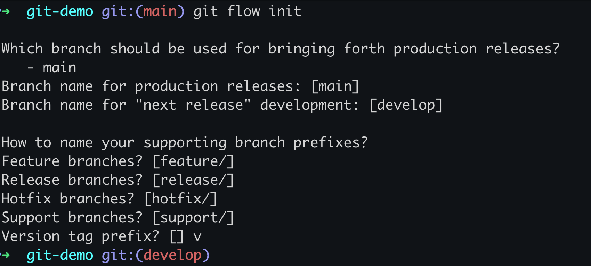
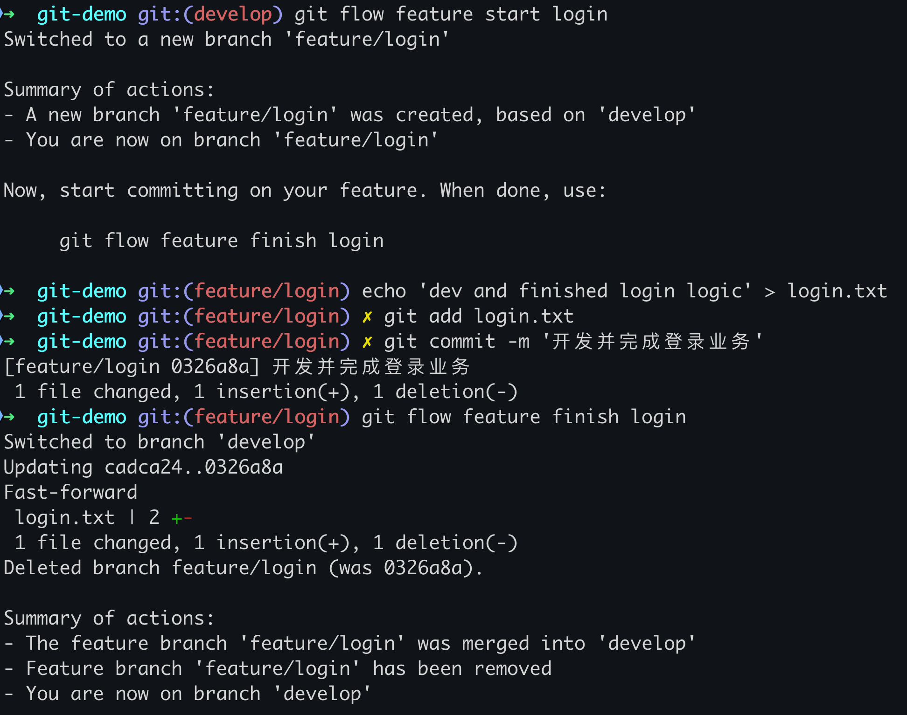
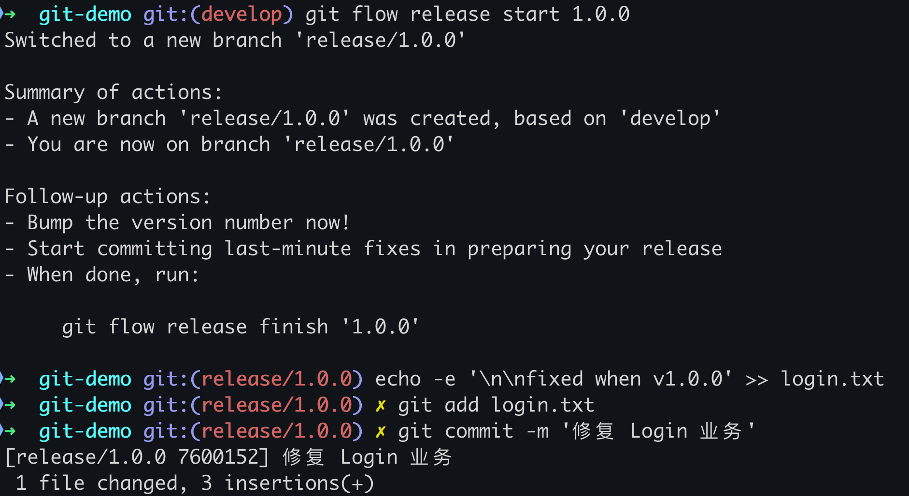
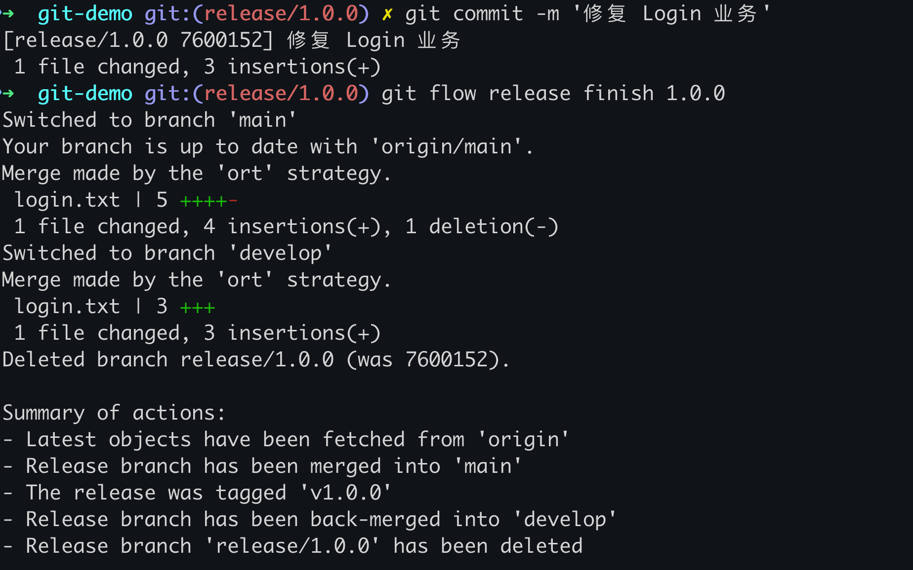
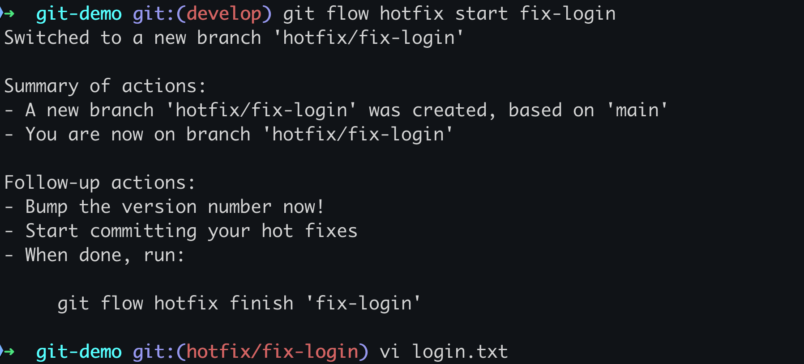
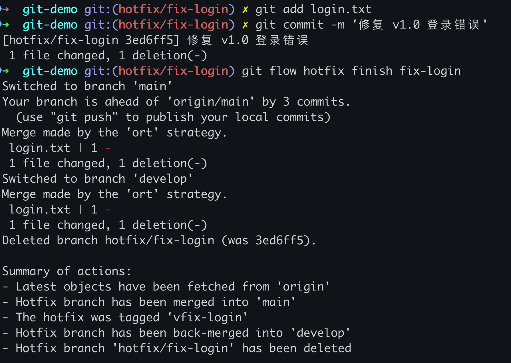

# Git 实战（4）：Git Flow 和实战项目案例

## 1. 引言

欢迎来到《Git 实战之九阴真经》的第四篇文章。在这一篇文章中，将继续与程序员朋友们分享 Git Flow 工作流和实战项目的应用。通过这些内容，希望你能更好地理解和应用 Git Flow，提高项目的管理和协作效率。

### 1.1 什么是 Git Flow？

Git Flow 是一种基于 Git 的分支管理模型，它定义了一套明确的分支策略，用于管理项目的开发流程，包括**功能开发**、**版本发布**、**紧急修复**等。通过 Git Flow，可以使团队协作更加有序，提高代码质量和项目交付效率。

### 1.2 Git Flow 的优势

- **清晰的分支结构**：不同的分支用于不同的目的，使开发流程更加清晰。
- **便于协作**：开发者可以在独立的功能分支上工作，不影响主线代码的稳定性。
- **版本管理方便**：发布分支和修复分支帮助管理不同的版本和紧急修复。

## 2. Git Flow 的基本概念

在 Git Flow 中，主要有以下几种分支：

- **主分支（master / main）**：存放已经发布的生产环境代码。
- **开发分支（develop）**：存放最新的开发代码，是所有功能分支的合并目标。
- **功能分支（feature）**：用于开发新的功能，从开发分支创建，完成后合并回开发分支。
- **发布分支（release）**：用于准备新版本的发布，从开发分支创建，完成后合并到主分支和开发分支。
- **修复分支（hotfix）**：用于紧急修复生产环境的问题，从主分支创建，完成后合并到主分支和开发分支。

## 3. 安装和初始化 Git Flow

### 3.1 安装 Git Flow

首先，需要安装 Git Flow 扩展工具。可以使用以下命令进行安装：

#### macOS 和 Linux

```bash
brew install git-flow
```

或使用以下命令（适用于多数 Linux 发行版）：

```bash
sudo apt-get install git-flow
```

#### Windows

可以从以下地址下载并安装 Git Flow：

[https://github.com/nvie/gitflow/wiki/Installation](https://github.com/nvie/gitflow/wiki/Installation)

### 3.2 初始化 Git Flow

安装完成后，需要在项目中初始化 Git Flow。使用以下命令：

```bash
git flow init
```

根据提示选择分支名称，通常主分支为 `master`，开发分支为 `develop`。如果没有这些分支，Git Flow 会自动创建。

**实战练习：**

- 在你的项目目录中初始化 Git Flow。

```bash
git flow init
```



## 4. Git Flow 的使用

### 4.1 创建功能分支

功能分支用于开发新的功能。使用以下命令创建功能分支：

```bash
git flow feature start <功能名称>
```

完成功能开发后，使用以下命令结束功能分支，并将其合并到开发分支：

```bash
git flow feature finish <功能名称>
```

**实战练习：**

- 创建一个名为 `login` 的功能分支。

```bash
git flow feature start login
```

- 完成功能开发后，结束功能分支并合并到开发分支。

```bash
git flow feature finish login
```



### 4.2 创建发布分支

发布分支用于准备新版本的发布。使用以下命令创建发布分支：

```bash
git flow release start <版本号>
```

在发布分支上进行最后的测试和修正后，使用以下命令结束发布分支，并将其合并到主分支和开发分支：

```bash
git flow release finish <版本号>
```

**实战练习：**

- 创建一个名为 `1.0.0` 的发布分支。

```bash
git flow release start 1.0.0
```



- 完成测试和修正后，结束发布分支并合并到主分支和开发分支。

```bash
git flow release finish 1.0.0
```



### 4.3 创建修复分支

修复分支用于紧急修复生产环境的问题。使用以下命令创建修复分支：

```bash
git flow hotfix start <修复名称>
```

完成修复后，使用以下命令结束修复分支，并将其合并到主分支和开发分支：

```bash
git flow hotfix finish <修复名称>
```

**实战练习：**

- 创建一个名为 `fix-login` 的修复分支。

```bash
git flow hotfix start fix-login
```



- 完成修复后，结束修复分支并合并到主分支和开发分支。

```bash
git flow hotfix finish fix-login
```



### 4.4 最佳实践

- **遵循 Git Flow 模型**：严格按照 Git Flow 模型管理分支，保持代码库的清晰和有序。
- **频繁提交**：在功能开发过程中，频繁提交代码，避免过大的代码变更。
- **充分测试**：在发布分支上进行充分的测试和修正，确保版本的稳定性。
- **文档记录**：在每次合并和发布时，记录相关的文档，保持团队的信息同步。

## 5. 实战项目案例

### 5.1 项目背景

假设我们正在开发一个名为 `MyApp` 的项目，该项目包括用户登录、用户注册和首页展示等功能。我们将通过 Git Flow 管理该项目的开发流程。

### 5.2 功能开发

- 创建功能分支 `feature-login` 进行用户登录功能的开发：

```bash
git flow feature start login
```

- 完成开发后，结束功能分支并合并到开发分支：

```bash
git flow feature finish login
```

- 创建功能分支 `feature-register` 进行用户注册功能的开发：

```bash
git flow feature start register
```

- 完成开发后，结束功能分支并合并到开发分支：

```bash
git flow feature finish register
```

### 5.3 版本发布

- 创建发布分支 `release-1.0.0` 准备发布版本 `1.0.0`：

```bash
git flow release start 1.0.0
```

- 在发布分支上进行测试和修正。

- 完成测试后，结束发布分支并合并到主分支和开发分支：

```bash
git flow release finish 1.0.0
```

### 5.4 紧急修复

- 创建修复分支 `hotfix-login-bug` 修复登录功能的紧急问题：

```bash
git flow hotfix start login-bug
```

- 完成修复后，结束修复分支并合并到主分支和开发分支：

```bash
git flow hotfix finish login-bug
```

### 5.5 推送分支和标签到远程仓库

在完成本地的分支操作后，需要将分支和标签推送到远程仓库，以便团队其他成员能够获取最新的代码和版本信息。

#### 推送分支

使用 `git push` 命令可以将本地分支推送到远程仓库。

```bash
git push origin <分支名称>
```

**示例：**

```bash
git push origin develop
```

#### 推送所有分支

使用以下命令将所有本地分支推送到远程仓库：

```bash
git push --all origin
```

#### 推送标签

使用 `git push` 命令可以将本地标签推送到远程仓库。

```bash
git push origin <标签名称>
```

**示例：**

```bash
git push origin 1.0.0
```

#### 推送所有标签

使用以下命令将所有本地标签推送到远程仓库：

```bash
git push origin --tags
```

## 6. 结语

在本篇文章中，总结了个人在 Git Flow 工作流和实战项目中的经验，包括 Git Flow 的基本概念、使用方法和最佳实践。通过这些内容，希望你能够更好地理解和应用 Git Flow，提高项目的管理和协作效率。在接下来的文章中，我们将继续探讨 **Git Hooks 和自动化流程**，期待与你继续交流。

> 本专栏文档及配套代码的 GitHub 地址：[壹刀流的技术人生](https://github.com/IdEvEbI/idevebi.github.io)。
