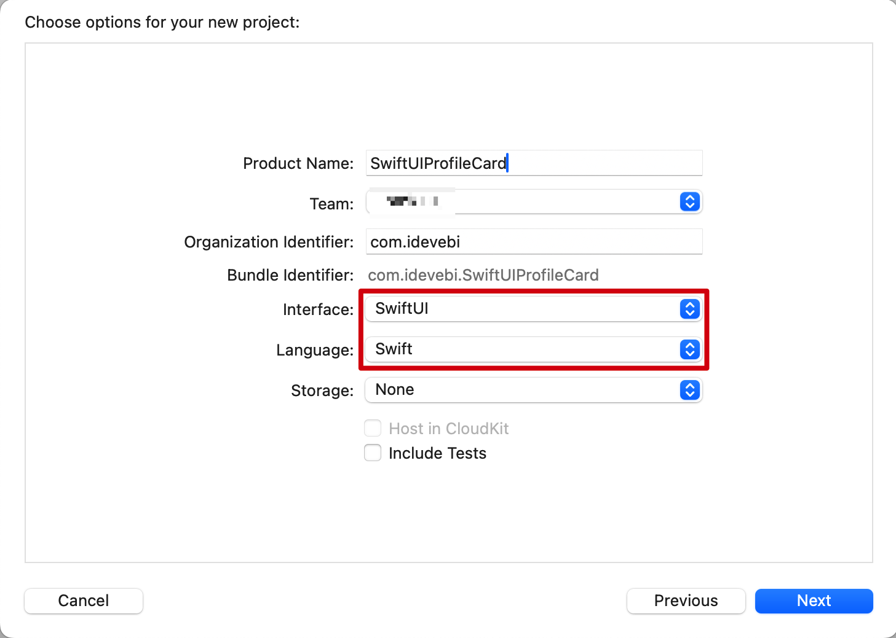
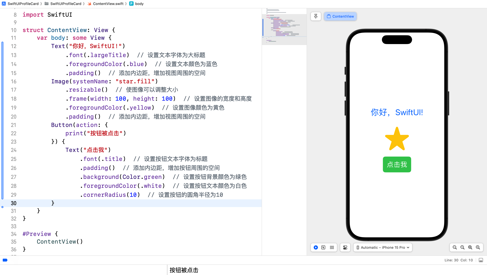
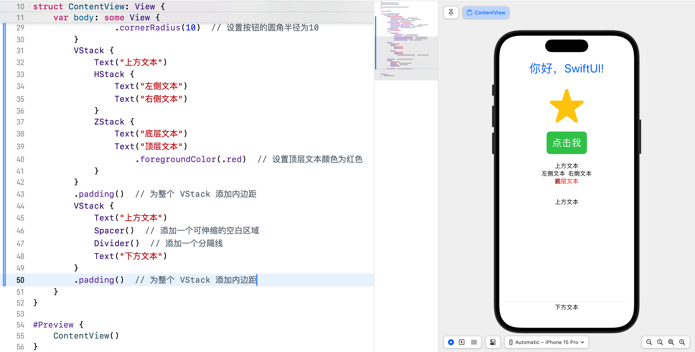
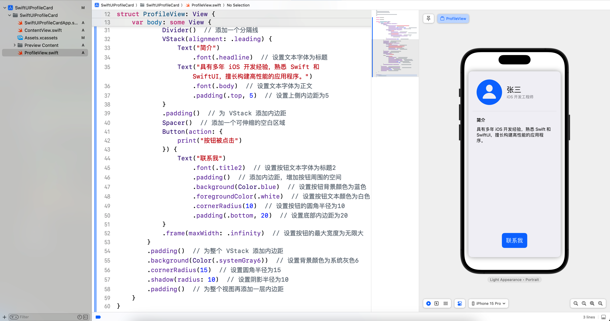

# ChatGPT SwiftUI 学习日志（1）：SwiftUI 基础

在本篇文章中，咱们将探讨 SwiftUI 的**基础概念**和**基本结构**。SwiftUI 是苹果公司推出的一种全新 UI 框架，用于构建跨平台的用户界面。通过 SwiftUI，我们可以使用简洁直观的声明式语法，快速构建复杂的用户界面。

## 1. SwiftUI 简介

**SwiftUI** 是苹果在 2019 年 WWDC 大会上推出的 UI 框架，旨在简化 iOS、macOS、watchOS 和 tvOS 应用的界面开发。SwiftUI 使用**声明式语法**，通过代码描述用户界面，**自动处理界面的状态和更新**。

## 2. 创建一个 SwiftUI 项目

在 Xcode 中创建一个 SwiftUI 项目非常简单。以下是步骤：

1. 打开 Xcode，选择 "Create a new Xcode project"。
2. 选择 "App" 模板，点击 "Next"。
3. 填写项目名称 "SwiftUIProfileCard" 和其他相关信息，确保选择 "Swift" 语言和 "SwiftUI" 界面。
4. 点击 "Next"，选择保存位置，然后点击 "Create"。



创建完成后，Xcode 会生成一个基本的 SwiftUI 项目，其中包含一个 `ContentView.swift` 文件，这是我们开始构建用户界面的地方。

## 3. SwiftUI 项目结构

一个典型的 SwiftUI 项目包含以下文件和文件夹：

- **ContentView.swift**：主视图文件，包含初始的用户界面代码。
- **App 文件**：应用程序的入口文件，定义了应用的生命周期。
- **Assets.xcassets**：资源文件夹，存放图像和其他资源。

## 4. SwiftUI 视图的生命周期

SwiftUI 视图的生命周期与 UIKit 不同，**视图是根据状态自动更新的。每当状态发生变化时，SwiftUI 会重新计算视图，并在需要时进行更新**。

## 5. 基本视图和修饰符

### 5.1 Text 视图

**Text** 视图用于显示文本，可以使用多种修饰符来调整文本样式。在 `var body: some View {}` 中增加以下代码：

```swift
Text("你好，SwiftUI!")
    .font(.largeTitle)  // 设置文本字体为大标题
    .foregroundColor(.blue)  // 设置文本颜色为蓝色
    .padding()  // 添加内边距，增加视图周围的空间
```

### 5.2 Image 视图

**Image** 视图用于显示图像，可以使用修饰符调整图像大小和样式。

```swift
Image(systemName: "star.fill")
    .resizable()  // 使图像可以调整大小
    .frame(width: 100, height: 100)  // 设置图像的宽度和高度
    .foregroundColor(.yellow)  // 设置图像颜色为黄色
    .padding()  // 添加内边距，增加视图周围的空间
```

### 5.3 Button 视图

**Button** 视图用于创建按钮，可以自定义按钮的外观和点击行为。

```swift
Button(action: {
    print("按钮被点击")
}) {
    Text("点击我")
        .font(.title)  // 设置按钮文本字体为标题
        .padding()  // 添加内边距，增加按钮周围的空间
        .background(Color.green)  // 设置按钮背景颜色为绿色
        .foregroundColor(.white)  // 设置按钮文本颜色为白色
        .cornerRadius(10)  // 设置按钮的圆角半径为10
}
```



### 5.4 VStack、HStack 和 ZStack

**VStack**、**HStack** 和 **ZStack** 用于组合和布局视图。

- VStack：垂直堆叠视图。
- HStack：水平排列视图。
- ZStack：重叠视图。

```swift
VStack {
    Text("上方文本")
    HStack {
        Text("左侧文本")
        Text("右侧文本")
    }
    ZStack {
        Text("底层文本")
        Text("顶层文本")
            .foregroundColor(.red)  // 设置顶层文本颜色为红色
    }
}
.padding()  // 为整个 VStack 添加内边距
```

### 5.5 Spacer 和 Divider

**Spacer** 用于在视图之间创建可伸缩的空白区域，而 **Divider** 则用于在视图之间创建分隔线。

```swift
VStack {
    Text("上方文本")
    Spacer()  // 添加一个可伸缩的空白区域
    Divider()  // 添加一个分隔线
    Text("下方文本")
}
.padding()  // 为整个 VStack 添加内边距
```



### padding 方法的作用

`padding` 方法用于在视图的周围添加内边距，增加视图与其边界之间的空间。通过使用 `padding` 方法，可以使视图显得更加美观和易读。

## 6. 综合案例：个人简介卡片

1. 在左侧导航窗口中的 `SwiftUIProfileCard` 上点击鼠标右键，然后在弹出菜单中选择 "New File..."。
2. 选择 "Swift File"，并输入 `ProfileView.swift`，然后点击 "Create" 按钮。
3. 在 `ProfileView.swift` 文件中输入以下代码：

```swift
import SwiftUI

struct ProfileView: View {
    var body: some View {
        VStack(alignment: .leading) {
            HStack {
                Image(systemName: "person.circle.fill")
                    .resizable()  // 使图像可以调整大小
                    .frame(width: 100, height: 100)  // 设置图像的宽度和高度
                    .foregroundColor(.blue)  // 设置图像颜色为蓝色
                VStack(alignment: .leading) {
                    Text("张三")
                        .font(.title)  // 设置文本字体为标题
                        .foregroundColor(.primary)  // 设置文本颜色为主要颜色
                    Text("iOS 开发工程师")
                        .font(.subheadline)  // 设置文本字体为副标题
                        .foregroundColor(.secondary)  // 设置文本颜色为次要颜色
                }
                .padding(.leading, 10)  // 设置左侧内边距为10
            }
            .padding()  // 为 HStack 添加内边距
            Divider()  // 添加一个分隔线
            VStack(alignment: .leading) {
                Text("简介")
                    .font(.headline)  // 设置文本字体为标题
                Text("具有多年 iOS 开发经验，熟悉 Swift 和 SwiftUI，擅长构建高性能的应用程序。")
                    .font(.body)  // 设置文本字体为正文
                    .padding(.top, 5)  // 设置上侧内边距为5
            }
            .padding()  // 为 VStack 添加内边距
            Spacer()  // 添加一个可伸缩的空白区域
            Button(action: {
                print("按钮被点击")
            }) {
                Text("联系我")
                    .font(.title2)  // 设置按钮文本字体为标题2
                    .padding()  // 添加内边距，增加按钮周围的空间
                    .background(Color.blue)  // 设置按钮背景颜色为蓝色
                    .foregroundColor(.white)  // 设置按钮文本颜色为白色
                    .cornerRadius(10)  // 设置按钮的圆角半径为10
                    .padding(.bottom, 20)  // 设置底部内边距为20
            }
            .frame(maxWidth: .infinity)  // 设置按钮的最大宽度为无限大
        }
        .padding()  // 为整个 VStack 添加内边距
        .background(Color(.systemGray6))  // 设置背景颜色为系统灰色6
        .cornerRadius(15)  // 设置圆角半径为15
        .shadow(radius: 10)  // 设置阴影半径为10
        .padding()  // 为整个视图再添加一层内边距
    }
}

#Preview {
    ProfileView()
}
```

在这个综合案例中，我们创建了一个简单的个人简介卡片，展示了头像、姓名、职业和简介信息。卡片底部还有一个联系按钮，点击按钮时会在控制台输出一条信息。



### 关键点

- **Image** 视图用于显示头像，并通过 **resizable()** 和 **frame** 修饰符调整大小。
- **Text** 视图用于显示姓名和职业信息。
- **VStack** 和 **HStack** 用于布局不同的视图。
- **Divider** 用于在卡片中添加分隔线。
- **Button** 视图用于创建联系按钮，并通过 **action** 闭包定义点击行为。
- **修饰符** 用于设置视图的样式和布局，如 **padding()**、**background()**、**cornerRadius()** 和 **shadow()** 等。

### 将 ProfileView 设为主视图

为了显示 `ProfileView` 的内容，我们需要修改项目的入口文件，使 `ProfileView` 成为应用程序的主视图。

1. 打开项目的入口文件（默认情况下是 `YourAppNameApp.swift`）。
2. 将 `ContentView` 替换为 `ProfileView`。

```swift
import SwiftUI

@main
struct SwiftUIProfileCardApp: App {
    var body: some Scene {
        WindowGroup {
            ProfileView()  // 将 ContentView 替换为 ProfileView
        }
    }
}
```

### `#Preview` 的解释

`#Preview` 是一个语法糖，用于在 Xcode 的预览窗口中显示 SwiftUI 视图的实时预览。这段代码使我们在不运行应用程序的情况下查看和修改视图的设计。

```swift
#Preview {
    ProfileView()
}
```

替代代码如下：

```swift
struct ProfileView_Previews: PreviewProvider {
    static var previews: some View {
        ProfileView()
    }
}
```

- **ProfileView_Previews**：结构体，遵循 `PreviewProvider` 协议，用于提供视图的预览。
- **previews**：静态属性，返回一个或多个视图，用于在预览窗口中显示。

通过在 `previews` 属性中返回 `ProfileView()`，我们可以在 Xcode 的预览窗口中查看 `ProfileView` 的实时预览，实时更新和调整视图的布局和样式。

## 7. 结语

在这篇文章中，我们介绍了 SwiftUI 的**基础概念**和**基本结构**，并展示了如何创建一个简单的 SwiftUI 项目。通过一个综合案例，我们将这些基本视图和布局结合起来，创建了一个简单的个人简介卡片。希望通过这篇文章，你对 SwiftUI 有了初步的了解。下一篇文章将进一步探讨 SwiftUI 的布局系统，敬请期待。

> 本专栏文档及配套代码的 GitHub 地址：[壹刀流的技术人生](https://github.com/IdEvEbI/idevebi.github.io)。
