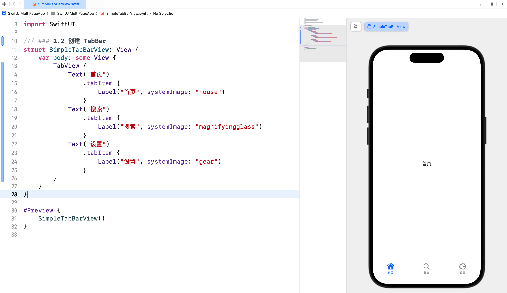
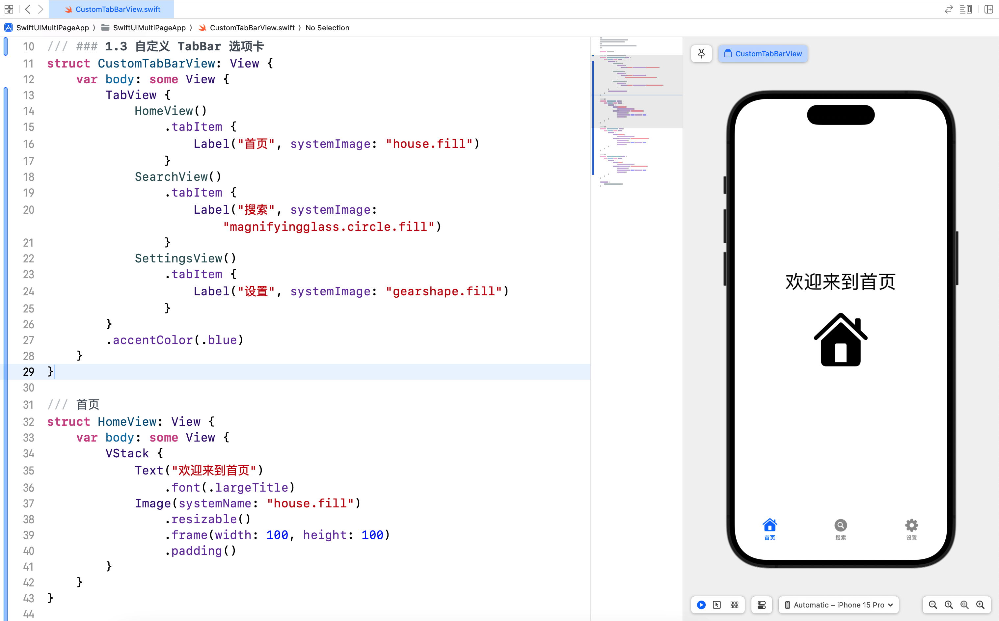
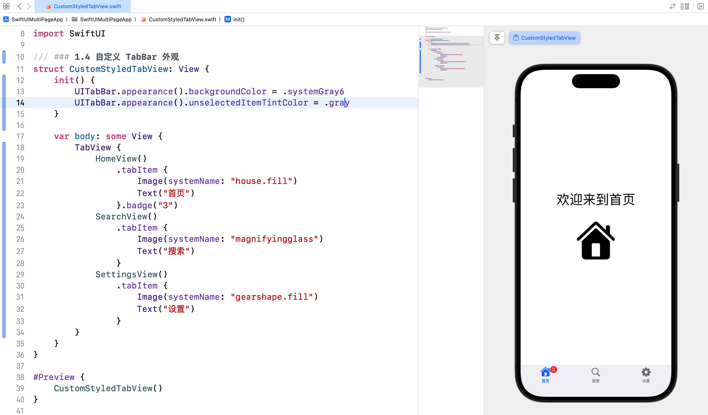
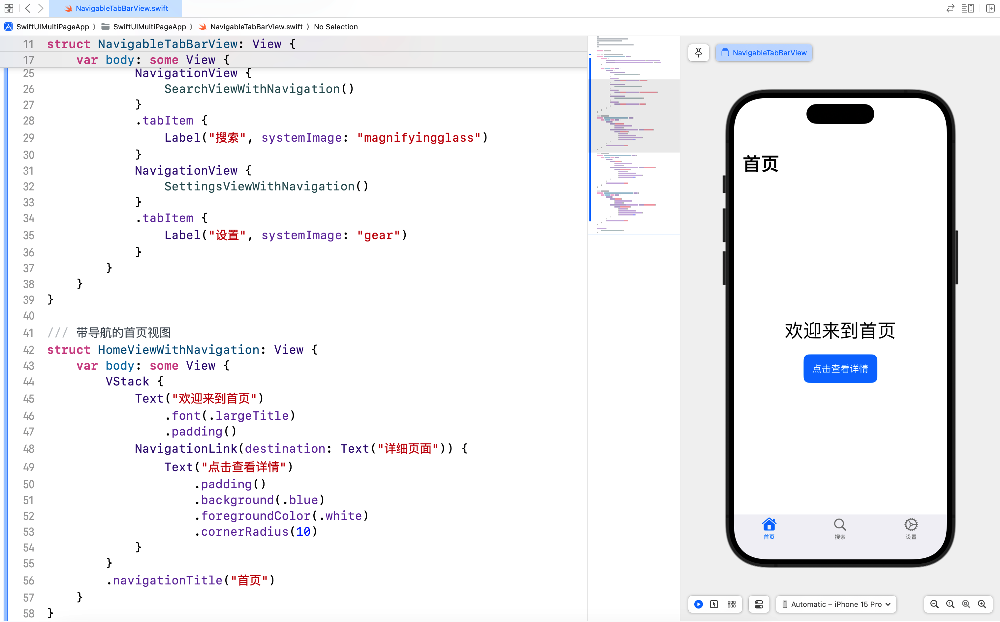
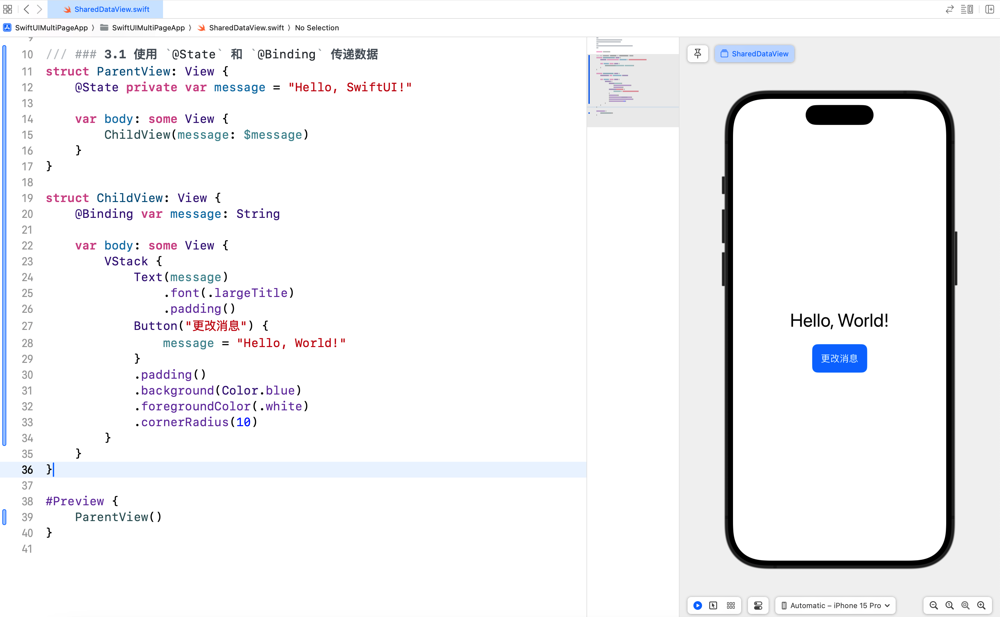
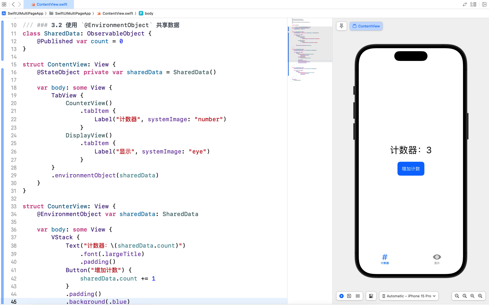
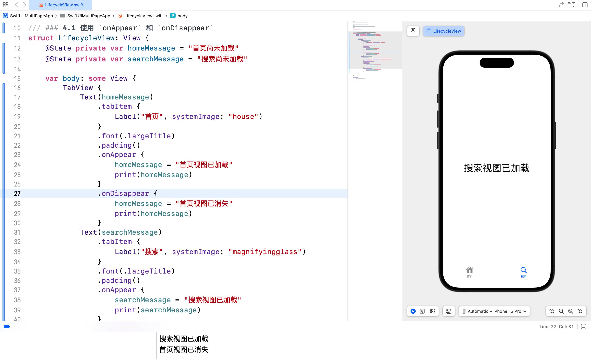
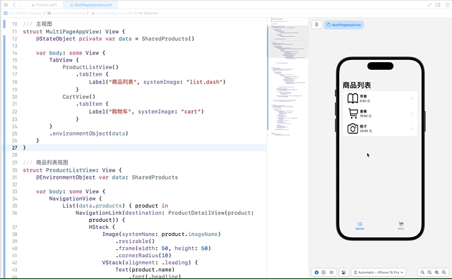

# SwiftUI 学习日志（10）：TabBar 与多页面应用

欢迎来到《SwiftUI 学习日志》的第 10 篇文章。在本篇文章中，我们将深入探讨如何在 SwiftUI 中实现**TabBar** 和 **多页面应用**。通过学习如何创建 **TabBar**、**多页面导航** 以及 **结合多种视图展示内容**，您将能够构建出更加复杂和功能丰富的应用程序。

## 1. TabBar 简介

### 1.1 什么是 TabBar

**TabBar** 是一种常见的用户界面组件，**位于应用程序的底部，包含多个选项卡，允许用户在不同页面之间快速切换**。每个选项卡都代表一个独立的视图或功能模块。

### 1.2 创建 TabBar

在 SwiftUI 中，创建 TabBar 非常简单。我们使用 `TabView` 视图并在其中包含多个 `View` 来实现 TabBar。

```swift
/// ### 1.2 创建 TabBar
struct SimpleTabBarView: View {
    var body: some View {
        TabView {
            Text("首页")
                .tabItem {
                    Label("首页", systemImage: "house")
                }
            Text("搜索")
                .tabItem {
                    Label("搜索", systemImage: "magnifyingglass")
                }
            Text("设置")
                .tabItem {
                    Label("设置", systemImage: "gear")
                }
        }
    }
}

#Preview {
    SimpleTabBarView()
}
```



在这个示例中，我们创建了一个简单的 TabBar，包含三个选项卡：**首页**、**搜索** 和 **设置**。每个选项卡都对应一个不同的视图，用户可以点击选项卡在不同的视图之间切换。

### 1.3 自定义 TabBar 选项卡

我们可以自定义 TabBar 中的每个选项卡，以展示更加复杂和丰富的内容。通过结合图标和文本，我们可以创建更具吸引力的 TabBar 选项卡。

```swift
/// ### 1.3 自定义 TabBar 选项卡
struct CustomTabBarView: View {
    var body: some View {
        TabView {
            HomeView()
                .tabItem {
                    Label("首页", systemImage: "house.fill")
                }
            SearchView()
                .tabItem {
                    Label("搜索", systemImage: "magnifyingglass.circle.fill")
                }
            SettingsView()
                .tabItem {
                    Label("设置", systemImage: "gearshape.fill")
                }
        }
        .accentColor(.blue)
    }
}

/// 首页
struct HomeView: View {
    var body: some View {
        VStack {
            Text("欢迎来到首页")
                .font(.largeTitle)
            Image(systemName: "house.fill")
                .resizable()
                .frame(width: 100, height: 100)
                .padding()
        }
    }
}

/// 搜索页
struct SearchView: View {
    var body: some View {
        VStack {
            Text("搜索内容")
                .font(.largeTitle)
            Image(systemName: "magnifyingglass")
                .resizable()
                .frame(width: 100, height: 100)
                .padding()
        }
    }
}

/// 设置页
struct SettingsView: View {
    var body: some View {
        VStack {
            Text("设置")
                .font(.largeTitle)
            Image(systemName: "gearshape.fill")
                .resizable()
                .frame(width: 100, height: 100)
                .padding()
        }
    }
}

#Preview {
    CustomTabBarView()
}
```



在这个示例中，我们自定义了每个选项卡的图标和文本，并为 TabBar 设置了 `accentColor`，以便在用户选择选项卡时改变颜色。

### 1.4 自定义 TabBar 外观

我们可以在 `init()` 构造方法中，自定义 TabBar 的外观。例如，**设置背景颜色**和**未选中的图标颜色**。

```swift
/// ### 1.4 自定义 TabBar 外观
struct CustomStyledTabView: View {
    init() {
        UITabBar.appearance().backgroundColor = .systemGray6
        UITabBar.appearance().unselectedItemTintColor = .gray
    }
    
    var body: some View {
        TabView {
            HomeView()
                .tabItem {
                    Image(systemName: "house.fill")
                    Text("首页")
                }.badge("3")
            SearchView()
                .tabItem {
                    Image(systemName: "magnifyingglass")
                    Text("搜索")
                }
            SettingsView()
                .tabItem {
                    Image(systemName: "gearshape.fill")
                    Text("设置")
                }
        }
    }
}

#Preview {
    CustomStyledTabView()
}
```



在这个示例中，我们通过 `UITabBar.appearance()` 方法自定义了 TabBar 的背景颜色和未选中项的图标颜色，使其更加符合设计需求。

**小结**：通过自定义 TabBar 的外观和选项卡，可以实现更具吸引力和个性化的用户界面。

## 2. 多页面导航

### 2.1 在 TabBar 中进行导航

在 TabBar 中，我们可以结合 `NavigationView` 和 `NavigationLink` 进行多页面导航。这使得我们可以在每个选项卡中实现复杂的导航逻辑。

```swift
/// ### 2.1 在 TabBar 中进行导航
struct NavigableTabBarView: View {
    init() {
        UITabBar.appearance().backgroundColor = .systemGray6
        UITabBar.appearance().unselectedItemTintColor = .gray
    }
    
    var body: some View {
        TabView {
            NavigationView {
                HomeViewWithNavigation()
            }
            .tabItem {
                Label("首页", systemImage: "house")
            }
            NavigationView {
                SearchViewWithNavigation()
            }
            .tabItem {
                Label("搜索", systemImage: "magnifyingglass")
            }
            NavigationView {
                SettingsViewWithNavigation()
            }
            .tabItem {
                Label("设置", systemImage: "gear")
            }
        }
    }
}

/// 带导航的首页视图
struct HomeViewWithNavigation: View {
    var body: some View {
        VStack {
            Text("欢迎来到首页")
                .font(.largeTitle)
                .padding()
            NavigationLink(destination: Text("详细页面")) {
                Text("点击查看详情")
                    .padding()
                    .background(.blue)
                    .foregroundColor(.white)
                    .cornerRadius(10)
            }
        }
        .navigationTitle("首页")
    }
}

/// 带导航的搜索视图
struct SearchViewWithNavigation: View {
    var body: some View {
        VStack {
            Text("搜索页面")
                .font(.largeTitle)
                .padding()
            NavigationLink(destination: Text("搜索结果页面")) {
                Text("点击查看搜索结果")
                    .padding()
                    .background(.blue)
                    .foregroundColor(.white)
                    .cornerRadius(10)
            }
        }
        .navigationTitle("搜索")
    }
}

/// 带导航的设置视图
struct SettingsViewWithNavigation: View {
    var body: some View {
        VStack {
            Text("设置页面")
                .font(.largeTitle)
                .padding()
            NavigationLink(destination: Text("设置详情页面")) {
                Text("点击查看设置详情")
                    .padding()
                    .background(.blue)
                    .foregroundColor(.white)
                    .cornerRadius(10)
            }
        }
        .navigationTitle("设置")
    }
}

#Preview {
    NavigableTabBarView()
}
```



在这个示例中，我们在每个选项卡中使用 `NavigationView` 和 `NavigationLink` 实现了页面导航。用户可以在每个选项卡中点击链接，导航到相应的详细页面。

## 3. 页面之间的数据传递与共享

### 3.1 使用 `@State` 和 `@Binding` 传递数据

在 SwiftUI 中，`@State` 和 `@Binding` 是用于在视图之间传递和共享数据的关键属性。`@State` 用于管理视图内部的状态，而 `@Binding` 则用于在父视图和子视图之间共享状态。

```swift
/// ### 3.1 使用 `@State` 和 `@Binding` 传递数据
struct ParentView: View {
    @State private var message = "Hello, SwiftUI!"
    
    var body: some View {
        ChildView(message: $message)
    }
}

struct ChildView: View {
    @Binding var message: String
    
    var body: some View {
        VStack {
            Text(message)
                .font(.largeTitle)
                .padding()
            Button("更改消息") {
                message = "Hello, World!"
            }
            .padding()
            .background(.blue)
            .foregroundColor(.white)
            .cornerRadius(10)
        }
    }
}

#Preview {
    ParentView()
}
```



在这个示例中，我们在 `ParentView` 中定义了一个 `@State` 属性 `message`，并将其传递给 `ChildView` 中的 `@Binding` 属性。这样，子视图 `ChildView` 就可以修改父视图 `ParentView` 中的状态。

### 3.2 使用 `@EnvironmentObject` 共享数据

在需要在多个视图之间共享数据时，可以使用 `@EnvironmentObject`。首先，我们需要定义一个数据模型，并将其作为环境对象注入视图层次结构中。

```swift
/// ### 3.2 使用 `@EnvironmentObject` 共享数据
class SharedData: ObservableObject {
    @Published var count = 0
}

struct ContentView: View {
    @StateObject private var sharedData = SharedData()
    
    var body: some View {
        TabView {
            CounterView()
                .tabItem {
                    Label("计数器", systemImage: "number")
                }
            DisplayView()
                .tabItem {
                    Label("显示", systemImage: "eye")
                }
        }
        .environmentObject(sharedData)
    }
}

struct CounterView: View {
    @EnvironmentObject var sharedData: SharedData
    
    var body: some View {
        VStack {
            Text("计数器：\(sharedData.count)")
                .font(.largeTitle)
                .padding()
            Button("增加计数") {
                sharedData.count += 1
            }
            .padding()
            .background(.blue)
            .foregroundColor(.white)
            .cornerRadius(10)
        }
    }
}

struct DisplayView: View {
    @EnvironmentObject var sharedData: SharedData
    
    var body: some View {
        VStack {
            Text("当前计数：\(sharedData.count)")
                .font(.largeTitle)
                .padding()
        }
    }
}

#Preview {
    ContentView()
}
```



在这个示例中，我们定义了一个 `SharedData` 类，并在 `ContentView` 中将其作为环境对象注入。然后，在 `CounterView` 和 `DisplayView` 中使用 `@EnvironmentObject` 访问和修改共享数据。

## 4. 页面生命周期管理

### 4.1 使用 `onAppear` 和 `onDisappear`

在 SwiftUI 中，您可以使用 `onAppear` 和 `onDisappear` 修饰符来管理视图的生命周期。这些修饰符允许您在视图出现或消失时执行特定的代码。

```swift
/// ### 4.1 使用 `onAppear` 和 `onDisappear`
struct LifecycleView: View {
    @State private var homeMessage = "首页尚未加载"
    @State private var searchMessage = "搜索尚未加载"
    
    var body: some View {
        TabView {
            Text(homeMessage)
                .tabItem {
                    Label("首页", systemImage: "house")
                }
                .font(.largeTitle)
                .padding()
                .onAppear {
                    homeMessage = "首页视图已加载"
                    print(homeMessage)
                }
                .onDisappear {
                    homeMessage = "首页视图已消失"
                    print(homeMessage)
                }
            Text(searchMessage)
                .tabItem {
                    Label("搜索", systemImage: "magnifyingglass")
                }
                .font(.largeTitle)
                .padding()
                .onAppear {
                    searchMessage = "搜索视图已加载"
                    print(searchMessage)
                }
                .onDisappear {
                    searchMessage = "搜索视图已消失"
                    print(searchMessage)
                }
        }
    }
}

#Preview {
    LifecycleView()
}
```



在这个示例中，`onAppear` 修饰符在视图加载时更新 `message` 并打印日志，而 `onDisappear` 修饰符在视图消失时更新 `message` 并打印日志。

## 5. 综合案例：多页面应用

### 5.1 案例简介

在这个综合案例中，我们将创建一个多页面应用，展示如何使用**TabBar**、**导航** 和 **数据共享** 在不同页面之间传递数据。我们将实现一个简单的商品管理应用，包括**商品列表**、**商品详情** 和 **购物车** 页面。

### 5.2 商品数据模型

首先，我们定义**商品数据模型** `Product`，包括**商品名称**、**价格**、**描述**和**图像**。

```swift
/// 商品数据模型
struct Product: Identifiable {
    /// 唯一标识
    var id = UUID()
    /// 商品名称
    var name: String
    /// 商品价格
    var price: Double
    /// 商品描述
    var description: String
    /// 图像名称
    var imageName: String
}
```

### 5.3 共享数据模型

我们定义一个 `SharedProducts` 类，用于在不同视图之间共享商品数据和购物车数据。

```swift
/// 共享商品数据
class SharedProducts: ObservableObject {
    /// 初始商品列表
    @Published var products: [Product] = [
        Product(name: "苹果", price: 9.9, description: "一种美味的水果", imageName: "book"),
        Product(name: "香蕉", price: 19.9, description: "富含钾的水果", imageName: "cart"),
        Product(name: "橙子", price: 29.9, description: "富含维生素C的水果", imageName: "camera")
    ]
    
    /// 购物车列表
    @Published var cart: [Product] = []
}
```

### 5.4 主视图

在 `MultiPageAppView` 中，我们使用 `TabView` 实现页面切换，并结合 `@StateObject` 管理共享数据。

```swift
/// 主视图
struct MultiPageAppView: View {
    @StateObject private var data = SharedProducts()
    
    var body: some View {
        TabView {
            ProductListView()
                .tabItem {
                    Label("商品列表", systemImage: "list.dash")
                }
            CartView()
                .tabItem {
                    Label("购物车", systemImage: "cart")
                }
        }
        .environmentObject(data)
    }
}
```

### 5.5 页面视图

我们创建两个页面视图：`ProductListView` 和 `CartView`，并在每个视图中实现各自的功能和导航逻辑。

```swift
/// 商品列表视图
struct ProductListView: View {
    @EnvironmentObject var data: SharedProducts
    
    var body: some View {
        NavigationView {
            List(data.products) { product in
                NavigationLink(destination: ProductDetailView(product: product)) {
                    HStack {
                        Image(systemName: product.imageName)
                            .resizable()
                            .frame(width: 50, height: 50)
                            .cornerRadius(10)
                        VStack(alignment: .leading) {
                            Text(product.name)
                                .font(.headline)
                            Text("\(product.price, specifier: "%.2f") 元")
                                .font(.subheadline)
                        }
                    }
                }
            }
            .navigationTitle("商品列表")
        }
    }
}

/// 购物车视图
struct CartView: View {
    @EnvironmentObject var data: SharedProducts
    @State private var isEditing = false
    
    var body: some View {
        NavigationView {
            List {
                ForEach(data.cart) { product in
                    HStack {
                        Image(systemName: product.imageName)
                            .resizable()
                            .frame(width: 50, height: 50)
                            .cornerRadius(10)
                        VStack(alignment: .leading) {
                            Text(product.name)
                                .font(.headline)
                            Text("\(product.price, specifier: "%.2f") 元")
                                .font(.subheadline)
                        }
                    }
                }
                .onDelete(perform: removeProducts)
            }
            .navigationTitle("购物车")
            .navigationBarItems(trailing: Button(action: {
                isEditing.toggle()
            }) {
                Text(isEditing ? "完成" : "编辑")
                    .foregroundColor(.blue)
                    .font(.headline)
            })
            .environment(\.editMode, isEditing ? .constant(.active) : .constant(.inactive))
        }
    }
    
    private func removeProducts(at offsets: IndexSet) {
        data.cart.remove(atOffsets: offsets)
    }
}

/// 商品详情视图
struct ProductDetailView: View {
    @EnvironmentObject var data: SharedProducts
    var product: Product
    
    var body: some View {
        VStack {
            Image(systemName: product.imageName)
                .resizable()
                .frame(width: 100, height: 100)
                .cornerRadius(10)
                .padding()
            Text(product.name)
                .font(.largeTitle)
                .padding()
            Text("\(product.price, specifier: "%.2f") 元")
                .font(.title)
                .padding()
            Text(product.description)
                .padding()
            Button("加入购物车") {
                data.cart.append(product)
            }
            .padding()
            .background(.blue)
            .foregroundColor(.white)
            .cornerRadius(10)
        }
        .navigationTitle(product.name)
    }
}

#Preview {
    MultiPageAppView()
        .environmentObject(SharedProducts())
}
```



在这个综合应用中，我们使用 TabBar 实现了多页面的切换，每个页面都有自己的导航逻辑和功能。通过 `@StateObject` 和 `@EnvironmentObject`，我们在不同视图之间共享数据，实现了商品列表、商品详情和购物车功能。

### 5.6 案例总结

在这个多页面应用案例中，我们应用了以下技术点和注意事项：

1. **TabBar**：使用 `TabView` 创建和管理多个页面的切换。
2. **自定义选项卡**：通过 `Label` 自定义每个选项卡的图标和文本。
3. **导航**：结合 `NavigationView` 和 `NavigationLink` 实现页面之间的导航。
4. **数据传递**：使用 `@State`、`@Binding` 和 `@EnvironmentObject` 属性在不同视图之间传递和共享数据。
5. **页面生命周期**：使用 `onAppear` 和 `onDisappear` 修饰符管理页面生命周期。

## 6. 结语

在本篇文章中，我们深入探讨了 SwiftUI 中的 **TabBar** 和 **多页面应用**，并通过一个综合案例将所学知识应用到实践中。通过学习如何创建和自定义 TabBar，如何在 TabBar 中实现导航，以及如何在不同视图之间传递数据和管理页面生命周期，您将能够构建出更加复杂和功能丰富的应用程序。下一篇文章将进一步探讨**开发和参与 SwiftUI 的开源框架**，敬请期待。

> - 本专栏文档及配套代码的 GitHub 地址：[壹刀流的技术人生](https://github.com/IdEvEbI/idevebi.github.io)。
> - 本文档配套项目名称：`SwiftUIMultiPageApp`。
