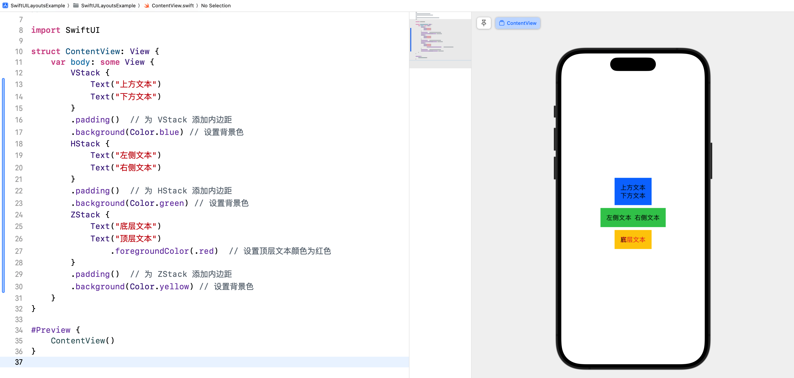
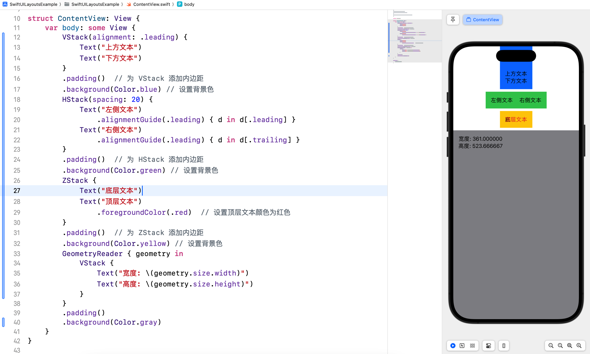
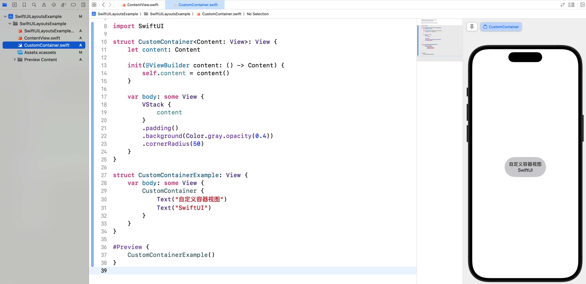
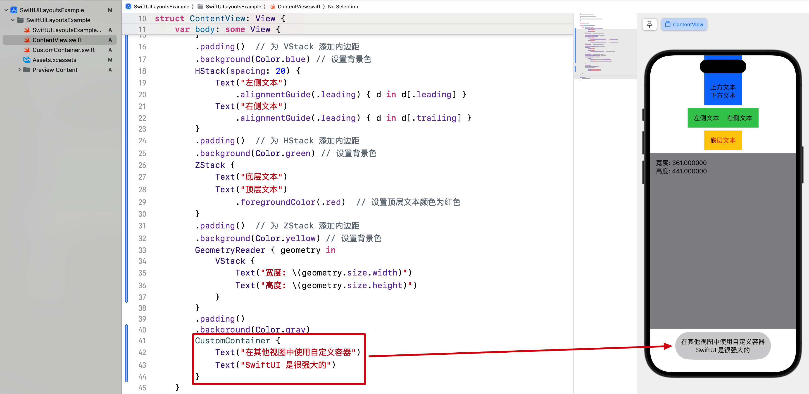
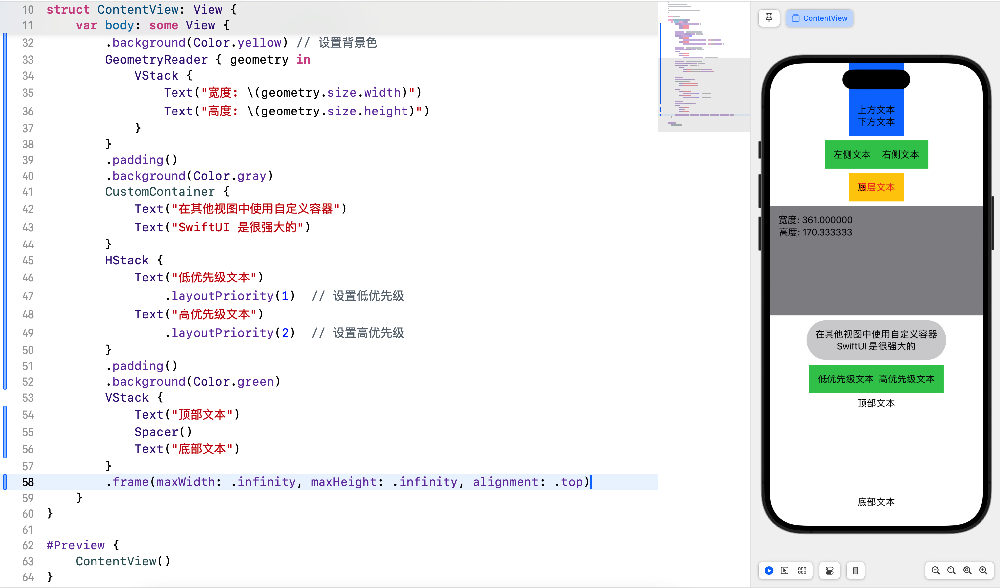
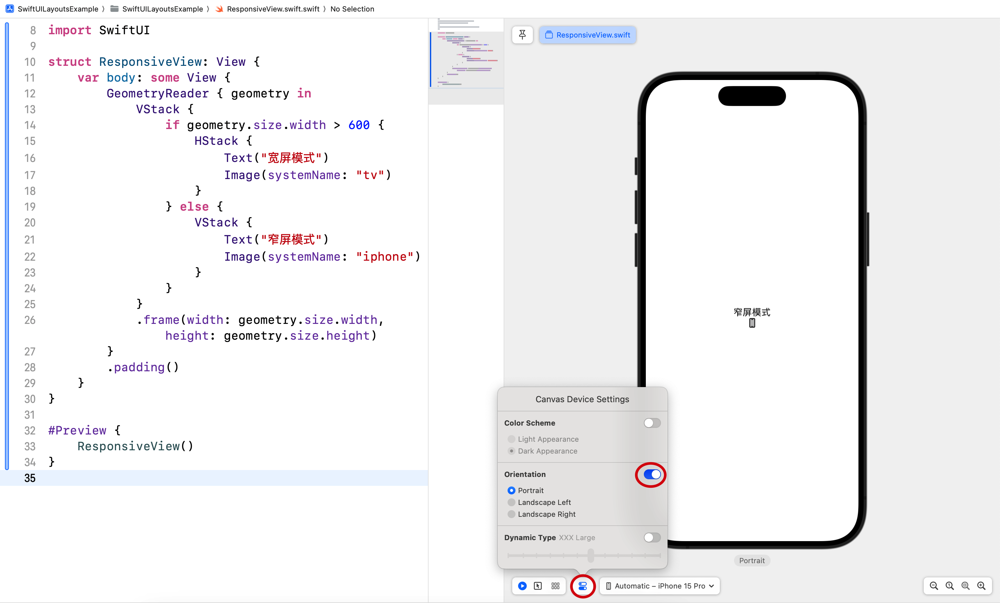
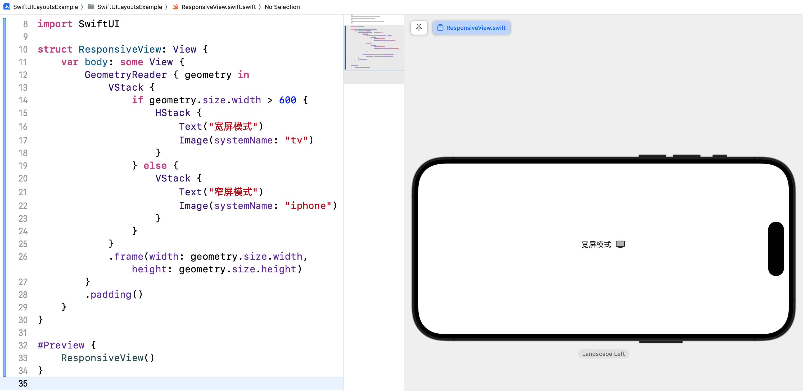

# SwiftUI 学习日志（2）：SwiftUI 视图布局

在本篇文章中，咱们将探讨 SwiftUI 的**视图布局**。SwiftUI 提供了多种布局工具和修饰符，帮助我们构建灵活且自适应的用户界面。

## 1. SwiftUI 布局简介

SwiftUI 使用声明式语法，通过组合不同的布局容器（如 VStack、HStack 和 ZStack）和修饰符，构建出复杂的用户界面。我们可以轻松地定义视图的排列、对齐方式和间距。

## 2. VStack、HStack 和 ZStack

### 2.1 VStack

**VStack** 用于垂直堆叠视图。

```swift
VStack {
    Text("上方文本")
    Text("下方文本")
}
.padding()  // 为 VStack 添加内边距
.background(Color.blue) // 设置背景色
```

### 2.2 HStack

**HStack** 用于水平排列视图。

```swift
HStack {
    Text("左侧文本")
    Text("右侧文本")
}
.padding()  // 为 HStack 添加内边距
.background(Color.green) // 设置背景色
```

### 2.3 ZStack

**ZStack** 用于重叠视图。

```swift
ZStack {
    Text("底层文本")
    Text("顶层文本")
        .foregroundColor(.red)  // 设置顶层文本颜色为红色
}
.padding()  // 为 ZStack 添加内边距
.background(Color.yellow) // 设置背景色
```



## 3. 对齐和间距

### 3.1 对齐方式

可以使用 `alignment` 参数来设置 VStack 和 HStack 的对齐方式。

```swift
VStack(alignment: .leading) {
    Text("上方文本")
    Text("下方文本")
}
.padding()  // 为 VStack 添加内边距
.background(Color.blue) // 设置背景色
```

### 3.2 间距

可以使用 `spacing` 参数来设置 VStack 和 HStack 内部视图之间的间距。

```swift
HStack(spacing: 20) {
    Text("左侧文本")
    Text("右侧文本")
}
.padding()  // 为 HStack 添加内边距
.background(Color.green) // 设置背景色
```

### 3.3 GeometryReader

**GeometryReader** 用于创建自适应布局，获取父视图的尺寸并进行相应调整。

```swift
GeometryReader { geometry in
    VStack {
        Text("宽度: \(geometry.size.width)")
        Text("高度: \(geometry.size.height)")
    }
}
.padding()
.background(Color.gray)
```

### 3.4 alignmentGuide 修饰符

**alignmentGuide** 修饰符用于自定义视图的对齐方式，解决特定对齐需求。通过指定对齐的锚点，可以精确控制视图的对齐行为。

```swift
HStack(spacing: 20) {
    Text("左侧文本")
        .alignmentGuide(.leading) { d in d[.leading] }
    Text("右侧文本")
        .alignmentGuide(.leading) { d in d[.trailing] }
}
.padding()  // 为 HStack 添加内边距
.background(Color.green) // 设置背景色
```

在上面的代码中，我们通过 `alignmentGuide` 修饰符自定义了视图的对齐方式，将右侧文本的对齐锚点设置为其自身的尾部，以便更好地控制其位置。



## 4. 自定义容器视图

### 4.1 自定义容器视图简介

我们可以通过组合现有的布局容器和修饰符，创建自定义容器视图。

### 4.2 实例代码

新建 `CustomContainer.swift` 文件，并输入以下代码：

```swift
import SwiftUI

struct CustomContainer<Content: View>: View {
    let content: Content

    init(@ViewBuilder content: () -> Content) {
        self.content = content()
    }

    var body: some View {
        VStack {
            content
        }
        .padding()
        .background(Color.gray.opacity(0.4))
        .cornerRadius(0)
    }
}

struct CustomContainerExample: View {
    var body: some View {
        CustomContainer {
            Text("自定义容器视图")
            Text("SwiftUI")
        }
    }
}

#Preview {
    CustomContainerExample()
}
```



在其他视图中引入自定义容器视图时，可以像使用其他 SwiftUI 视图一样，直接在需要的位置使用自定义视图标签。例如：

```swift
CustomContainer {
    Text("在其他视图中使用自定义容器")
    Text("SwiftUI 是很强大的")
}
```



## 5. 布局优先级和对齐

### 5.1 布局优先级

使用 `layoutPriority` 修饰符来设置视图的布局优先级。当空间不足时，优先级高的视图将获得更多的空间。这个修饰符解决了当多个视图在同一容器中争夺空间时如何分配的问题。

```swift
HStack {
    Text("低优先级文本")
        .layoutPriority(1)  // 设置低优先级
    Text("高优先级文本")
        .layoutPriority(2)  // 设置高优先级
}
.padding()
.background(Color.green)
```

在上面的代码中，当空间不足时，高优先级的文本将获得更多的空间，而低优先级的文本将被压缩。

### 5.2 对齐方式

我们可以使用对齐修饰符来调整视图在父容器中的对齐方式。

```swift
VStack {
    Text("顶部文本")
    Spacer()
    Text("底部文本")
}
.frame(maxWidth: .infinity, maxHeight: .infinity, alignment: .top)
```



## 6. 综合案例：响应式布局

### 6.1 案例简介

咱们将创建一个响应式布局视图，展示如何使用 VStack、HStack 和 GeometryReader 等布局工具来构建自适应的用户界面。

### 6.2 实现步骤

1. 创建一个新的 SwiftUI 文件 `ResponsiveView.swift`。
2. 实现响应式布局视图。

### 6.3 代码示例

```swift
import SwiftUI

struct ResponsiveView: View {
    var body: some View {
        GeometryReader { geometry in
            VStack {
                if geometry.size.width > 600 {
                    HStack {
                        Text("宽屏模式")
                        Image(systemName: "tv")
                    }
                } else {
                    VStack {
                        Text("窄屏模式")
                        Image(systemName: "iphone")
                    }
                }
            }
            .frame(width: geometry.size.width, height: geometry.size.height)
        }
        .padding()
    }
}

struct ResponsiveView_Previews: PreviewProvider {
    static var previews: some View {
        ResponsiveView()
    }
}
```



> 提示：点击预览区域下方的 "Device Settings" 按钮，在弹出的窗口中可以预览模拟器的显示方向。



在这个综合案例中，我们创建了一个响应式布局的视图，展示了如何使用 VStack、HStack 和 GeometryReader 等布局工具来构建自适应的用户界面。通过这些布局工具和修饰符，我们可以轻松地创建复杂且灵活的布局。

## 7. 结语

在这篇文章中，我们深入探讨了 SwiftUI 的**视图布局系统**，并展示了如何使用 VStack、HStack、ZStack、GeometryReader 等工具来创建复杂的布局。希望通过这篇文章，你对 SwiftUI 的布局系统有了更深入的了解。下一篇文章将进一步探讨 SwiftUI 的状态和数据绑定，敬请期待。

> 本专栏文档及配套代码的 GitHub 地址：[壹刀流的技术人生](https://github.com/IdEvEbI/idevebi.github.io)。
