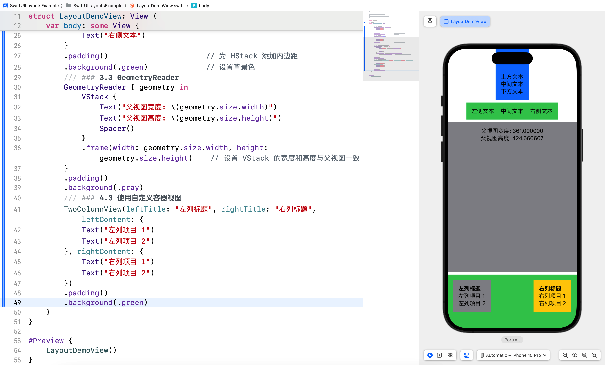

# SwiftUI 学习日志（2）：SwiftUI 视图布局

在《SwiftUI 学习日志》的第 2 篇文章中，我们将深入探讨 SwiftUI 中的视图布局。在实际开发中，布局是非常重要的一环。通过本文的学习，您将了解如何使用 SwiftUI 提供的布局组件来构建复杂而灵活的用户界面。

## 1. SwiftUI 视图布局简介

### 1.1 声明式布局

SwiftUI 使用**声明式语法**进行视图布局，通过**描述视图的层级关系**和**布局规则**，让系统自动管理视图的排列和更新。声明式布局使得代码更加简洁和可读，同时减少了手动管理视图状态和布局的复杂性。

### 1.2 布局组件

SwiftUI 提供了多种布局组件，包括 **VStack**、**HStack**、**ZStack**、**Spacer**、**Divider** 等。这些组件可以组合使用，以实现复杂的布局效果。

## 2. VStack、HStack 和 ZStack

### 2.1 VStack

**VStack** 用于垂直堆叠视图，使多个子视图在垂直方向上排列。

```swift
/// ### 2.1 VStack
VStack {
    Text("上方文本")
    Text("中间文本")
    Text("下方文本")
}
.padding()                      // 为 VStack 添加内边距
.background(.blue)              // 设置背景色
```

### 2.2 HStack

**HStack** 用于水平排列视图，使多个子视图在水平方向上排列。

```swift
/// ### 2.2 HStack
HStack {
    Text("左侧文本")
    Text("中间文本")
    Text("右侧文本")
}
.padding()                      // 为 HStack 添加内边距
.background(.green)             // 设置背景色
```

### 2.3 ZStack

**ZStack** 用于重叠视图，使多个子视图在同一平面上重叠排列。

```swift
/// ### 2.3 ZStack
ZStack {
    Image(systemName: "star")
        .resizable()
        .frame(width: 100, height: 100)
    Text("叠加文本")
        .foregroundColor(.red)
        .font(.largeTitle)
}
.padding()                      // 为 ZStack 添加内边距
.background(.yellow)            // 设置背景色
```


## 3. 对齐和间距

### 3.1 对齐方式

可以使用 `alignment` 参数来设置 VStack 和 HStack 的对齐方式。

```swift
/// ### 3.1 对齐方式
VStack(alignment: .leading) {
    Text("上方文本")
    Text("中间文本")
    Text("下方文本")
}
.padding()                      // 为 VStack 添加内边距
.background(.blue)              // 设置背景色
```

### 3.2 间距

可以使用 `spacing` 参数来设置 VStack 和 HStack 内部视图之间的间距。

```swift
/// ### 3.2 间距
HStack(spacing: 20) {
    Text("左侧文本")
    Text("中间文本")
    Text("右侧文本")
}
.padding()                      // 为 HStack 添加内边距
.background(.green)             // 设置背景色
```

### 3.3 GeometryReader

**GeometryReader** 是一个强大的布局工具，它可以获取父视图的尺寸和位置，从而实现自适应布局。

```swift
/// ### 3.3 GeometryReader
GeometryReader { geometry in
    VStack {
        Text("父视图宽度: \(geometry.size.width)")
        Text("父视图高度: \(geometry.size.height)")
        Spacer()
    }
    .frame(width: geometry.size.width, height: geometry.size.height)    // 设置 VStack 的宽度和高度与父视图一致
}
.padding()
.background(.gray)
```


## 4. 自定义容器视图

### 4.1 自定义容器视图简介

有时候，我们需要创建自定义的容器视图，以实现特殊的布局需求。自定义容器视图可以通过**组合现有的布局组件**来实现。

### 4.2 实现自定义容器视图

例如，我们可以创建一个自定义的两列布局视图，每一列都包含一个标题和多个项目。新建 `TwoColumnView.swift` 文件，并输入以下代码：

```swift
import SwiftUI

/// ## 4. 自定义容器视图 - 两列布局视图
struct TwoColumnView<Content: View>: View {
    let leftTitle: String               // 左侧标题
    let leftContent: Content            // 左侧内容
    let rightTitle: String              // 右侧标题
    let rightContent: Content           // 右侧内容

    init(leftTitle: String, rightTitle: String, @ViewBuilder leftContent: () -> Content, @ViewBuilder rightContent: () -> Content) {
        self.leftTitle = leftTitle
        self.rightTitle = rightTitle
        self.leftContent = leftContent()
        self.rightContent = rightContent()
    }

    var body: some View {
        HStack {
            VStack(alignment: .leading) {
                Text(leftTitle)
                    .font(.headline)
                leftContent
            }
            .padding()
            .background(.gray)
            Spacer()
            VStack(alignment: .leading) {
                Text(rightTitle)
                    .font(.headline)
                rightContent
            }
            .padding()
            .background(.yellow)
        }
    }
}

#Preview {
    TwoColumnView(leftTitle: "左列标题", rightTitle: "右列标题", leftContent: {
        Text("左列项目 1")
        Text("左列项目 2")
    }, rightContent: {
        Text("右列项目 1")
        Text("右列项目 2")
    })
}
```


### 4.3 使用自定义容器视图

在其他视图中引入自定义容器视图时，可以像使用其他 SwiftUI 视图一样，直接在需要的位置使用自定义视图标签。例如：

```swift
/// ### 4.3 使用自定义容器视图
TwoColumnView(leftTitle: "左列标题", rightTitle: "右列标题", leftContent: {
    Text("左列项目 1")
    Text("左列项目 2")
}, rightContent: {
    Text("右列项目 1")
    Text("右列项目 2")
})
.padding()
.background(.green)
```



## 5. 布局优先级

在 SwiftUI 中，**layoutPriority** 用于指定视图在其父容器中的布局优先级。当空间不足时，优先级高的视图将获得更多的空间。这个修饰符解决了当多个视图在同一容器中争夺空间时如何分配的问题。

以下示例演示了如何使用 **layoutPriority** 来控制视图的布局优先级。

```swift
/// ## 5. 布局优先级
HStack {
    Text("低优先级").background(.red)
    Text("低优先级").background(.green)
    Text("低优先级").background(.yellow)
    Text("低优先级").background(.orange)
    Text("高优先级")
        .layoutPriority(1)
        .background(Color.blue)
}
.frame(height: 50)
.padding()                      // 为 HStack 添加内边距
```

在上面的代码中，"高优先级" 视图设置了较高的布局优先级，因此它会比 "低优先级" 视图获得更多的空间。


## 6. 综合案例：响应式布局

### 6.1 案例简介

我们将创建一个响应式布局的用户界面，通过使用 **VStack**、**HStack**、**ZStack**、**Spacer**、**Divider** 和 **GeometryReader** 等布局组件，实现不同屏幕尺寸下的灵活布局。

### 6.2 实现步骤

1. 在左侧导航窗口中的 `SwiftUILayoutsExample` 上点击鼠标右键，然后在弹出菜单中选择 "New File..."。
2. 选择 "Swift File"，并输入 `ResponsiveLayoutView.swift`，然后点击 "Create" 按钮。
3. 在 `ResponsiveLayoutView.swift` 文件中输入以下代码：

```swift
/// 响应式视图案例
struct ResponsiveLayoutView: View {
    var body: some View {
        GeometryReader { geometry in
            VStack {
                Text("响应式布局示例")
                    .font(.largeTitle)
                    .padding()
                HStack {
                    Text("左侧视图")
                        .frame(width: geometry.size.width * 0.3)
                        .background(.red)
                        .padding()
                    Spacer()
                    Text("右侧视图")
                        .frame(width: geometry.size.width * 0.3)
                        .background(.blue)
                        .padding()
                }
                Spacer()
                HStack {
                    Spacer()
                    Text("底部视图")
                        .padding()
                        .background(.green)
                    Spacer()
                }
                .padding(.bottom, 20)
            }
            .frame(width: geometry.size.width, height: geometry.size.height)
            .background(Color(.systemGray6))
        }
    }
}

#Preview {
    ResponsiveLayoutView()
}
```


**提示**：点击预览区域下方的 `Device Settings` 按钮，在弹出的窗口中可以预览模拟器的显示方向。


在这个综合案例中，我们创建了一个响应式布局的视图，展示了如何使用 `VStack`、`HStack` 和 `GeometryReader` 等布局工具实现了一个响应式布局的用户界面，能够根据父视图的尺寸灵活调整布局。通过这些布局工具和修饰符，我们可以轻松地创建复杂且灵活的布局。

## 7. 结语

在本篇文章中，我们深入探讨了 SwiftUI 的视图布局，包括 **VStack**、**HStack**、**ZStack**、**自定义容器视图** 和 **GeometryReader** 等布局组件。通过综合案例，我们将这些布局组件结合起来，实现了一个响应式布局的用户界面。希望通过这篇文章，你对 SwiftUI 的布局系统有了更深入的了解。下一篇文章将进一步探讨 **数据绑定与状态管理**，敬请期待。

> 本专栏文档及配套代码的 GitHub 地址：[壹刀流的技术人生](https://github.com/IdEvEbI/idevebi.github.io)。
> 本文档配套项目名称：`SwiftUILayoutsExample`。
