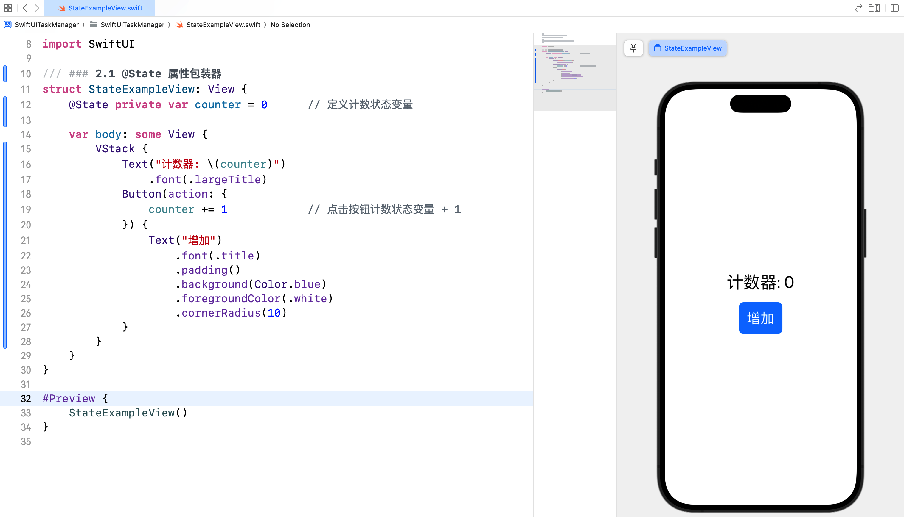
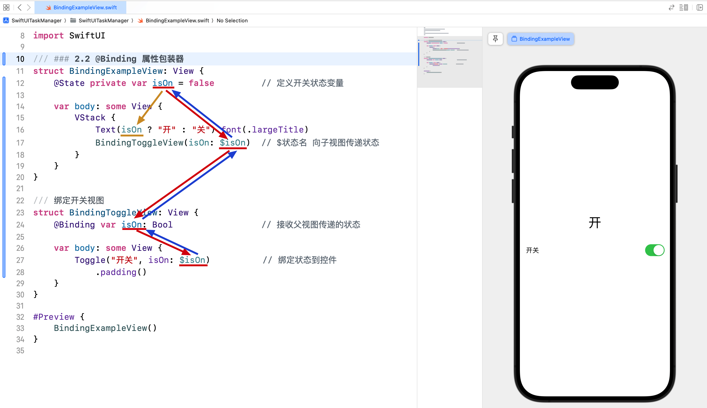
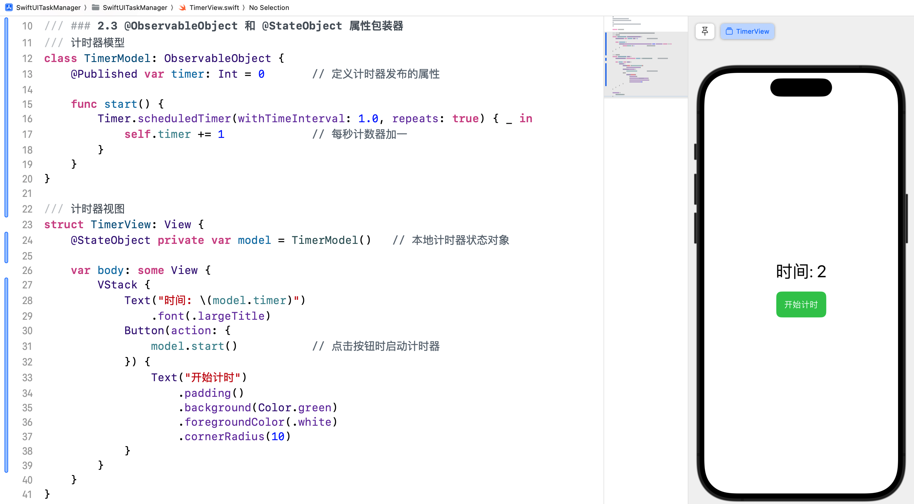
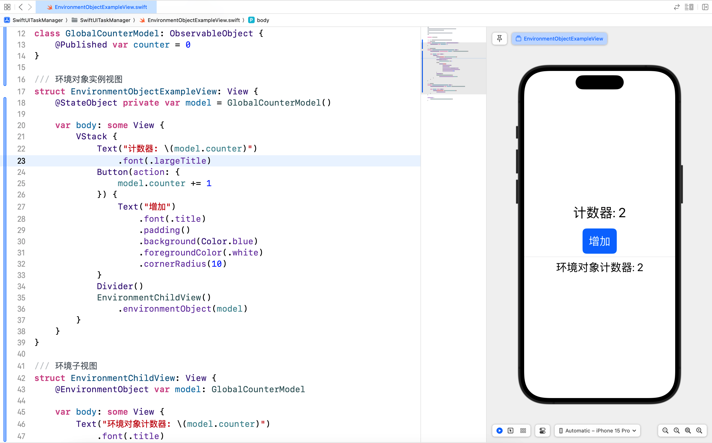
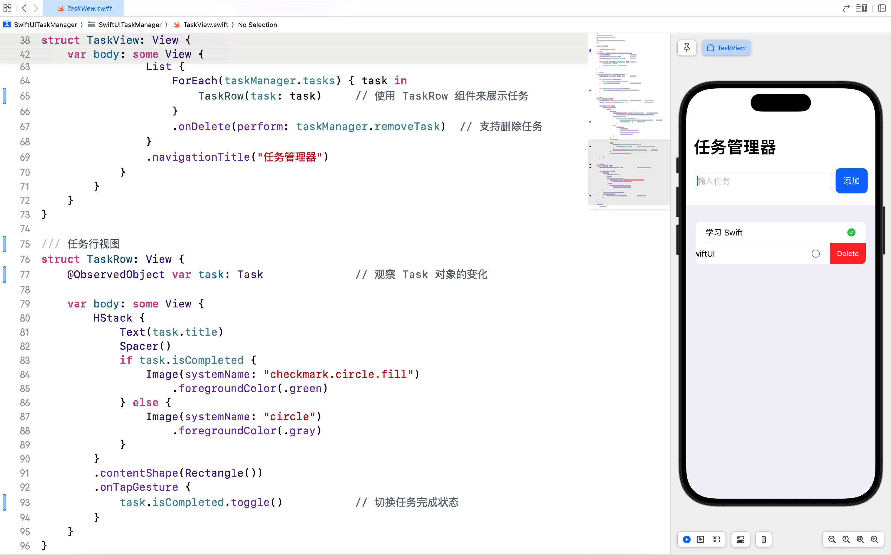

# SwiftUI 学习日志（3）：数据绑定与状态管理

欢迎来到《SwiftUI 学习日志》的第 3 篇文章。在本篇文章中，我们将深入探讨 SwiftUI 中的**数据绑定**与**状态管理**。数据绑定和状态管理是 SwiftUI 的核心概念，通过理解和掌握这些概念，您将能够构建出更加灵活和动态的用户界面。

## 1. SwiftUI 数据绑定简介

### 1.1 什么是数据绑定

**数据绑定**是指在**视图**和**数据模型**之间建立一种**双向链接**，使得**视图能够实时反映数据模型的变化**，并且用户在视图上的操作也能直接更新数据模型。在 SwiftUI 中，数据绑定使得界面和数据保持同步，极大简化了开发过程。

### 1.2 数据绑定的优势

- **实时更新**：视图和数据保持同步，数据变化时，视图会自动更新。
- **简化代码**：减少手动更新视图和数据的代码，提升开发效率。
- **提高可维护性**：通过数据绑定，视图逻辑和数据逻辑分离，代码更加清晰和可维护。

## 2. 数据绑定与状态管理

### 2.1 @State 属性包装器

**@State** 属性包装器用于**在视图内部声明状态变量**，当状态变量的值发生变化时，视图会自动刷新。

```swift
/// ### 2.1 @State 属性包装器
struct StateExampleView: View {
    @State private var counter = 0      // 定义计数状态变量
    
    var body: some View {
        VStack {
            Text("计数器: \(counter)")
                .font(.largeTitle)
            Button(action: {
                counter += 1            // 点击按钮计数状态变量 + 1
            }) {
                Text("增加")
                    .font(.title)
                    .padding()
                    .background(Color.blue)
                    .foregroundColor(.white)
                    .cornerRadius(10)
            }
        }
    }
}

#Preview {
    StateExampleView()
}
```



#### @State 的使用场景

- 需要在视图内部管理状态时使用。
- 状态仅在当前视图中使用，不需要在多个视图之间共享。

### 2.2 @Binding 属性包装器

**@Binding** 属性包装器用于**在多个视图之间共享状态**，父视图将状态变量传递给子视图，子视图通过 `@Binding` 修改父视图的状态。

```swift
/// ### 2.2 @Binding 属性包装器
struct BindingExampleView: View {
    @State private var isOn = false         // 定义开关状态变量
    
    var body: some View {
        VStack {
            Text(isOn ? "开" : "关").font(.largeTitle)
            BindingToggleView(isOn: $isOn)  // $状态名 向子视图传递状态
        }
    }
}

/// 绑定开关视图
struct BindingToggleView: View {
    @Binding var isOn: Bool                 // 接收父视图传递的状态
    
    var body: some View {
        Toggle("开关", isOn: $isOn)          // 绑定状态到控件
            .padding()
    }
}

#Preview {
    BindingExampleView()
}
```



#### @Binding 的使用场景

- 在父视图和子视图之间共享状态时使用。
- 需要在多个视图之间同步状态时使用。

### 2.3 @ObservableObject 和 @StateObject 属性包装器

- **@ObservableObject** 属性包装器用于**在多个视图之间共享数据模型**，数据模型通过 **@Published** 属性包装器声明的变量来触发视图更新。
  - **@Published** 属性包装器用于声明可观察对象的属性，**当属性值变化时，会通知所有观察该对象的视图进行更新**。
- **@StateObject** 用于创建本地状态对象。

```swift
/// ### 2.3 @ObservableObject 和 @StateObject 属性包装器
/// 计时器模型
class TimerModel: ObservableObject {
    @Published var timer: Int = 0       // 定义计时器发布的属性
    
    func start() {
        Timer.scheduledTimer(withTimeInterval: 1.0, repeats: true) { _ in
            self.timer += 1             // 每秒计数器加一
        }
    }
}

/// 计时器视图
struct TimerView: View {
    @StateObject private var model = TimerModel()   // 本地计时器状态对象
    
    var body: some View {
        VStack {
            Text("时间: \(model.timer)")
                .font(.largeTitle)
            Button(action: {
                model.start()           // 点击按钮时启动计时器
            }) {
                Text("开始计时")
                    .padding()
                    .background(Color.green)
                    .foregroundColor(.white)
                    .cornerRadius(10)
            }
        }
    }
}

#Preview {
    TimerView()
}
```



#### @ObservableObject 和 @StateObject 的使用场景

- 需要在多个视图之间共享数据模型时使用。
- 数据模型包含多个属性，且需要对属性变化进行监听和响应时使用。

### 2.4. @EnvironmentObject 属性包装器

**@EnvironmentObject** 属性包装器用于在应用程序的**多个视图之间共享全局数据模型**，**数据模型通过环境对象注入到视图中**。

```swift
/// ### 2.4. @EnvironmentObject 属性包装器
/// 全局计数器模型
class GlobalCounterModel: ObservableObject {
    @Published var counter = 0
}

/// 环境对象实例视图
struct EnvironmentObjectExampleView: View {
    @StateObject private var model = GlobalCounterModel()
    
    var body: some View {
        VStack {
            Text("计数器: \(model.counter)")
                .font(.largeTitle)
            Button(action: {
                model.counter += 1
            }) {
                Text("增加")
                    .font(.title)
                    .padding()
                    .background(Color.blue)
                    .foregroundColor(.white)
                    .cornerRadius(10)
            }
            Divider()
            EnvironmentChildView()
                .environmentObject(model)
        }
    }
}

/// 环境子视图
struct EnvironmentChildView: View {
    @EnvironmentObject var model: GlobalCounterModel
    
    var body: some View {
        Text("环境对象计数器: \(model.counter)")
            .font(.title)
    }
}

#Preview {
    EnvironmentObjectExampleView()
}
```



#### 2.4.1 @EnvironmentObject 的使用场景

- 需要在整个应用程序中共享全局数据时使用。
- 视图层级较深，需要在多个层级之间传递数据时使用。

#### 2.4.2 @StateObject 和 @EnvironmentObject 对比

##### @StateObject

- **作用**：用于在视图内部声明和管理可观察对象。
- **使用场景**：当对象的生命周期与视图的生命周期一致时使用。

##### @EnvironmentObject

- **作用**：用于在应用程序的多个视图之间共享全局数据模型。
- **使用场景**：需要在整个应用程序中共享全局数据时使用。

## 3. 综合案例：任务管理器

### 3.1 案例简介

在这个综合案例中，我们将创建一个简单的任务管理器，展示如何使用数据绑定和状态管理来添加、删除和标记任务完成状态。

### 3.2 实现步骤

- **定义任务模型**：定义一个 `Task` 类，包含任务的基本信息。
- **定义任务管理器模型**：定义一个 `TaskManager` 类，存储任务数组，并实现添加和删除任务操作。
- **创建任务视图**：创建一个视图，用于显示和管理任务。
- **定义任务行视图**：创建一个任务行视图，用于显示和操作每一项任务及状态。
- **实现添加和删除任务的功能**。

### 3.3 代码示例

新建 `TaskView.swift` 并输入以下代码：

```swift
import SwiftUI

/// ## 3. 综合案例：任务管理器
/// 任务模型
class Task: Identifiable, ObservableObject {
    let id = UUID()                     // 唯一标识符
    @Published var title: String        // 任务标题
    @Published var isCompleted: Bool    // 是否完成
    
    init(title: String, isCompleted: Bool = false) {
        self.title = title
        self.isCompleted = isCompleted
    }
}

/// 任务管理器
class TaskManager: ObservableObject {
    @Published var tasks: [Task] = []   // 任务数组
    
    func addTask(title: String) {
        let newTask = Task(title: title)
        tasks.append(newTask)           // 添加新任务到任务数组
    }
    
    func removeTask(at offsets: IndexSet) {
        tasks.remove(atOffsets: offsets)// 从任务数组中移除任务
    }
}

/// 任务视图
struct TaskView: View {
    @StateObject private var taskManager = TaskManager()  // 任务管理器状态
    @State private var newTaskTitle = ""                  // 新任务标题状态
    
    var body: some View {
        NavigationView {
            VStack {
                HStack {
                    TextField("输入任务", text: $newTaskTitle)  // 绑定状态到文本输入框
                        .textFieldStyle(RoundedBorderTextFieldStyle())
                    Button(action: {
                        if !newTaskTitle.isEmpty {
                            taskManager.addTask(title: newTaskTitle)  // 添加新任务
                            newTaskTitle = ""   // 清空文本输入框
                        }
                    }) {
                        Text("添加")
                            .padding()
                            .background(Color.blue)
                            .foregroundColor(.white)
                            .cornerRadius(10)
                    }
                }
                .padding()
                
                List {
                    ForEach(taskManager.tasks) { task in
                        TaskRow(task: task)     // 使用 TaskRow 组件来展示任务
                    }
                    .onDelete(perform: taskManager.removeTask)  // 支持删除任务
                }
                .navigationTitle("任务管理器")
            }
        }
    }
}

/// 任务行视图
struct TaskRow: View {
    @ObservedObject var task: Task              // 观察 Task 对象的变化
    
    var body: some View {
        HStack {
            Text(task.title)
            Spacer()
            if task.isCompleted {
                Image(systemName: "checkmark.circle.fill")
                    .foregroundColor(.green)
            } else {
                Image(systemName: "circle")
                    .foregroundColor(.gray)
            }
        }
        .contentShape(Rectangle())
        .onTapGesture {
            task.isCompleted.toggle()           // 切换任务完成状态
        }
    }
}

#Preview {
    TaskView()
}
```



在这个综合案例中，我们创建了一个简单的任务管理器，展示了如何使用 **@State**、**@Binding**、**@ObservedObject** 和 **@StateObject** 来管理和传递状态。通过这些技术，我们可以轻松地实现任务的添加、删除和状态更新。

## 4. 结语

在这篇文章中，我们深入探讨了 SwiftUI 的**数据绑定**和**状态管理**，包括 **@State**、**@Binding**、**@ObservedObject**、**@Published** 和 **@EnvironmentObject** 等属性包装器。通过综合案例，我们展示了如何在多个视图之间共享数据和状态。希望你对 SwiftUI 的数据绑定和状态管理有了更深入的理解。下一篇文章将进一步探讨 **SwiftUI 的动画和手势**，敬请期待。

> 本专栏文档及配套代码的 GitHub 地址：[壹刀流的技术人生](https://github.com/IdEvEbI/idevebi.github.io)。
