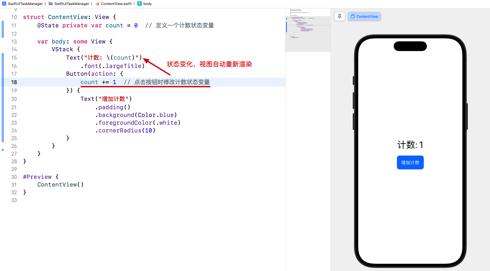
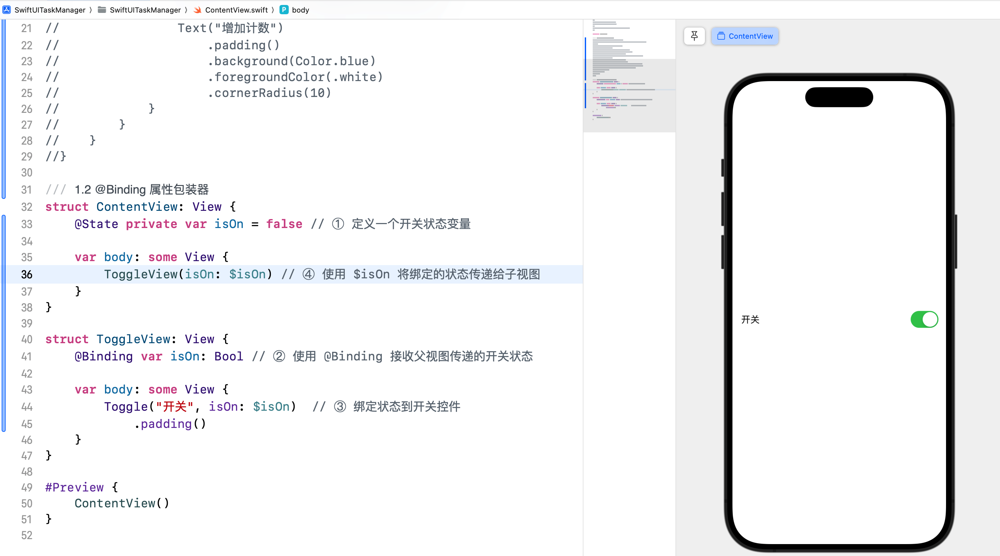
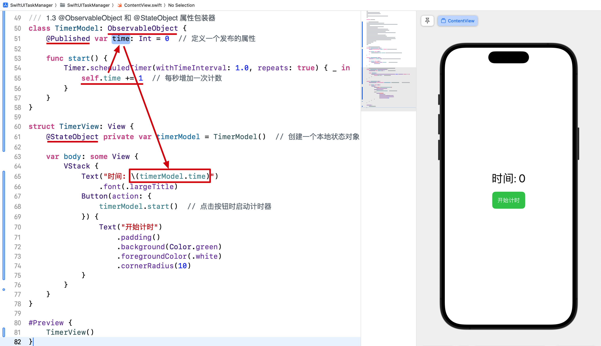
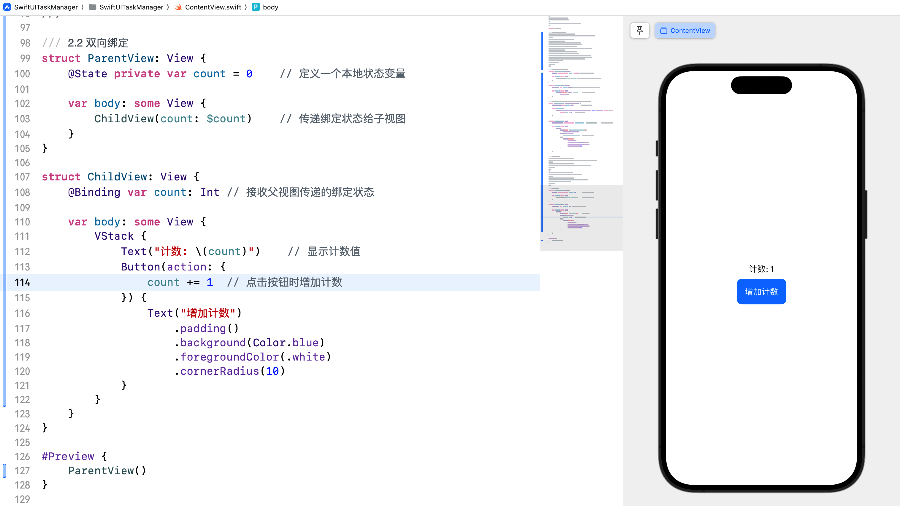
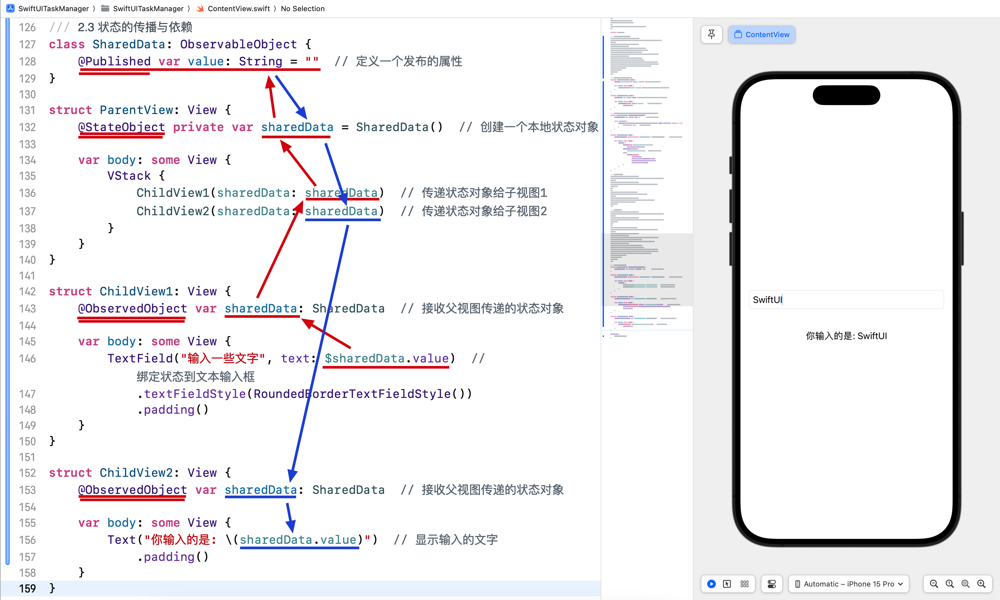
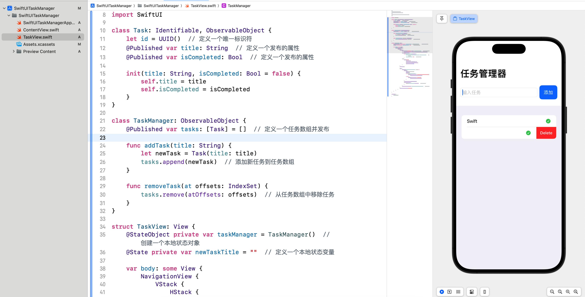

# SwiftUI 学习日志（3）：数据绑定与状态管理

在本篇文章中，咱们将探讨 SwiftUI 中的**数据绑定**和**状态管理**。数据绑定和状态管理是 SwiftUI 的核心概念，通过这些特性，我们可以简化数据的传递和处理，使应用程序更具响应性。

## 1. 状态和绑定的基础

### 1.1 @State 属性包装器

**@State** 属性包装器用于声明视图的本地**状态**。**当状态发生变化时，视图会自动重新渲染**。

```swift
@State private var count = 0  // 定义一个计数状态变量

var body: some View {
    VStack {
        Text("计数: \(count)")
            .font(.largeTitle)
        Button(action: {
            count += 1  // 点击按钮时修改计数状态变量
        }) {
            Text("增加计数")
                .padding()
                .background(Color.blue)
                .foregroundColor(.white)
                .cornerRadius(10)
        }
    }
}
```



### 1.2 @Binding 属性包装器

**@Binding** 属性包装器用于**在多个视图之间共享状态**，使得**子视图可以读写父视图的状态**。

```swift
struct ContentView: View {
    @State private var isOn = false // ① 定义一个开关状态变量
    
    var body: some View {
        ToggleView(isOn: $isOn) // ④ 使用 $isOn 将绑定的状态传递给子视图
    }
}

struct ToggleView: View {
    @Binding var isOn: Bool // ② 使用 @Binding 接收父视图传递的开关状态
    
    var body: some View {
        Toggle("开关", isOn: $isOn)  // ③ 绑定状态到开关控件
            .padding()
    }
}
```

> 提示：子视图使用 `@Binding` 属性包装器，可以**接收并绑定**父视图传递的状态，在子视图中对绑定状态做出修改后，父视图的状态值会同时发生变化。



### 1.3 @ObservableObject 和 @StateObject 属性包装器

**@ObservableObject** 和 **@StateObject** 用于管理复杂的状态对象。**@ObservableObject** 用于定义可被观察的状态对象，而 **@StateObject** 用于创建本地状态对象。

```swift
class TimerModel: ObservableObject {
    @Published var time: Int = 0  // 定义一个发布的属性
    
    func start() {
        Timer.scheduledTimer(withTimeInterval: 1.0, repeats: true) { _ in
            self.time += 1  // 每秒增加一次计数
        }
    }
}

struct TimerView: View {
    @StateObject private var timerModel = TimerModel()  // 创建一个本地状态对象
    
    var body: some View {
        VStack {
            Text("时间: \(timerModel.time)")
                .font(.largeTitle)
            Button(action: {
                timerModel.start()  // 点击按钮时启动计时器
            }) {
                Text("开始计时")
                    .padding()
                    .background(Color.green)
                    .foregroundColor(.white)
                    .cornerRadius(10)
            }
        }
    }
}
```



## 2. 数据流动

### 2.1 单向数据流

在 SwiftUI 中，数据通常以**单向数据流**的方式从父视图传递到子视图。父视图负责管理状态，并将状态通过**属性传递**给子视图。

```swift
struct ParentView: View {
    @State private var count = 0    // 定义一个本地状态变量
    
    var body: some View {
        ChildView(count: count) // 传递状态给子视图
    }
}

struct ChildView: View {
    let count: Int  // 接收父视图传递的状态
    
    var body: some View {
        Text("计数: \(count)")    // 显示计数值
            .padding()
    }
}
```

### 2.2 双向绑定

使用 **@Binding** 可以实现**双向绑定**，允许子视图修改父视图的状态。

```swift
struct ParentView: View {
    @State private var count = 0  // 定义一个本地状态变量
    
    var body: some View {
        ChildView(count: $count)  // 传递绑定状态给子视图
    }
}

struct ChildView: View {
    @Binding var count: Int  // 接收父视图传递的绑定状态
    
    var body: some View {
        VStack {
            Text("计数: \(count)")  // 显示计数值
            Button(action: {
                count += 1  // 点击按钮时增加计数
            }) {
                Text("增加计数")
                    .padding()
                    .background(Color.blue)
                    .foregroundColor(.white)
                    .cornerRadius(10)
            }
        }
    }
}
```



### 2.3 状态的传播与依赖

通过使用 **@ObservedObject** 和 **@StateObject**，我们可以将状态对象在视图层次结构中传播，使得多个视图能够依赖同一个状态对象。

```swift
class SharedData: ObservableObject {
    @Published var value: String = ""  // 定义一个发布的属性
}

struct ParentView: View {
    @StateObject private var sharedData = SharedData()  // 创建一个本地状态对象
    
    var body: some View {
        VStack {
            ChildView1(sharedData: sharedData)  // 传递状态对象给子视图1
            ChildView2(sharedData: sharedData)  // 传递状态对象给子视图2
        }
    }
}

struct ChildView1: View {
    @ObservedObject var sharedData: SharedData  // 接收父视图传递的状态对象
    
    var body: some View {
        TextField("输入一些文字", text: $sharedData.value)  // 绑定状态到文本输入框
            .textFieldStyle(RoundedBorderTextFieldStyle())
            .padding()
    }
}

struct ChildView2: View {
    @ObservedObject var sharedData: SharedData  // 接收父视图传递的状态对象
    
    var body: some View {
        Text("你输入的是: \(sharedData.value)")  // 显示输入的文字
            .padding()
    }
}
```



## 3. 综合案例：任务管理器

### 3.1 案例简介

咱们将创建一个简单的任务管理器，展示如何使用数据绑定和状态管理来添加、删除和标记任务完成状态。

### 3.2 实现步骤

1. **定义任务模型**：定义一个 `Task` 类，包含任务的基本信息。
2. **创建任务视图**：创建一个视图，用于显示和管理任务。
3. **实现添加和删除任务的功能**。

### 3.3 代码示例

新建 `TaskView.swift`  并输入以下代码：

```swift
import SwiftUI

class Task: Identifiable, ObservableObject {
    let id = UUID()  // 定义一个唯一标识符
    @Published var title: String  // 定义一个发布的属性
    @Published var isCompleted: Bool  // 定义一个发布的属性
    
    init(title: String, isCompleted: Bool = false) {
        self.title = title
        self.isCompleted = isCompleted
    }
}

class TaskManager: ObservableObject {
    @Published var tasks: [Task] = []  // 定义一个任务数组并发布
    
    func addTask(title: String) {
        let newTask = Task(title: title)
        tasks.append(newTask)  // 添加新任务到任务数组
    }
    
    func removeTask(at offsets: IndexSet) {
        tasks.remove(atOffsets: offsets)  // 从任务数组中移除任务
    }
}

struct TaskView: View {
    @StateObject private var taskManager = TaskManager()  // 创建一个本地状态对象
    @State private var newTaskTitle = ""  // 定义一个本地状态变量
    
    var body: some View {
        NavigationView {
            VStack {
                HStack {
                    TextField("输入任务", text: $newTaskTitle)  // 绑定状态到文本输入框
                        .textFieldStyle(RoundedBorderTextFieldStyle())
                    Button(action: {
                        if !newTaskTitle.isEmpty {
                            taskManager.addTask(title: newTaskTitle)  // 添加新任务
                            newTaskTitle = ""  // 清空文本输入框
                        }
                    }) {
                        Text("添加")
                            .padding()
                            .background(Color.blue)
                            .foregroundColor(.white)
                            .cornerRadius(10)
                    }
                }
                .padding()
                
                List {
                    ForEach(taskManager.tasks) { task in
                        HStack {
                            Text(task.title)
                            Spacer()
                            if task.isCompleted {
                                Image(systemName: "checkmark.circle.fill")
                                    .foregroundColor(.green)
                            } else {
                                Image(systemName: "circle")
                                    .foregroundColor(.gray)
                            }
                        }
                        .contentShape(Rectangle())
                        .onTapGesture {
                            task.isCompleted.toggle()  // 切换任务完成状态
                        }
                    }
                    .onDelete(perform: taskManager.removeTask)  // 支持删除任务
                }
                .navigationTitle("任务管理器")
            }
        }
    }
}

#Preview {
    TaskView()
}
```



在这个综合案例中，我们创建了一个简单的任务管理器，展示了如何使用 **@State**、**@Binding**、**@ObservedObject** 和 **@StateObject** 来管理和传递状态。通过这些技术，我们可以轻松地实现任务的添加、删除和状态更新。

## 4. 结语

在这篇文章中，我们深入探讨了 SwiftUI 的**数据绑定**和**状态管理**，并通过一个简单的任务管理器案例将所学知识应用到实践中。希望你对 SwiftUI 的数据绑定和状态管理有了更深入的理解。下一篇文章将进一步探讨 SwiftUI 的动画和过渡效果，敬请期待。

> 本专栏文档及配套代码的 GitHub 地址：[壹刀流的技术人生](https://github.com/IdEvEbI/idevebi.github.io)。
