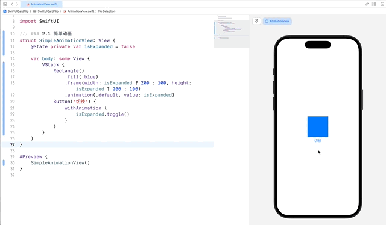
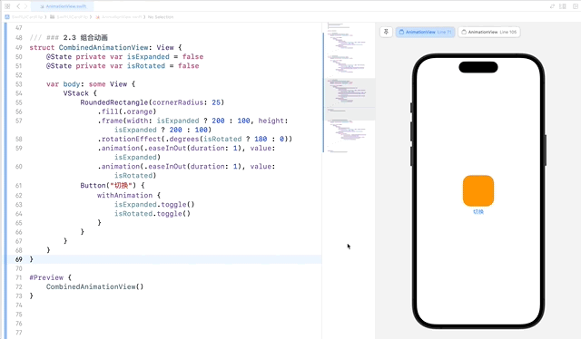
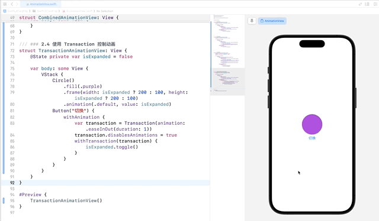
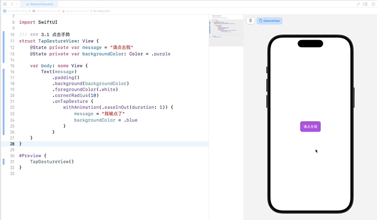
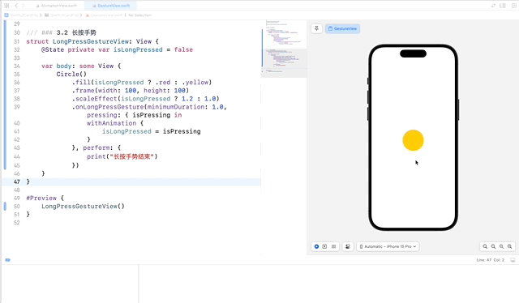
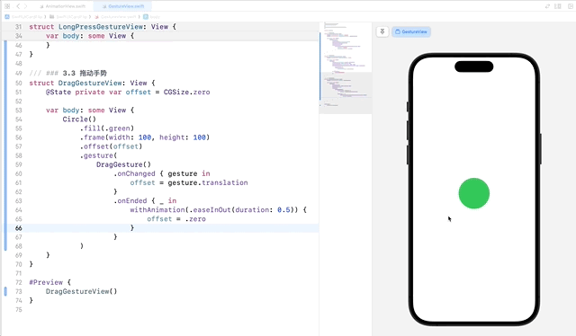
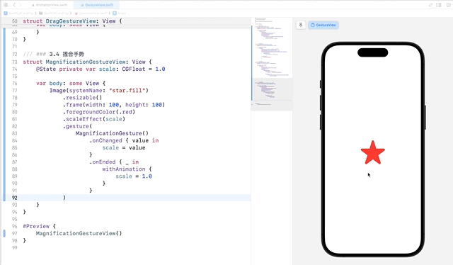
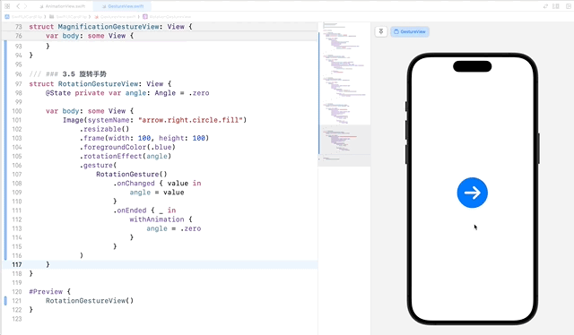
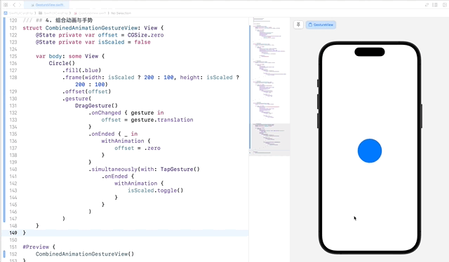
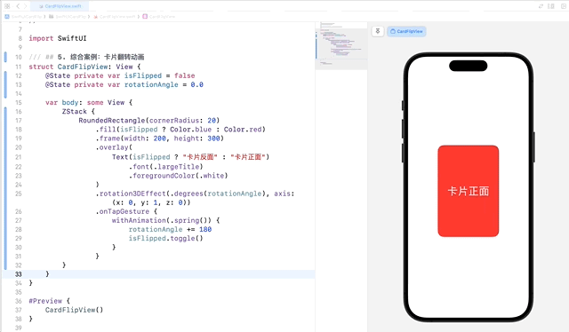

# SwiftUI 学习日志（4）：动画与手势

欢迎来到《SwiftUI 学习日志》的第 4 篇文章。在本篇文章中，我们将深入探讨 SwiftUI 中的**动画**与**手势**。动画和手势是构建现代用户界面的重要组成部分，通过这些特性，我们可以为应用添加丰富的交互体验。

## 1. SwiftUI 动画简介

### 1.1 什么是动画

**动画**是指在一段时间内，视图属性（如**位置**、**大小**、**颜色**等）**发生连续变化的过程**。动画能够提升用户体验，使应用更加生动和有趣。

### 1.2 动画的优势

- **吸引用户注意**：通过动画引导用户的注意力。
- **提升用户体验**：使界面更具互动性和流畅性。
- **提供视觉反馈**：通过动画反馈用户操作结果。

## 2. SwiftUI 中的基本动画

### 2.1 简单动画

在 SwiftUI 中，可以通过 `withAnimation` 函数轻松添加简单动画。`withAnimation` 函数可以包装**状态**改变，从而控制动画的时机和方式。

```swift
/// ### 2.1 简单动画
struct SimpleAnimationView: View {
    @State private var isExpanded = false
    
    var body: some View {
        VStack {
            Rectangle()
                .fill(.blue)
                .frame(width: isExpanded ? 200 : 100, height: isExpanded ? 200 : 100)
                .animation(.default, value: isExpanded)
            Button("切换") {
                withAnimation {
                    isExpanded.toggle()
                }
            }
        }
    }
}

#Preview {
    SimpleAnimationView()
}
```



### 2.2 自定义动画

可以使用 `.animation()` 修饰符来自定义动画效果，可以**指定动画方式**、**重复次数**及**引起动画的状态**，这种方式又被称为**隐式动画**。

```swift
/// ### 2.2 自定义动画
struct CustomAnimationView: View {
    @State private var isExpanded = false
    
    var body: some View {
        VStack {
            Circle()
                .fill(.green)
                .frame(width: isExpanded ? 150 : 75, height: isExpanded ? 150 : 75)
                .animation(Animation.easeInOut(duration: 1).repeatCount(3), value: isExpanded)
            Button("切换") {
                withAnimation {
                    isExpanded.toggle()
                }
            }
        }
    }
}

#Preview {
    CustomAnimationView()
}
```


### 2.3 组合动画

我们可以将多种动画效果组合在一起，实现更加复杂和有趣的动画。

```swift
/// ### 2.3 组合动画
struct CombinedAnimationView: View {
    @State private var isExpanded = false
    @State private var isRotated = false
    
    var body: some View {
        VStack {
            RoundedRectangle(cornerRadius: 25)
                .fill(.orange)
                .frame(width: isExpanded ? 200 : 100, height: isExpanded ? 200 : 100)
                .rotationEffect(.degrees(isRotated ? 180 : 0))
                .animation(.easeInOut(duration: 1), value: isExpanded)
                .animation(.easeInOut(duration: 1), value: isRotated)
            Button("切换") {
                withAnimation {
                    isExpanded.toggle()
                    isRotated.toggle()
                }
            }
        }
    }
}

#Preview {
    CombinedAnimationView()
}
```



### 2.4 使用 Transaction 控制动画

在某些情况下，我们希望在动画过程中进行一些自定义操作，比如在动画开始或结束时执行特定的代码。**Transaction** 可以帮助我们实现这一点。

```swift
/// ### 2.4 使用 Transaction 控制动画
struct TransactionAnimationView: View {
    @State private var isExpanded = false
    
    var body: some View {
        VStack {
            Circle()
                .fill(.purple)
                .frame(width: isExpanded ? 200 : 100, height: isExpanded ? 200 : 100)
                .animation(.default, value: isExpanded)
            Button("切换") {
                withAnimation {
                    var transaction = Transaction(animation: .easeInOut(duration: 1))
                    transaction.disablesAnimations = true
                    withTransaction(transaction) {
                        isExpanded.toggle()
                    }
                }
            }
        }
    }
}

#Preview {
    TransactionAnimationView()
}
```



## 3. SwiftUI 中的手势

### 3.1 点击手势

**点击手势 `TapGesture`** 用于识别用户的点击操作。

```swift
/// ### 3.1 点击手势
struct TapGestureView: View {
    @State private var message = "请点击我"
    @State private var backgroundColor: Color = .purple
    
    var body: some View {
        Text(message)
            .padding()
            .background(backgroundColor)
            .foregroundColor(.white)
            .cornerRadius(10)
            .onTapGesture {
                withAnimation(.easeInOut(duration: 1)) {
                    message = "我被点了"
                    backgroundColor = .blue
                }
            }
    }
}

#Preview {
    TapGestureView()
}
```



### 3.2 长按手势

**长按手势 `LongPressGesture`** 用于识别用户的长按操作。

```swift
/// ### 3.2 长按手势
struct LongPressGestureView: View {
    @State private var isLongPressed = false
    
    var body: some View {
        Circle()
            .fill(isLongPressed ? .red : .yellow)
            .frame(width: 100, height: 100)
            .scaleEffect(isLongPressed ? 1.2 : 1.0)
            .onLongPressGesture(minimumDuration: 1.0, pressing: { isPressing in
                withAnimation {
                    isLongPressed = isPressing
                }
            }, perform: {
                print("长按手势结束")
            })
    }
}

#Preview {
    LongPressGestureView()
}
```



### 3.3 拖动手势

**拖动手势 `DragGesture`** 用于识别用户的拖动操作。

```swift
/// ### 3.3 拖动手势
struct DragGestureView: View {
    @State private var offset: CGSize = .zero
    
    var body: some View {
        Circle()
            .fill(.green)
            .frame(width: 100, height: 100)
            .offset(offset)
            .gesture(
                DragGesture()
                    .onChanged { gesture in
                        offset = gesture.translation
                    }
                    .onEnded { _ in
                        withAnimation(.easeInOut(duration: 0.5)) {
                            offset = .zero
                        }
                    }
            )
    }
}

#Preview {
    DragGestureView()
}
```



### 3.4 捏合缩放手势

**捏合缩放手势 `MagnificationGesture`** 用于识别用户的捏合操作，常用于实现视图的缩放效果。

```swift
/// ### 3.4 捏合手势
struct MagnificationGestureView: View {
    @State private var scale: CGFloat = 1.0
    
    var body: some View {
        Image(systemName: "star.fill")
            .resizable()
            .frame(width: 100, height: 100)
            .foregroundColor(.red)
            .scaleEffect(scale)
            .gesture(
                MagnificationGesture()
                    .onChanged { value in
                        scale = value
                    }
                    .onEnded { _ in
                        withAnimation {
                            scale = 1.0
                        }
                    }
            )
    }
}

#Preview {
    MagnificationGestureView()
}
```



> **提示**：在**预览模式**或**模拟器**中，按住 **option** 键，**向上**或**向下**拖动拖动触控板可以模拟缩放手势。

### 3.5 旋转手势

**旋转手势 `RotationGesture`** 用于识别用户的旋转操作，常用于实现视图的旋转效果。

```swift
/// ### 3.5 旋转手势
struct RotationGestureView: View {
    @State private var angle: Angle = .zero
    
    var body: some View {
        Image(systemName: "arrow.right.circle.fill")
            .resizable()
            .frame(width: 100, height: 100)
            .foregroundColor(.blue)
            .rotationEffect(angle)
            .gesture(
                RotationGesture()
                    .onChanged { value in
                        angle = value
                    }
                    .onEnded { _ in
                        withAnimation {
                            angle = .zero
                        }
                    }
            )
    }
}

#Preview {
    RotationGestureView()
}
```



## 4. 组合动画与手势

通过组合动画和手势，可以创建更加复杂和有趣的用户交互效果。

```swift
/// ## 4. 组合动画与手势
struct CombinedAnimationGestureView: View {
    @State private var offset = CGSize.zero
    @State private var isScaled = false
    
    var body: some View {
        Circle()
            .fill(.blue)
            .frame(width: isScaled ? 200 : 100, height: isScaled ? 200 : 100)
            .offset(offset)
            .gesture(
                DragGesture()
                    .onChanged { gesture in
                        offset = gesture.translation
                    }
                    .onEnded { _ in
                        withAnimation {
                            offset = .zero
                        }
                    }
                    .simultaneously(with: TapGesture()
                        .onEnded {
                            withAnimation {
                                isScaled.toggle()
                            }
                        }
                    )
            )
    }
}

#Preview {
    CombinedAnimationGestureView()
}
```



## 5. 综合案例：卡片翻转动画

### 5.1 案例简介

在这个综合案例中，我们将创建一个卡片翻转动画，展示如何结合动画和手势来创建复杂的交互效果。

### 5.2 实现步骤

1. **定义卡片翻转视图**：创建一个视图，包含卡片的正面和反面。
2. **实现卡片翻转动画**：通过结合动画和手势，实现卡片翻转效果。

### 5.3 代码示例

新建 `CardFlipView.swift` 并输入以下代码：

```swift
/// ## 5. 综合案例：卡片翻转动画
struct CardFlipView: View {
    @State private var isFlipped = false
    @State private var rotationAngle = 0.0
    
    var body: some View {
        ZStack {
            RoundedRectangle(cornerRadius: 20)
                .fill(isFlipped ? Color.blue : Color.red)
                .frame(width: 200, height: 300)
                .overlay(
                    Text(isFlipped ? "卡片反面" : "卡片正面")
                        .font(.largeTitle)
                        .foregroundColor(.white)
                )
                .rotation3DEffect(.degrees(rotationAngle), axis: (x: 0, y: 1, z: 0))
                .onTapGesture {
                    withAnimation(.spring()) {
                        rotationAngle += 180
                        isFlipped.toggle()
                    }
                }
        }
    }
}

#Preview {
    CardFlipView()
}
```



## 6. 结语

在本篇文章中，我们深入探讨了 SwiftUI 中的**动画**与**手势**，包括 **TapGesture**、**LongPressGesture**、**DragGesture**、**MagnificationGesture** 和 **RotationGesture** 等。并通过卡片翻转案例，展示了如何结合动画和手势来创建复杂的交互效果。希望你对 SwiftUI 的动画和手势有了更深入的理解。下一篇文章将进一步探讨 **SwiftUI 的自定义视图和修饰符**，敬请期待。

> - 本专栏文档及配套代码的 GitHub 地址：[壹刀流的技术人生](https://github.com/IdEvEbI/idevebi.github.io)。
> - 本文档配套项目名称：`SwiftUICardFlip`。
