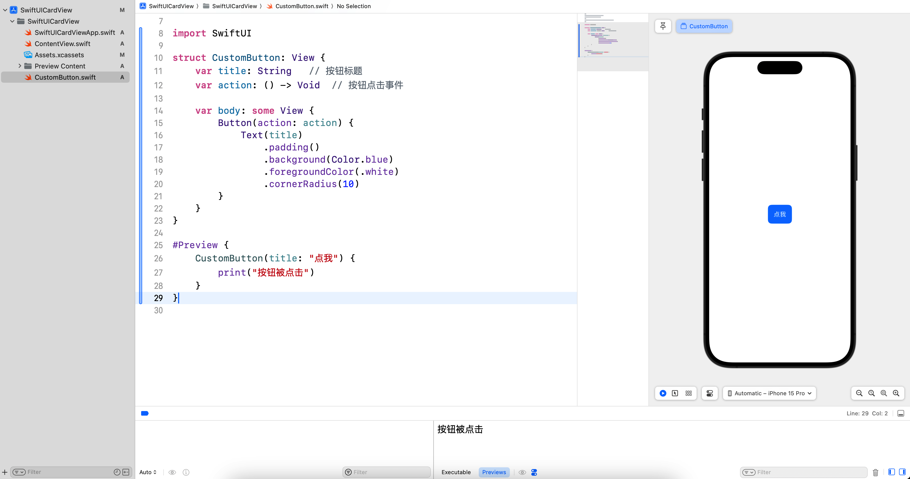
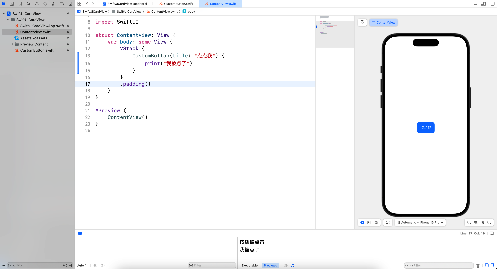
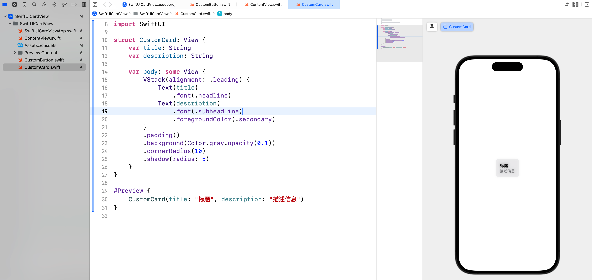
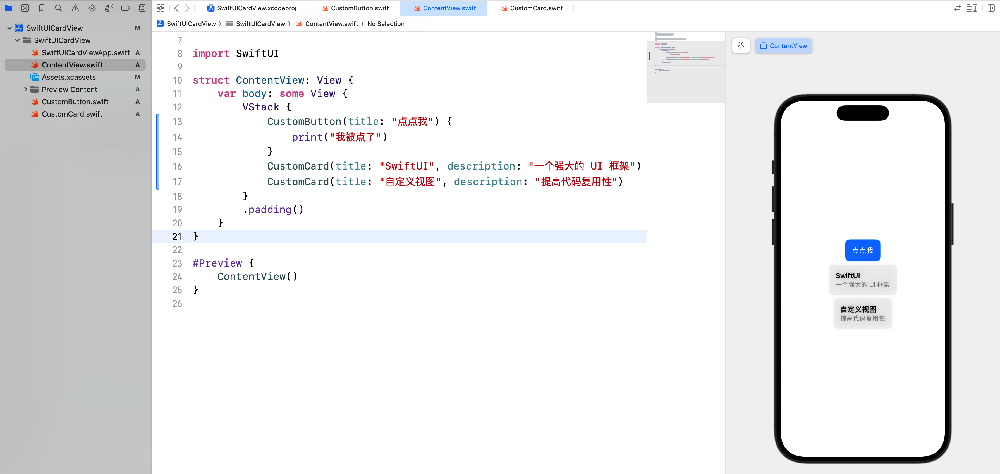
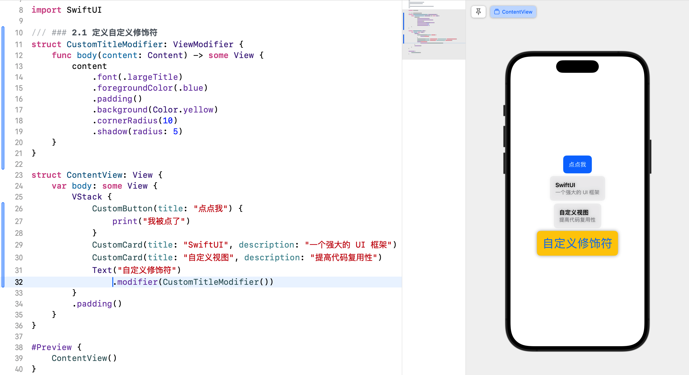
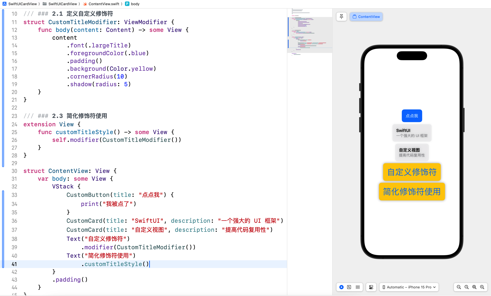
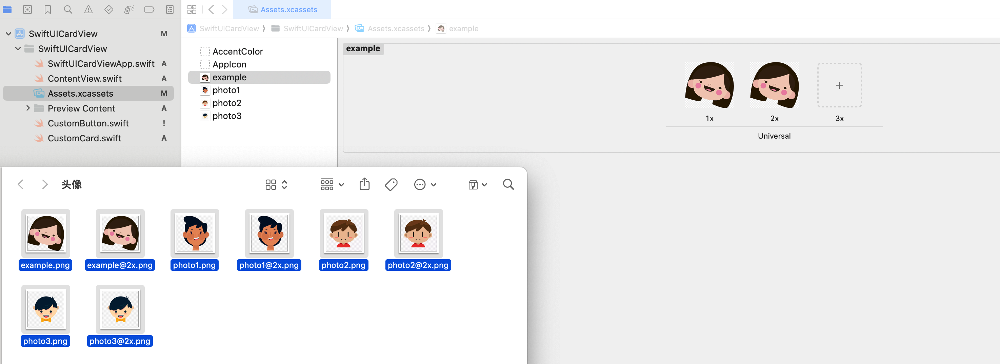
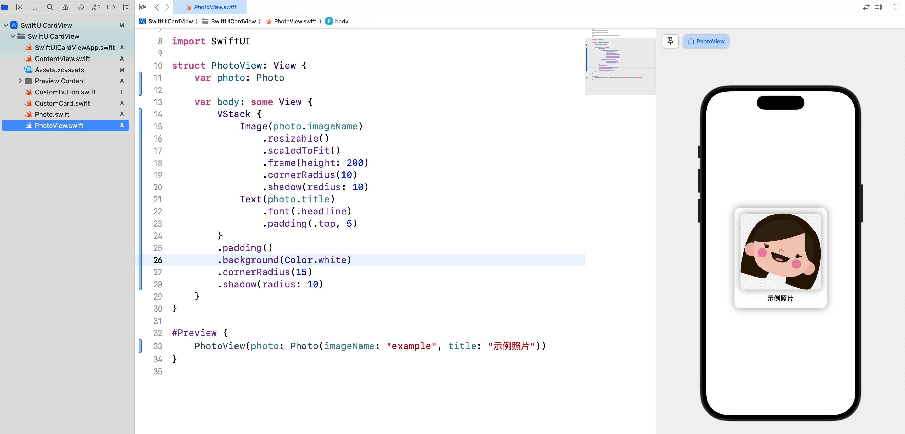
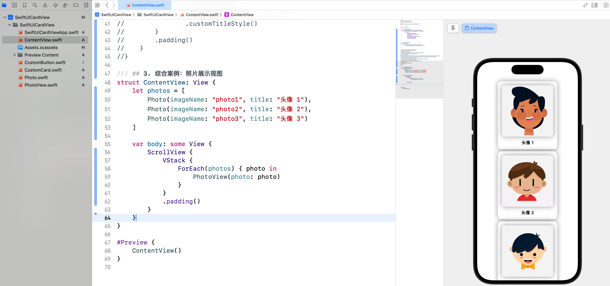

# SwiftUI 学习日志（5）：自定义视图和修饰符

在本篇文章中，咱们将探讨 SwiftUI 中的**自定义视图**和**修饰符**。通过自定义视图和修饰符，咱们可以创建可重用的组件，提高代码的可读性和可维护性。

## 1. 自定义视图

### 1.1 定义自定义视图

SwiftUI 允许我们通过组合现有视图来创建新的**自定义视图**。自定义视图是可重用的组件，可以在项目中多次使用。新建 `CustomButton.swift` 文件，然后输入以下代码：

```swift
import SwiftUI

struct CustomButton: View {
    var title: String   // 按钮标题
    var action: () -> Void  // 按钮点击事件
    
    var body: some View {
        Button(action: action) {
            Text(title)
                .padding()
                .background(Color.blue)
                .foregroundColor(.white)
                .cornerRadius(10)
        }
    }
}

#Preview {
    CustomButton(title: "点我") {
        print("按钮被点击")
    }
}
```



### 1.2 使用自定义视图

定义好自定义视图后，我们可以像使用系统视图一样，在其他地方使用它。

```swift
struct ContentView: View {
    var body: some View {
        VStack {
            CustomButton(title: "点点我") {
                print("我被点了")
            }
        }
        .padding()
    }
}
```



### 1.3 参数化自定义视图

自定义视图可以接受参数，从而在不同情况下呈现不同的内容。新建 `CustomCard.swift` 文件，然后输入以下代码：

```swift
import SwiftUI

struct CustomCard: View {
    var title: String
    var description: String

    var body: some View {
        VStack(alignment: .leading) {
            Text(title)
                .font(.headline)
            Text(description)
                .font(.subheadline)
                .foregroundColor(.secondary)
        }
        .padding()
        .background(Color.gray.opacity(0.1))
        .cornerRadius(10)
        .shadow(radius: 5)
    }
}

#Preview {
    CustomCard(title: "标题", description: "描述信息")
}
```



### 1.4 使用参数化自定义视图

```swift
CustomCard(title: "SwiftUI", description: "一个强大的 UI 框架")
CustomCard(title: "自定义视图", description: "提高代码复用性")
```



## 2. 自定义修饰符

### 2.1 定义自定义修饰符

SwiftUI 允许我们通过创建自定义修饰符来封装复杂的视图修饰逻辑。自定义修饰符需要遵循 `ViewModifier` 协议。

```swift
struct CustomTitleModifier: ViewModifier {
    func body(content: Content) -> some View {
        content
            .font(.largeTitle)
            .foregroundColor(.blue)
            .padding()
            .background(Color.yellow)
            .cornerRadius(10)
            .shadow(radius: 5)
    }
}
```

### 2.2 使用自定义修饰符

定义好自定义修饰符后，我们可以使用 `.modifier` 方法将其应用到视图上。

```swift
struct ContentView: View {
    var body: some View {
        Text("自定义修饰符")
            .modifier(CustomTitleModifier())
    }
}
```



### 2.3 简化修饰符使用

我们可以通过扩展 `View` 协议来简化自定义修饰符的使用。

```swift
extension View {
    func customTitleStyle() -> some View {
        self.modifier(CustomTitleModifier())
    }
}

struct ContentView: View {
    var body: some View {
        Text("简化修饰符使用")
            .customTitleStyle()
    }
}
```



## 3. 综合案例：照片展示视图

### 3.1 案例简介

咱们将创建一个照片展示视图，展示如何通过自定义视图和修饰符来显示照片和照片信息。这个案例将展示如何传递 `Image` 和其他数据到自定义视图中。

### 3.2 实现步骤

1. **准备图片素材**：准备案例所需的图片素材，并导入到 `Assets.xcassets`。
2. **定义照片数据模型**：定义一个 `Photo` 结构体，包含照片的基本信息。
3. **创建自定义照片视图**：创建一个自定义视图，用于显示照片和照片信息。
4. **实现主视图**：在主视图中使用自定义照片视图，展示多个照片。

### 3.3 案例实现

#### 3.3.1 导入图片素材

点击并打开导航区域左侧的 `Assets.xcassets`，将案例素材拖拽到项目中，如下图所示：



#### 3.3.2 定义照片数据模型

新建 `Photo.swift` 并输入以下代码：

```swift
import Foundation

struct Photo: Identifiable {
    var id = UUID()
    var imageName: String
    var title: String
}
```

#### 3.3.3 创建自定义照片视图

新建 `PhotoView.swift` 并输入以下代码：

```swift
import SwiftUI

struct PhotoView: View {
    var photo: Photo

    var body: some View {
        VStack {
            Image(photo.imageName)
                .resizable()
                .scaledToFit()
                .frame(height: 200)
                .cornerRadius(10)
                .shadow(radius: 10)
            Text(photo.title)
                .font(.headline)
                .padding(.top, 5)
        }
        .padding()
        .background(Color.white)
        .cornerRadius(15)
        .shadow(radius: 10)
    }
}

#Preview {
    PhotoView(photo: Photo(imageName: "example", title: "示例照片"))
}
```



#### 3.3.4 实现主视图

修改 `ContentView.swift` 并输入以下代码：

```swift
import SwiftUI

struct ContentView: View {
    let photos = [
        Photo(imageName: "photo1", title: "头像 1"),
        Photo(imageName: "photo2", title: "头像 2"),
        Photo(imageName: "photo3", title: "头像 3")
    ]

    var body: some View {
        ScrollView {
            VStack {
                ForEach(photos) { photo in
                    PhotoView(photo: photo)
                }
            }
            .padding()
        }
    }
}

#Preview {
    ContentView()
}
```



在这个综合案例中，我们创建了一个**照片展示视图**，展示了如何通过自定义视图和修饰符来显示照片和照片信息。通过传递 `Image` 和其他数据到自定义视图中，我们可以轻松创建灵活和可复用的组件。

## 4. 结语

在这篇文章中，我们深入探讨了 SwiftUI 的**自定义视图**和**修饰符**，并通过一个照片展示视图的综合案例将所学知识应用到实践中。希望你对 SwiftUI 的自定义视图和修饰符有了更深入的理解。下一篇文章将进一步探讨 SwiftUI 的列表与导航，敬请期待。

> 本专栏文档及配套代码的 GitHub 地址：[壹刀流的技术人生](https://github.com/IdEvEbI/idevebi.github.io)。
