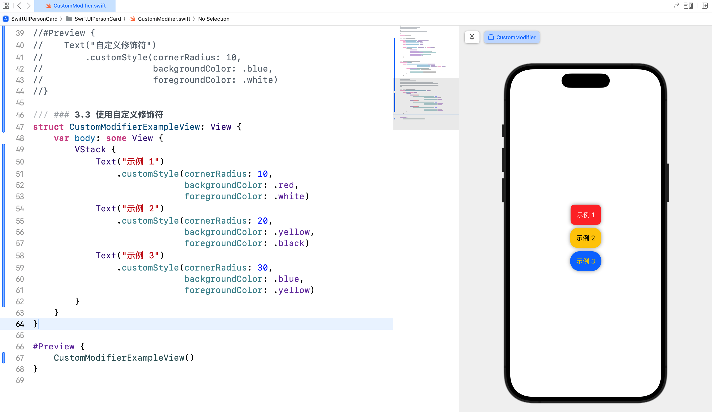

# SwiftUI 学习日志（5）：自定义视图和修饰符

欢迎来到《SwiftUI 学习日志》的第 5 篇文章。在本篇文章中，我们将探讨 SwiftUI 中的**自定义视图**和**修饰符**。通过学习如何创建和使用自定义视图和修饰符，您可以构建出更加模块化和可复用的代码，提高开发效率和代码质量。

## 1. SwiftUI 自定义视图简介

### 1.1 什么是自定义视图

**自定义视图**是指开发者根据需求**封装了特定的功能或布局**的视图，可以在项目中被多次使用，是可重用的组件。自定义视图可以提高代码的复用性和可维护性，减少重复代码。

### 1.2 自定义视图的优势

- **提高复用性**：将常用的视图逻辑封装成自定义视图，便于在多个地方使用。
- **提升可维护性**：通过模块化的视图组件，代码更加清晰和易于维护。
- **简化代码**：减少视图层的代码冗余，使代码结构更加简洁。

## 2. 创建自定义视图

### 2.1 简单的自定义视图

创建一个简单的自定义视图，只需要定义一个新的 Swift 结构体，并遵循 `View` 协议。

```swift
/// ### 2.1 简单的自定义视图
struct CustomButton: View {
    var title: String                   // 按钮标题
    var action: () -> Void              // 按钮点击事件
    
    var body: some View {
        Button(action: action) {
            Text(title)
                .font(.headline)
                .padding()
                .background(.blue)
                .foregroundColor(.white)
                .cornerRadius(10)
        }
    }
}

#Preview {
    CustomButton(title: "点击我", action: {
        print("按钮被点击了")
    })
}
```


### 2.2 带有状态的自定义视图

自定义视图可以包含内部状态，通过 `@State` 属性包装器管理状态变化。

```swift
/// ### 2.2 带有状态的自定义视图
struct CounterView: View {
    @State private var count = 0
    
    var body: some View {
        VStack {
            Text("计数器: \(count)")
                .font(.largeTitle)
            Button("增加") {
                count += 1
            }
            .font(.headline)
            .padding()
            .background(.blue)
            .foregroundColor(.white)
            .cornerRadius(10)
        }
    }
}

#Preview {
    CounterView()
}
```


### 2.3 带有绑定的自定义视图

自定义视图可以通过 `@Binding` 属性包装器接收来自父视图的绑定状态，实现双向数据绑定。

```swift
/// ### 2.3 带有绑定的自定义视图
/// 开关切换自定义视图
struct ToggleSwitch: View {
    @Binding var isOn: Bool
    
    var body: some View {
        Toggle(isOn: $isOn) {
            Text("开关状态: \(isOn ? "开" : "关")")
        }
        .padding()
    }
}

/// 开关切换视图容器
struct ToggleSwitchContainer: View {
    @State private var isOn = true
    
    var body: some View {
        ToggleSwitch(isOn: $isOn)
    }
}

#Preview {
    ToggleSwitchContainer()
}
```


## 3. 自定义修饰符

### 3.1 什么是修饰符

**修饰符**是用于修改视图外观和行为的函数，**可以链式调用多个修饰符来组合效果**。SwiftUI 提供了大量的内置修饰符，同时我们也可以创建自定义修饰符。

### 3.2 创建自定义修饰符

创建自定义修饰符需要定义一个遵循 `ViewModifier` 协议的结构体，并实现 `body` 方法。

```swift
/// ### 3.2 创建自定义修饰符
struct CustomModifier: ViewModifier {
    var cornerRadius: CGFloat
    var backgroundColor: Color
    var foregroundColor: Color
    
    func body(content: Content) -> some View {
        content
            .padding()
            .background(backgroundColor)
            .foregroundColor(foregroundColor)
            .cornerRadius(cornerRadius)
            .shadow(radius: 5)
    }
}

/// 扩展 View 协议简化自定义修饰符的使用
extension View {
    func customStyle(cornerRadius: CGFloat, 
                     backgroundColor: Color,
                     foregroundColor: Color) -> some View {
        self.modifier(CustomModifier(
            cornerRadius: cornerRadius,
            backgroundColor: backgroundColor,
            foregroundColor: foregroundColor)
        )
    }
}

#Preview {
    Text("自定义修饰符")
        .customStyle(cornerRadius: 10, 
                     backgroundColor: .blue,
                     foregroundColor: .white)
}
```


### 3.3 使用自定义修饰符

自定义修饰符可以提高代码的复用性和一致性，便于在多个视图中复用相同的样式。

```swift
/// ### 3.3 使用自定义修饰符
struct CustomModifierExampleView: View {
    var body: some View {
        VStack {
            Text("示例 1")
                .customStyle(cornerRadius: 10, 
                             backgroundColor: .red,
                             foregroundColor: .white)
            Text("示例 2")
                .customStyle(cornerRadius: 20, 
                             backgroundColor: .yellow,
                             foregroundColor: .black)
            Text("示例 3")
                .customStyle(cornerRadius: 30, 
                             backgroundColor: .blue,
                             foregroundColor: .yellow)
        }
    }
}

#Preview {
    CustomModifierExampleView()
}
```



## 4. 综合案例：个人信息卡片

### 4.1 案例简介

在这个综合案例中，我们将创建一个包含个人信息的卡片，展示如何使用自定义视图和修饰符来构建模块化的界面。

### 4.2 实现步骤

1. **定义个人信息模型**：创建一个 `Person` 结构体，包含个人信息字段。
2. **创建带有状态的个人信息视图**：创建一个带有内部状态的自定义视图，显示和编辑个人信息。
3. **创建带有绑定的个人信息视图**：创建一个带有绑定状态的自定义视图，实现信息同步。
4. **使用自定义修饰符**：为个人信息视图添加自定义样式。

### 4.3 代码示例

新建 `PersonCardView.swift` 并输入以下代码：

```swift
/// ## 4. 综合案例：个人信息卡片
/// 个人信息模型
struct Person {
    var name: String                    // 姓名
    var age: Int                        // 年龄
    var occupation: String              // 职业
}

/// 自定义修饰符
struct CardModifier: ViewModifier {
    func body(content: Content) -> some View {
        content
            .padding()
            .background(.white)
            .cornerRadius(15)
            .shadow(radius: 5)
            .padding()
    }
}

extension View {
    func cardStyle() -> some View {
        self.modifier(CardModifier())
    }
}

/// 带有状态的个人信息视图
struct StatefulPersonCardView: View {
    @State private var person: Person = Person(name: "壹刀流", 
                                               age: 30,
                                               occupation: "iOS 开发工程师")
    
    var body: some View {
        VStack(alignment: .leading) {
            Text("姓名: \(person.name)")
                .font(.headline)
            Text("年龄: \(person.age)")
                .font(.subheadline)
            Text("职业: \(person.occupation)")
                .font(.subheadline)
            Button("修改信息") {
                person.name = "新名字"
                person.age = 25
                person.occupation = "全栈开发工程师"
            }
            .padding()
            .background(Color.blue)
            .foregroundColor(.white)
            .cornerRadius(10)
        }
        .cardStyle()
    }
}

/// 带有绑定的个人信息视图
struct BindingPersonCardView: View {
    @Binding var person: Person
    
    var body: some View {
        VStack(alignment: .leading) {
            Text("姓名: \(person.name)")
                .font(.headline)
            Text("年龄: \(person.age)")
                .font(.subheadline)
            Text("职业: \(person.occupation)")
                .font(.subheadline)
        }
        .cardStyle()
    }
}

/// 综合示例视图
struct PersonCardExampleView: View {
    @State private var person = Person(name: "壹刀流", 
                                       age: 30,
                                       occupation: "iOS 开发工程师")
    
    var body: some View {
        VStack {
            StatefulPersonCardView()
            BindingPersonCardView(person: $person)
            Button("修改绑定信息") {
                person.name = "新名字（绑定）"
                person.age = 28
                person.occupation = "后端开发工程师"
            }
            .padding()
            .background(Color.green)
            .foregroundColor(.white)
            .cornerRadius(10)
        }
    }
}

#Preview {
    PersonCardExampleView()
}
```


## 5. 结语

在本篇文章中，我们深入探讨了 SwiftUI 中的**自定义视图**和**修饰符**，包括如何创建**简单的自定义视图**、**带有状态的自定义视图**和**带有绑定的自定义视图**。同时，我们还介绍了**自定义修饰符的创建和使用**。通过综合案例，我们展示了如何将这些技术结合起来，创建一个模块化的**个人信息卡片视图**。希望你对 SwiftUI 的自定义视图和修饰符有了更深入的理解。下一篇文章将进一步探讨**表单和用户输入**，敬请期待。

> - 本专栏文档及配套代码的 GitHub 地址：[壹刀流的技术人生](https://github.com/IdEvEbI/idevebi.github.io)。
> - 本文档配套项目名称：`SwiftUIPersonCard`。
