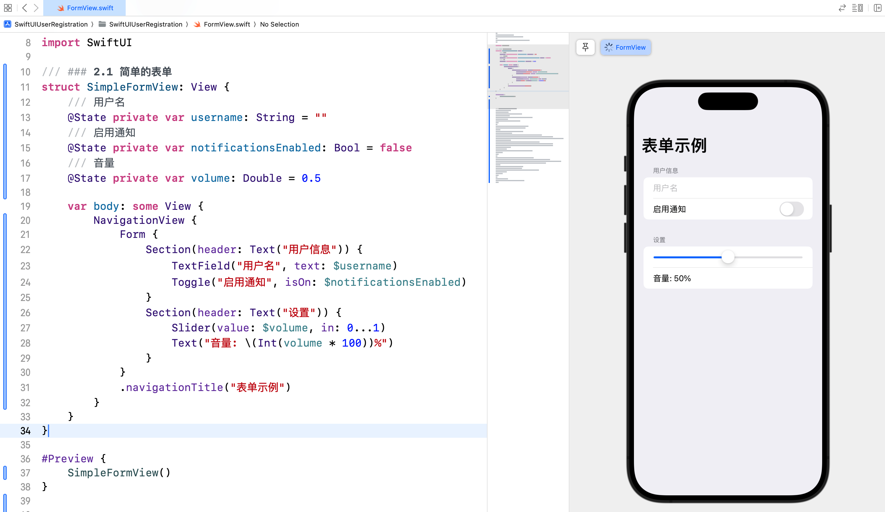
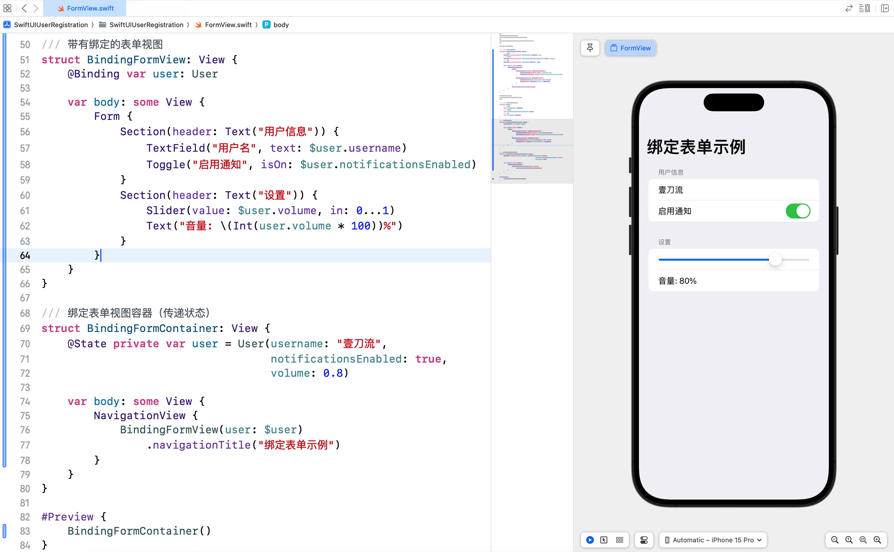
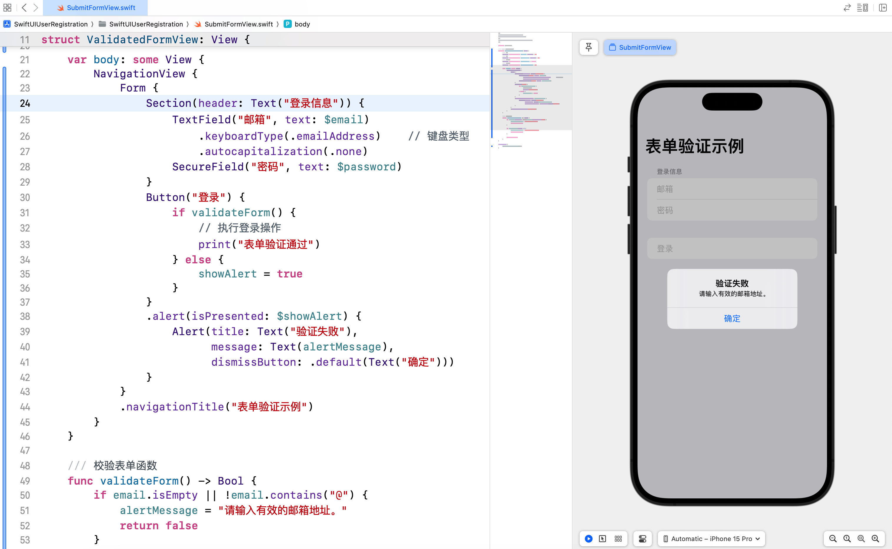
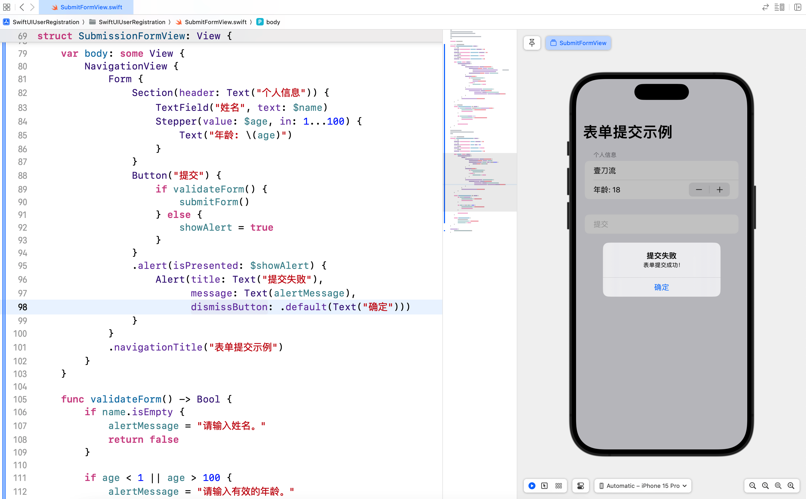
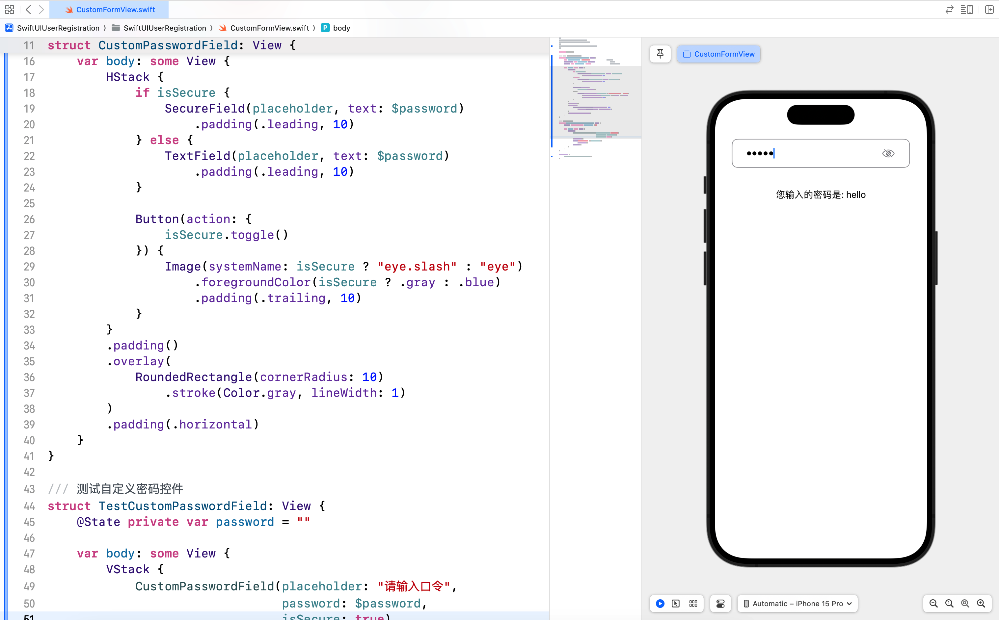
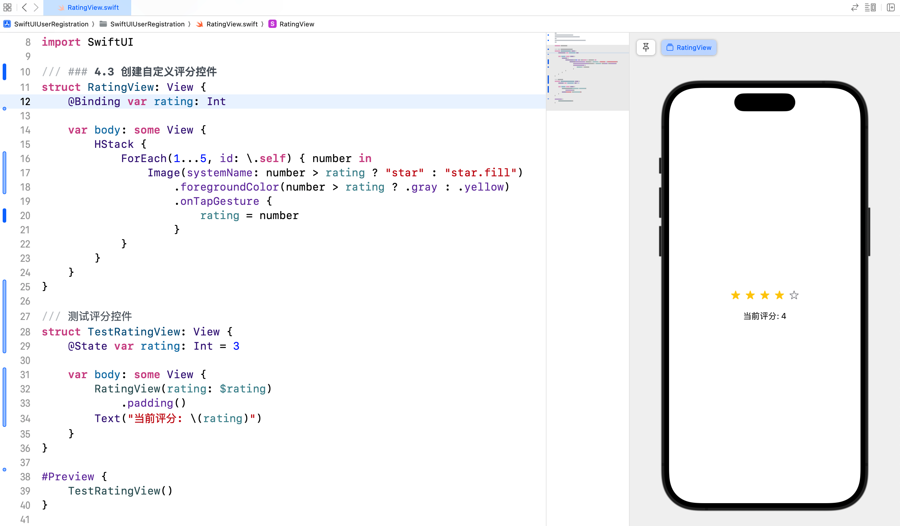
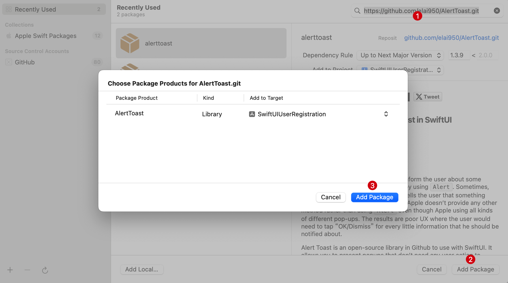
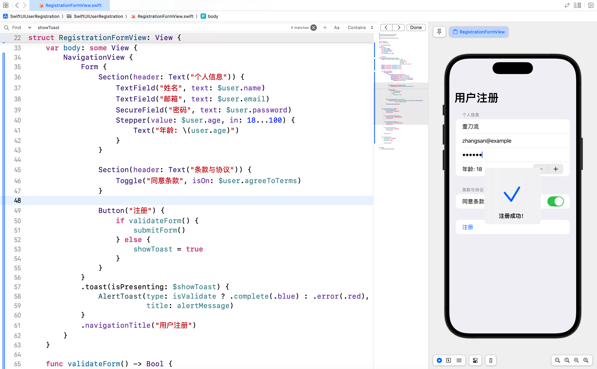

# SwiftUI 学习日志（6）：表单和用户输入

欢迎来到《SwiftUI 学习日志》的第 6 篇文章。在本篇文章中，我们将深入探讨 SwiftUI 中的**表单和用户输入**。表单是应用程序中常见的组件，用于收集用户输入。通过学习如何创建和管理表单，您将能够构建出功能丰富且用户友好的输入界面。

## 1. SwiftUI 表单简介

### 1.1 什么是表单

**表单**是一种用于收集用户输入的视图组件，通常包含**文本框**、**切换按钮**、**滑块**、**选择器**等。表单在应用中广泛用于**用户注册**、**登录**、**信息填写**等场景。

### 1.2 表单的优势

- **方便用户输入**：提供直观的输入界面，便于用户填写信息。
- **提高交互体验**：通过表单组件的组合和布局，提升用户的操作体验。
- **数据验证**：可以对用户输入的数据进行验证，确保数据的正确性和完整性。

## 2. 创建基本表单

### 2.1 简单的表单

我们可以使用 `Form` 组件创建一个简单的表单，包含文本框、切换按钮和滑块等基本输入控件。

```swift
/// ### 2.1 简单的表单
struct SimpleFormView: View {
    /// 用户名
    @State private var username: String = ""
    /// 启用通知
    @State private var notificationsEnabled: Bool = false
    /// 音量
    @State private var volume: Double = 0.5
    
    var body: some View {
        NavigationView {
            Form {
                Section(header: Text("用户信息")) {
                    TextField("用户名", text: $username)
                    Toggle("启用通知", isOn: $notificationsEnabled)
                }
                Section(header: Text("设置")) {
                    Slider(value: $volume, in: 0...1)
                    Text("音量: \(Int(volume * 100))%")
                }
            }
            .navigationTitle("表单示例")
        }
    }
}

#Preview {
    SimpleFormView()
}
```



### 2.2 带有绑定的表单

通过 `@Binding` 属性包装器，我们可以将表单中的输入控件与外部数据进行绑定，实现双向数据绑定。

```swift
/// ### 2.2 带有绑定的表单
struct User {
    /// 用户名
    var username: String
    /// 启用通知
    var notificationsEnabled: Bool
    /// 音量
    var volume: Double
}

/// 带有绑定的表单视图
struct BindingFormView: View {
    @Binding var user: User
    
    var body: some View {
        Form {
            Section(header: Text("用户信息")) {
                TextField("用户名", text: $user.username)
                Toggle("启用通知", isOn: $user.notificationsEnabled)
            }
            Section(header: Text("设置")) {
                Slider(value: $user.volume, in: 0...1)
                Text("音量: \(Int(user.volume * 100))%")
            }
        }
    }
}

/// 绑定表单视图容器（传递状态）
struct BindingFormContainer: View {
    @State private var user = User(username: "壹刀流",
                                   notificationsEnabled: true,
                                   volume: 0.8)
    
    var body: some View {
        NavigationView {
            BindingFormView(user: $user)
                .navigationTitle("绑定表单示例")
        }
    }
}

#Preview {
    BindingFormContainer()
}
```



## 3. 表单验证和提交

### 3.1 表单验证

在表单中进行数据验证，可以**确保用户输入的数据符合要求**。以下示例展示了如何对表单输入进行简单的验证。

```swift
/// ### 3.1 表单验证
struct ValidatedFormView: View {
    /// 邮箱
    @State private var email: String = ""
    /// 密码
    @State private var password: String = ""
    /// 显示警告
    @State private var showAlert = false
    /// 警告信息
    @State private var alertMessage = ""
    
    var body: some View {
        NavigationView {
            Form {
                Section(header: Text("登录信息")) {
                    TextField("邮箱", text: $email)
                        .keyboardType(.emailAddress)    // 键盘类型
                        .autocapitalization(.none)
                    SecureField("密码", text: $password)
                }
                Button("登录") {
                    if validateForm() {
                        // 执行登录操作
                        print("表单验证通过")
                    } else {
                        showAlert = true
                    }
                }
                .alert(isPresented: $showAlert) {
                    Alert(title: Text("验证失败"),
                          message: Text(alertMessage),
                          dismissButton: .default(Text("确定")))
                }
            }
            .navigationTitle("表单验证示例")
        }
    }
    
    /// 校验表单函数
    func validateForm() -> Bool {
        if email.isEmpty || !email.contains("@") {
            alertMessage = "请输入有效的邮箱地址。"
            return false
        }
        
        if password.count < 6 {
            alertMessage = "密码长度至少为 6 位。"
            return false
        }
        
        return true
    }
}

#Preview {
    ValidatedFormView()
}
```



### 3.2 表单提交

在表单提交时，可以**对用户输入的数据进行处理**，例如**发送到服务器进行验证或存储**。

```swift
/// ### 3.2 表单提交
struct SubmissionFormView: View {
    /// 姓名
    @State private var name: String = ""
    /// 年龄
    @State private var age: Int = 18
    /// 显示警告
    @State private var showAlert = false
    /// 警告信息
    @State private var alertMessage = ""
    
    var body: some View {
        NavigationView {
            Form {
                Section(header: Text("个人信息")) {
                    TextField("姓名", text: $name)
                    Stepper(value: $age, in: 1...100) {
                        Text("年龄: \(age)")
                    }
                }
                Button("提交") {
                    if validateForm() {
                        submitForm()
                    } else {
                        showAlert = true
                    }
                }
                .alert(isPresented: $showAlert) {
                    Alert(title: Text("提交失败"), 
                          message: Text(alertMessage),
                          dismissButton: .default(Text("确定")))
                }
            }
            .navigationTitle("表单提交示例")
        }
    }
    
    func validateForm() -> Bool {
        if name.isEmpty {
            alertMessage = "请输入姓名。"
            return false
        }
        
        if age < 1 || age > 100 {
            alertMessage = "请输入有效的年龄。"
            return false
        }
        
        return true
    }
    
    func submitForm() {
        // 模拟提交表单数据
        alertMessage = "表单提交成功！"
        showAlert = true
    }
}

#Preview {
    SubmissionFormView()
}
```



## 4. 自定义输入控件

### 4.1 什么是自定义输入控件

**自定义输入控件**是指开发者根据需求**封装了特定功能或样式的输入组件**。这些控件可以在项目中被多次使用，提高代码的复用性和可维护性。

### 4.2 创建自定义密码控件

创建自定义输入控件只需定义一个新的 Swift 结构体，并遵循 `View` 协议。以下是**自定义密码控件**示例，点击眼睛按钮，可以将密码文字在明文和密文之间切换，代码如下：

```swift
/// ### 4.2 创建自定义密码控件
struct CustomPasswordField: View {
    var placeholder = "请输入密码"            // 占位符
    @Binding var password: String           // 密码
    @State var isSecure = true              // 是否显示密文
    
    var body: some View {
        HStack {
            if isSecure {
                SecureField(placeholder, text: $password)
                    .padding(.leading, 10)
            } else {
                TextField(placeholder, text: $password)
                    .padding(.leading, 10)
            }
            
            Button(action: {
                isSecure.toggle()
            }) {
                Image(systemName: isSecure ? "eye.slash" : "eye")
                    .foregroundColor(isSecure ? .gray : .blue)
                    .padding(.trailing, 10)
            }
        }
        .padding()
        .overlay(
            RoundedRectangle(cornerRadius: 10)
               .stroke(Color.gray, lineWidth: 1)
        )
        .padding(.horizontal)
    }
}

/// 测试自定义密码控件
struct TestCustomPasswordField: View {
    @State private var password = ""
    
    var body: some View {
        VStack {
            CustomPasswordField(placeholder: "请输入口令",
                                password: $password,
                                isSecure: true)
            .padding()
            Text("您输入的密码是: \(password)")
                .padding()
            Spacer()
        }
    }
}

#Preview {
    TestCustomPasswordField()
}
```



### 4.3 创建自定义评分控件

以下是**自定义评分控件**，可以用于收集用户的评分数据，通过星形图标实现评分结果展示。

```swift
/// ### 4.3 创建自定义评分控件
struct RatingView: View {
    @Binding var rating: Int
    
    var body: some View {
        HStack {
            ForEach(1...5, id: \.self) { number in
                Image(systemName: number > rating ? "star" : "star.fill")
                    .foregroundColor(number > rating ? .gray : .yellow)
                    .onTapGesture {
                        rating = number
                    }
            }
        }
    }
}

/// 测试评分控件
struct TestRatingView: View {
    @State var rating: Int = 3
    
    var body: some View {
        RatingView(rating: $rating)
            .padding()
        Text("当前评分: \(rating)")
    }
}

#Preview {
    TestRatingView()
}
```



## 5. 综合案例：用户注册表单

### 5.1 案例简介

在这个综合案例中，我们将创建一个用户注册表单，展示如何结合**自定义输入控件**和**第三方框架**实现表单验证和提交功能。

### 5.2 实现步骤

1. **定义用户模型**：创建一个 `User` 结构体，包含用户注册信息字段。
2. **创建注册表单视图**：使用**文本框**、**密码框**、**切换按钮**、**滑块**等控件，收集用户输入。
3. **实现表单验证和提交功能**：对用户输入进行**验证**，并**模拟提交注册信息**。
4. **引入第三方框架 AlertToast**：用于显示表单验证结果和提交成功提示。

### 5.3 第三方框架

**第三方框架**是指由开发者社区或公司发布的**功能库**，用于简化开发过程，提高开发效率。使用第三方框架可以快速实现复杂功能，而不必从头开始编写代码。

#### 5.3.1 为什么使用第三方框架

- **节省时间**：避免重复造轮子，节省开发时间。
- **提高效率**：使用成熟的解决方案，提高开发效率。
- **增强功能**：扩展应用功能，实现更加复杂的需求。

#### 5.3.2 引入 AlertToast 框架

1. 在 Xcode 中打开项目。
2. 选择 **File > Add Package Dependencies...**。
3. 在弹出的窗口中输入 AlertToast 的 GitHub 地址：`https://github.com/elai950/AlertToast.git`。
4. 选择 **AlertToast** 包并添加到项目中。



### 5.4 代码示例

新建 `RegistrationFormView.swift` 并输入以下代码：

```swift
import SwiftUI
import AlertToast

/// ## 5. 综合案例：用户注册表单
/// 用户模型
struct User {
    var name: String
    var email: String
    var password: String
    var age: Int
    var agreeToTerms: Bool
}

/// 用户注册表单视图
struct RegistrationFormView: View {
    @State private var user = User(name: "",
                                   email: "",
                                   password: "",
                                   age: 18,
                                   agreeToTerms: false)
    @State private var showAlert = false
    @State private var alertMessage = ""
    @State private var showToast = false
    @State private var isValidate = false
    
    var body: some View {
        NavigationView {
            Form {
                Section(header: Text("个人信息")) {
                    TextField("姓名", text: $user.name)
                    TextField("邮箱", text: $user.email)
                    SecureField("密码", text: $user.password)
                    Stepper(value: $user.age, in: 18...100) {
                        Text("年龄: \(user.age)")
                    }
                }
                
                Section(header: Text("条款与协议")) {
                    Toggle("同意条款", isOn: $user.agreeToTerms)
                }
                
                Button("注册") {
                    if validateForm() {
                        submitForm()
                    } else {
                        showToast = true
                    }
                }
            }
            .toast(isPresenting: $showToast) {
                AlertToast(type: isValidate ? .complete(.blue) : .error(.red),
                           title: alertMessage)
            }
            .navigationTitle("用户注册")
        }
    }
    
    func validateForm() -> Bool {
        if user.name.isEmpty {
            alertMessage = "请输入姓名。"
            return false
        }
        
        if !user.email.contains("@") {
            alertMessage = "请输入有效的邮箱地址。"
            return false
        }
        
        if user.password.count < 6 {
            alertMessage = "密码长度至少为 6 位。"
            return false
        }
        
        if !user.agreeToTerms {
            alertMessage = "请同意条款。"
            return false
        }
        
        return true
    }
    
    func submitForm() {
        alertMessage = "注册成功！"
        isValidate = true
        showToast = true
        
        // 模拟提交注册数据……
    }
}

#Preview {
    RegistrationFormView()
}
```



## 6. 结语

在本篇文章中，我们深入探讨了 SwiftUI 中的**表单和用户输入**，包括如何创建**基本表单**、**带有绑定的表单**、**表单验证**和**提交功能**以及**自定义输入控件**。通过综合案例，我们展示了如何结合自定义输入控件和第三方框架实现一个完整的用户注册表单。希望你对 SwiftUI 的表单和用户输入有了更深入的理解。下一篇文章将进一步探讨 **SwiftUI 的网络请求和数据处理**，敬请期待。

> - 本专栏文档及配套代码的 GitHub 地址：[壹刀流的技术人生](https://github.com/IdEvEbI/idevebi.github.io)。
> - 本文档配套项目名称：`SwiftUIUserRegistration`。
