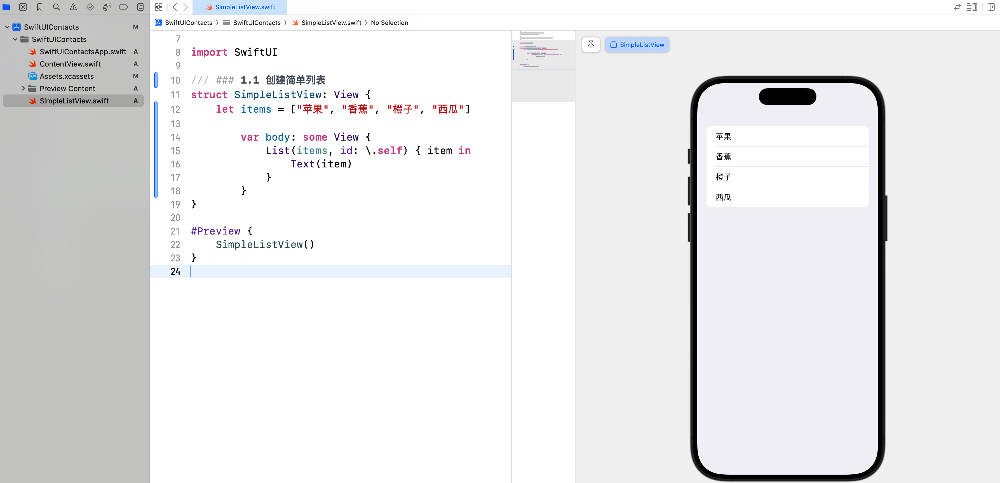
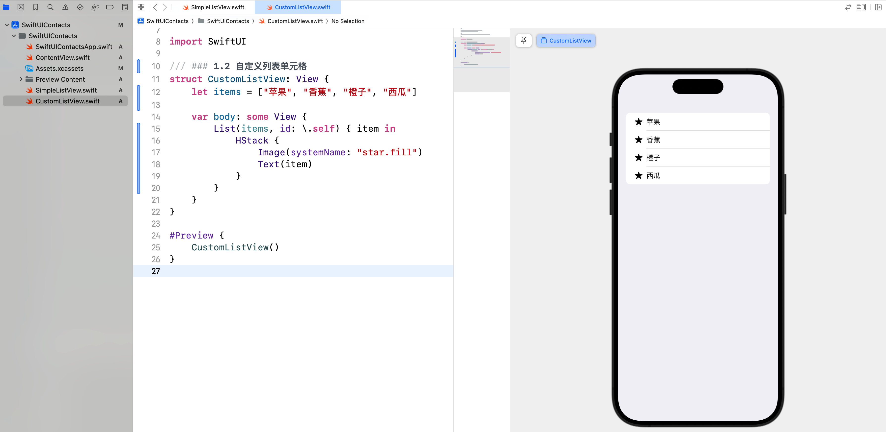
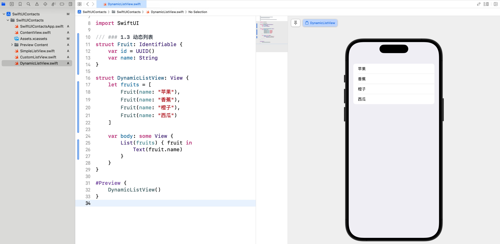
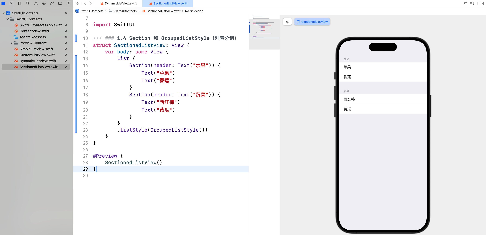
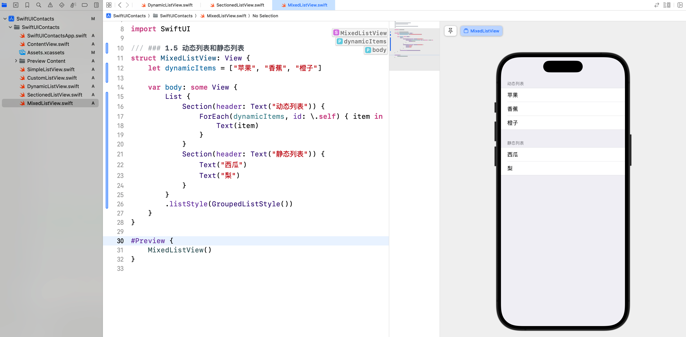
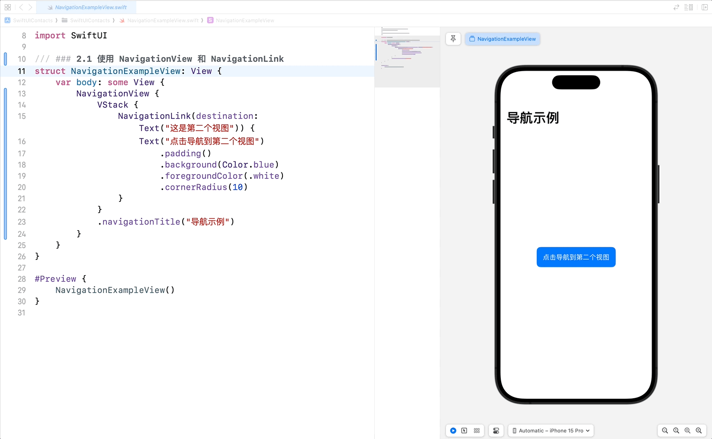
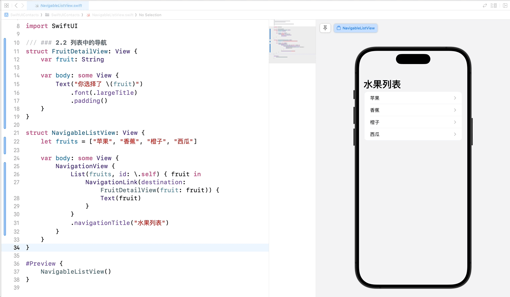
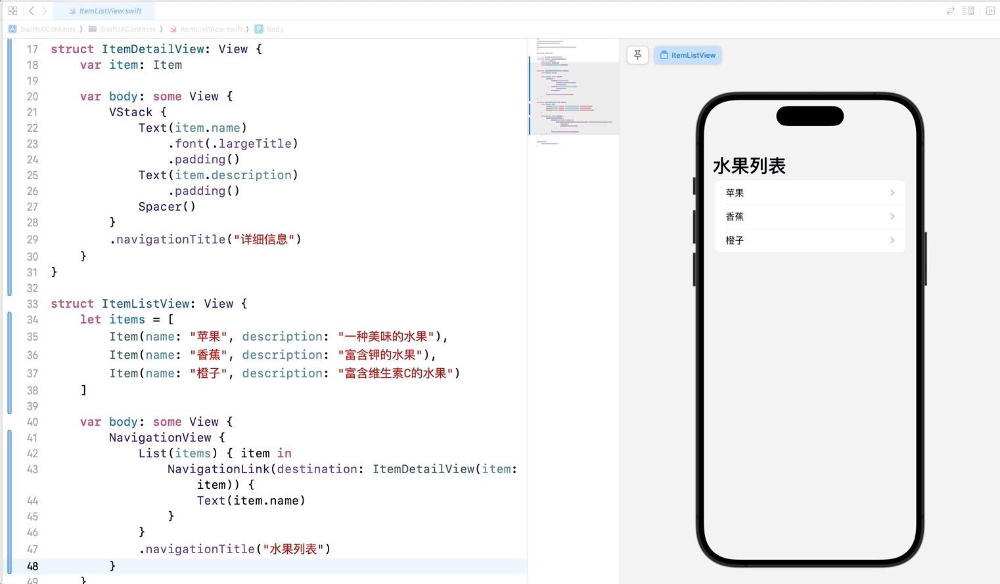
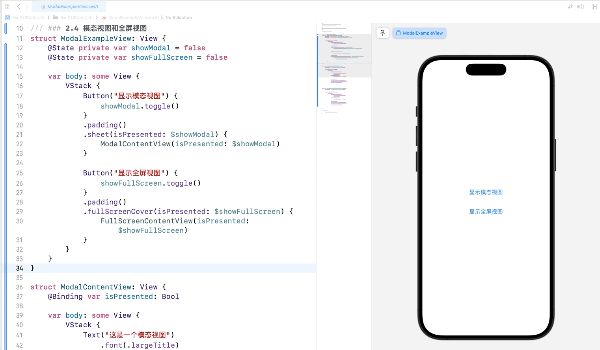
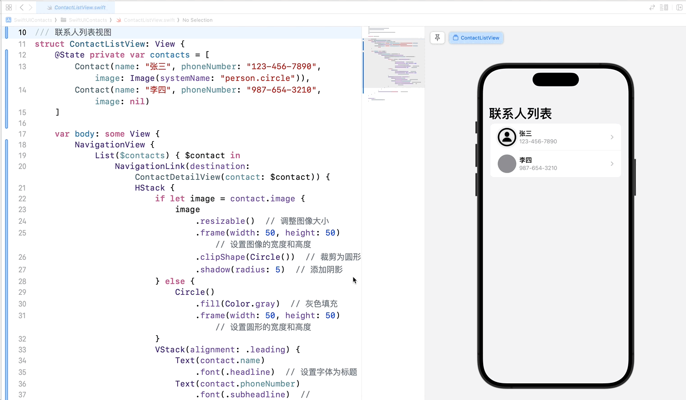

# SwiftUI 学习日志（6）：列表和导航

在本篇文章中，咱们将探讨 SwiftUI 中的**列表**和**导航**。列表和导航是构建 iOS 应用中常见的组件，通过这些组件，咱们可以轻松地展示数据并在不同视图之间导航。

## 1. 列表

### 1.1 创建简单列表

SwiftUI 提供了 **List** 视图来创建和显示列表。我们可以使用 `List` 来展示一组数据。

```swift
struct SimpleListView: View {
    let items = ["苹果", "香蕉", "橙子", "西瓜"]
    
    var body: some View {
        List(items, id: \.self) { item in
            Text(item)
        }
    }
}

#Preview {
    SimpleListView()
}
```



### 1.2 自定义列表单元格

我们可以自定义列表的单元格，以显示更加复杂的内容。

```swift
struct CustomListView: View {
    let items = ["苹果", "香蕉", "橙子", "西瓜"]
    
    var body: some View {
        List(items, id: \.self) { item in
            HStack {
                Image(systemName: "star.fill")
                Text(item)
            }
        }
    }
}

#Preview {
    CustomListView()
}
```



### 1.3 动态列表

使用 `ForEach` 和自定义数据模型，可以创建动态列表。

```swift
struct Fruit: Identifiable {
    var id = UUID()
    var name: String
}

struct DynamicListView: View {
    let fruits = [
        Fruit(name: "苹果"),
        Fruit(name: "香蕉"),
        Fruit(name: "橙子"),
        Fruit(name: "西瓜")
    ]
    
    var body: some View {
        List(fruits) { fruit in
            Text(fruit.name)
        }
    }
}

#Preview {
    DynamicListView()
}
```



**动态列表和静态列表的区别**：

- **动态列表**：使用 `ForEach` 和自定义数据模型创建，数据可以随时更改和更新，适用于显示动态变化的数据。
- **静态列表**：直接在 `List` 视图中定义列表项，数据相对固定，适用于显示固定的、少量的数据。

### 1.4 Section 和 GroupedListStyle

使用 `Section` 可以将列表分组，并使用 `GroupedListStyle` 设置列表样式。

```swift
struct SectionedListView: View {
    var body: some View {
        List {
            Section(header: Text("水果")) {
                Text("苹果")
                Text("香蕉")
            }
            Section(header: Text("蔬菜")) {
                Text("西红柿")
                Text("黄瓜")
            }
        }
        .listStyle(GroupedListStyle())
    }
}

#Preview {
    SectionedListView()
}
```



### 1.5 动态列表和静态列表

在一个列表中，咱们可以同时使用动态和静态数据。

```swift
struct MixedListView: View {
    let dynamicItems = ["苹果", "香蕉", "橙子"]
    
    var body: some View {
        List {
            Section(header: Text("动态列表")) {
                ForEach(dynamicItems, id: \.self) { item in
                    Text(item)
                }
            }
            Section(header: Text("静态列表")) {
                Text("西瓜")
                Text("梨")
            }
        }
        .listStyle(GroupedListStyle())
    }
}

#Preview {
    MixedListView()
}
```



## 2. 导航

### 2.1 使用 NavigationView 和 NavigationLink

**NavigationView** 是创建导航界面的基础，可以在视图之间导航。**NavigationLink** 用于创建可导航的链接。

```swift
struct NavigationExampleView: View {
    var body: some View {
        NavigationView {
            VStack {
                NavigationLink(destination: Text("这是第二个视图")) {
                    Text("点击导航到第二个视图")
                        .padding()
                        .background(Color.blue)
                        .foregroundColor(.white)
                        .cornerRadius(10)
                }
            }
            .navigationTitle("导航示例")
        }
    }
}

#Preview {
    NavigationExampleView()
}
```



### 2.2 列表中的导航

在列表中使用 `NavigationLink` 可以实现从列表项到详细视图的导航。

```swift
struct FruitDetailView: View {
    var fruit: String
    
    var body: some View {
        Text("你选择了 \(fruit)")
            .font(.largeTitle)
            .padding()
    }
}

struct NavigableListView: View {
    let fruits = ["苹果", "香蕉", "橙子", "西瓜"]
    
    var body: some View {
        NavigationView {
            List(fruits, id: \.self) { fruit in
                NavigationLink(destination: FruitDetailView(fruit: fruit)) {
                    Text(fruit)
                }
            }
            .navigationTitle("水果列表")
        }
    }
}

#Preview {
    NavigableListView()
}
```



### 2.3 视图间的导航和传递数据

通过 `NavigationLink` 传递数据，实现视图间的导航和数据传递。

```swift
struct Item: Identifiable {
    var id = UUID()
    var name: String
    var description: String
}

struct ItemDetailView: View {
    var item: Item
    
    var body: some View {
        VStack {
            Text(item.name)
                .font(.largeTitle)
                .padding()
            Text(item.description)
                .padding()
            Spacer()
        }
        .navigationTitle("详细信息")
    }
}

struct ItemListView: View {
    let items = [
        Item(name: "苹果", description: "一种美味的水果"),
        Item(name: "香蕉", description: "富含钾的水果"),
        Item(name: "橙子", description: "富含维生素C的水果")
    ]
    
    var body: some View {
        NavigationView {
            List(items) { item in
                NavigationLink(destination: ItemDetailView(item: item)) {
                    Text(item.name)
                }
            }
            .navigationTitle("水果列表")
        }
    }
}

#Preview {
    ItemListView()
}
```



### 2.4 模态视图和全屏视图

使用 `sheet` 和 `fullScreenCover` 可以实现模态视图和全屏视图的展示。

```swift
struct ModalExampleView: View {
    @State private var showModal = false
    @State private var showFullScreen = false
    
    var body: some View {
        VStack {
            Button("显示模态视图") {
                showModal.toggle()
            }
            .padding()
            .sheet(isPresented: $showModal) {
                ModalContentView(isPresented: $showModal)
            }
            
            Button("显示全屏视图") {
                showFullScreen.toggle()
            }
            .padding()
            .fullScreenCover(isPresented: $showFullScreen) {
                FullScreenContentView(isPresented: $showFullScreen)
            }
        }
    }
}

struct ModalContentView: View {
    @Binding var isPresented: Bool
    
    var body: some View {
        VStack {
            Text("这是一个模态视图")
                .font(.largeTitle)
                .padding()
            Button("关闭") {
                isPresented = false
            }
            .padding()
            .background(Color.red)
            .foregroundColor(.white)
            .cornerRadius(10)
        }
    }
}

struct FullScreenContentView: View {
    @Binding var isPresented: Bool
    
    var body: some View {
        VStack {
            Text("这是一个全屏视图")
                .font(.largeTitle)
                .padding()
            Button("关闭") {
                isPresented = false
            }
            .padding()
            .background(Color.red)
            .foregroundColor(.white)
            .cornerRadius(10)
        }
    }
}

#Preview {
    ModalExampleView()
}
```



在上述代码中，`ModalContentView` 和 `FullScreenContentView` 都使用了一个 `@Binding var isPresented: Bool` 来接收绑定的状态，并在关闭按钮的点击事件中将其设置为 `false`，以关闭模态窗口或全屏视图。

## 3. 综合案例：联系人列表

### 3.1 案例简介

咱们将创建一个联系人列表，通过列表展示联系人，并可以导航到联系人详情页面，同时添加从手机相册上传头像的功能。

### 3.2 实现步骤

1. **定义联系人数据模型**：定义一个 `Contact` 结构体，包含联系人的基本信息。
2. **实现头像上传功能**：通过 `PHPickerViewController` 实现从手机相册上传头像。
3. **实现联系人详情视图**：创建一个视图，用于显示联系人的详细信息。
4. **创建联系人列表视图**：创建一个视图，用于显示联系人列表。
5. **实现主视图**：在主视图中使用联系人列表视图。

### 3.3 案例实现

#### 3.3.1 定义联系人数据模型

新建 `Contact.swift` 并输入以下代码：

```swift
import SwiftUI

/// 联系人结构体
struct Contact: Identifiable {
    var id = UUID()             // 唯一标识
    var name: String            // 姓名
    var phoneNumber: String     // 电话
    var image: Image?           // 头像
}
```

#### 3.3.2 实现头像上传功能

新建 `ImagePicker.swift` 并输入以下代码：

```swift
import SwiftUI
import PhotosUI

struct ImagePicker: UIViewControllerRepresentable {
    @Binding var image: Image?  // 绑定选中的图像

    class Coordinator: NSObject, PHPickerViewControllerDelegate {
        @Binding var image: Image?

        init(image: Binding<Image?>) {
            _image = image
        }

        func picker(_ picker: PHPickerViewController, didFinishPicking results: [PHPickerResult]) {
            picker.dismiss(animated: true)

            guard let provider = results.first?.itemProvider else { return }

            if provider.canLoadObject(ofClass: UIImage.self) {
                provider.loadObject(ofClass: UIImage.self) { [self] (uiImage, error) in
                    if let uiImage = uiImage as? UIImage {
                        image = Image(uiImage: uiImage)  // 转换为 SwiftUI 的 Image
                    }
                }
            }
        }
    }

    func makeCoordinator() -> Coordinator {
        Coordinator(image: $image)
    }

    func makeUIViewController(context: Context) -> PHPickerViewController {
        var configuration = PHPickerConfiguration()
        configuration.filter = .images  // 仅选择图像
        let picker = PHPickerViewController(configuration: configuration)
        picker.delegate = context.coordinator
        return picker
    }

    func updateUIViewController(_ uiViewController: PHPickerViewController, context: Context) {}
}
```

#### 3.3.3 创建联系人详情视图

新建 `ContactDetailView.swift` 并输入以下代码：

```swift
import SwiftUI

struct ContactDetailView: View {
    @Binding var contact: Contact  // 绑定联系人数据
    @State private var showingImagePicker = false  // 显示图片选择器的状态
    
    var body: some View {
        VStack {
            if let image = contact.image {
                image
                    .resizable()  // 调整图像大小
                    .frame(width: 200, height: 200)  // 设置图像的宽度和高度
                    .clipShape(Circle())  // 裁剪为圆形
                    .shadow(radius: 10)  // 添加阴影
                    .padding()  // 添加内边距
            } else {
                Circle()
                    .fill(Color.gray)  // 灰色填充
                    .frame(width: 200, height: 200)  // 设置圆形的宽度和高度
                    .padding()  // 添加内边距
            }
            Button("上传头像") {
                showingImagePicker.toggle()  // 切换图片选择器的显示状态
            }
            .padding()  // 添加内边距
            .background(Color.blue)  // 设置按钮背景颜色为蓝色
            .foregroundColor(.white)  // 设置按钮文字颜色为白色
            .cornerRadius(10)  // 设置按钮圆角
            .sheet(isPresented: $showingImagePicker) {
                ImagePicker(image: $contact.image)  // 显示图片选择器
            }
            Spacer()  // 占用剩余空间
        }
        .navigationTitle(contact.name)  // 设置导航标题为联系人姓名
    }
}

#Preview {
    ContactDetailView(contact: .constant(Contact(name: "张三", phoneNumber: "123-456-7890", image: nil)))
}
```

#### 3.3.4 创建联系人列表视图

新建 `ContactListView.swift` 并输入以下代码：

```swift
import SwiftUI

struct ContactListView: View {
    @State private var contacts = [
        Contact(name: "张三", phoneNumber: "123-456-7890", image: Image(systemName: "person.circle")),
        Contact(name: "李四", phoneNumber: "987-654-3210", image: nil)
    ]
    
    var body: some View {
        NavigationView {
            List($contacts) { $contact in
                NavigationLink(destination: ContactDetailView(contact: $contact)) {
                    HStack {
                        if let image = contact.image {
                            image
                                .resizable()  // 调整图像大小
                                .frame(width: 50, height: 50)  // 设置图像的宽度和高度
                                .clipShape(Circle())  // 裁剪为圆形
                                .shadow(radius: 5)  // 添加阴影
                        } else {
                            Circle()
                                .fill(Color.gray)  // 灰色填充
                                .frame(width: 50, height: 50)  // 设置圆形的宽度和高度
                        }
                        VStack(alignment: .leading) {
                            Text(contact.name)
                                .font(.headline)  // 设置字体为标题
                            Text(contact.phoneNumber)
                                .font(.subheadline)  // 设置字体为副标题
                                .foregroundColor(.gray)  // 字体颜色为灰色
                        }
                    }
                }
            }
            .navigationTitle("联系人列表")  // 设置导航标题
        }
    }
}

#Preview {
    ContactListView()
}
```

#### 3.3.5 实现主视图

修改 `ContentView.swift` 并输入以下代码：

```swift
import SwiftUI

struct ContentView: View {
    var body: some View {
        ContactListView()  // 显示联系人列表视图
    }
}

#Preview {
    ContentView()
}
```



### UIKit 和 SwiftUI 的结合

在上述代码中，`ImagePicker` 使用了 `UIViewControllerRepresentable` 协议将 `PHPickerViewController` 集成到 SwiftUI 中。这种方法允许我们在 SwiftUI 项目中使用 UIKit 提供的功能，从而利用已有的 UIKit 组件进行更复杂的操作。

1. **UIViewControllerRepresentable**：通过实现该协议，可以将 UIKit 的视图控制器集成到 SwiftUI 中。
2. **makeUIViewController**：创建并配置 `UIViewController` 实例。
3. **updateUIViewController**：根据 SwiftUI 的状态更新 `UIViewController` 的内容。
4. **Coordinator**：用于管理 `UIViewController` 的委托和数据通信。

## 4. 结语

在这篇文章中，我们深入探讨了 SwiftUI 的**列表**和**导航**，并通过一个联系人列表的综合案例将所学知识应用到实践中。希望你对 SwiftUI 的列表和导航有了更深入的理解。下一篇文章将进一步探讨 SwiftUI 的 TabBar 与多页面应用，敬请期待。

> 本专栏文档及配套代码的 GitHub 地址：[壹刀流的技术人生](https://github.com/IdEvEbI/idevebi.github.io)。
