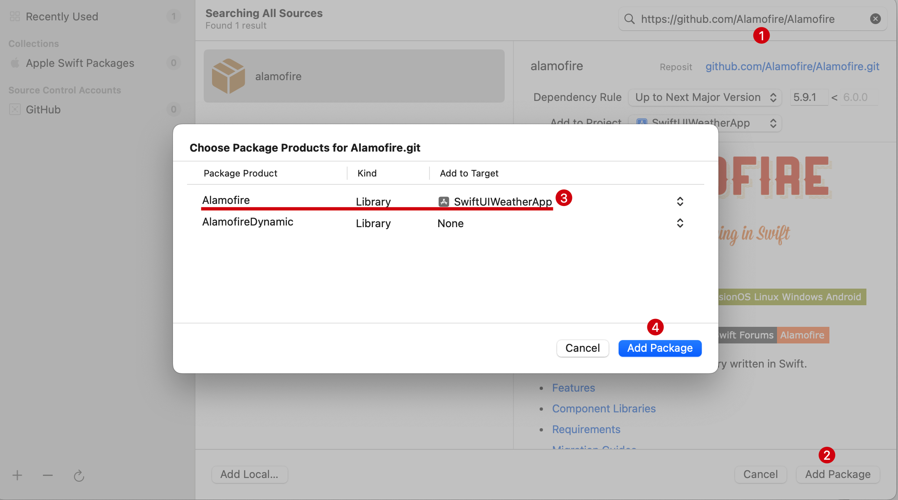
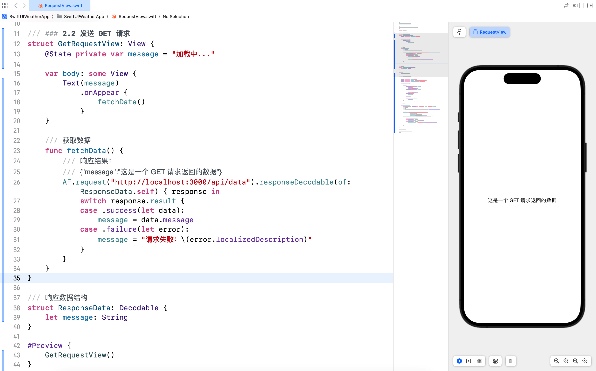
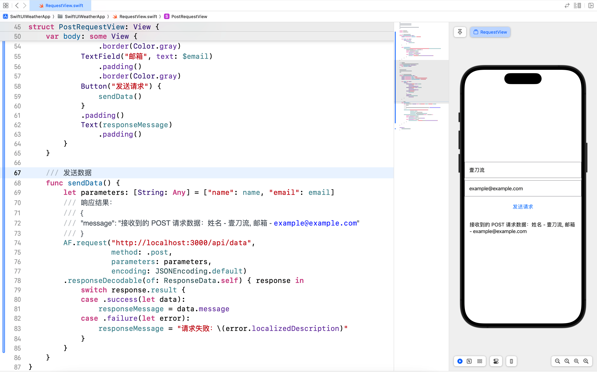
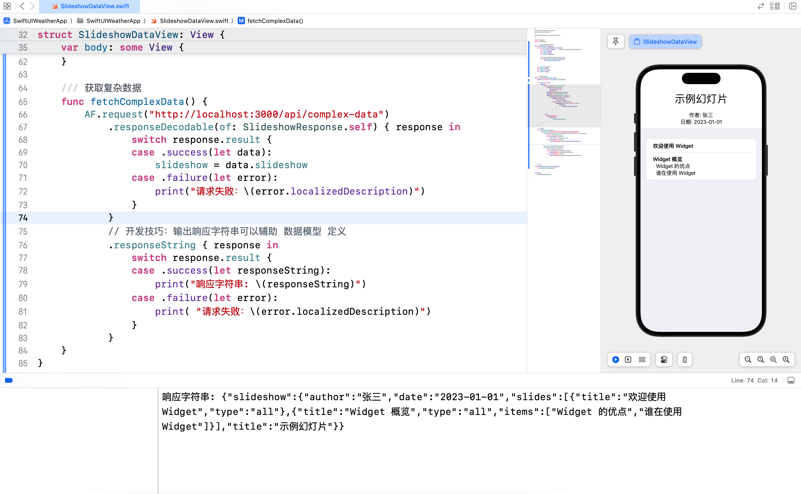
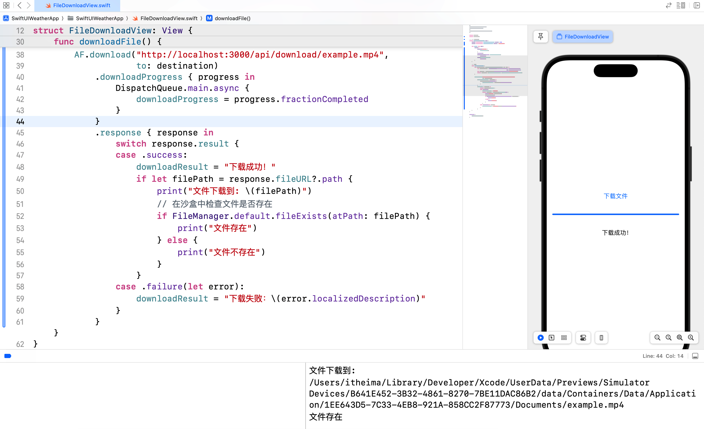
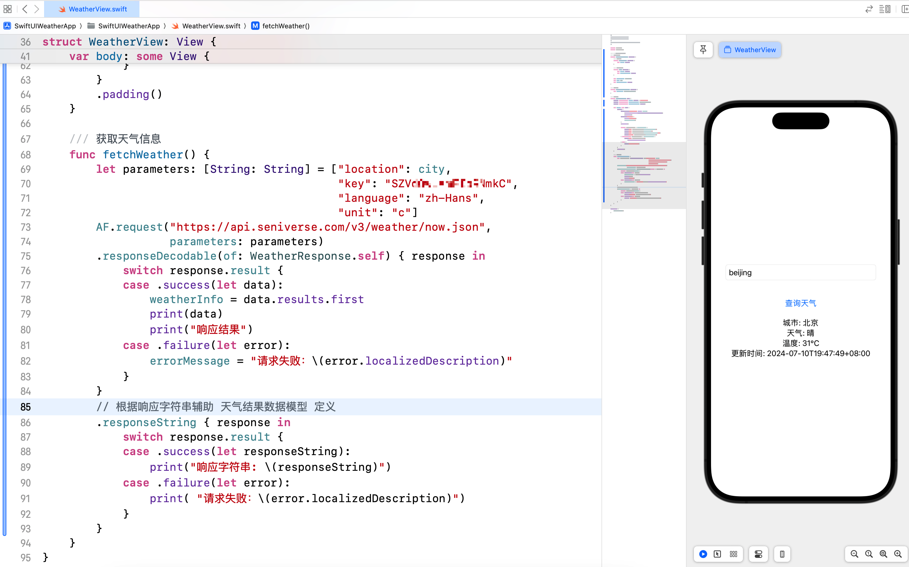
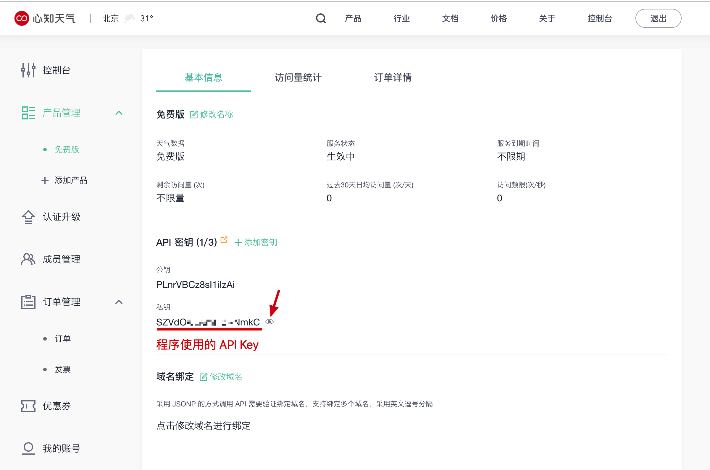

# SwiftUI 学习日志（7）：网络请求与数据处理

欢迎来到《SwiftUI 学习日志》的第 7 篇文章。在本篇文章中，我们将深入探讨如何在 SwiftUI 中进行**网络请求**和**数据处理**。通过学习如何**发送和接收网络请求**，并**解析返回的数据**，您将能够构建出功能更加完善的应用程序。

为配合本专栏的案例设计，我之前用 **Node.js** 编写了一个简易的**后台服务**，并在知乎上发布了一篇配套文章。文章标题为：[SwiftUI 学习日志：为 SwiftUI 网络请求专题准备后台服务](https://zhuanlan.zhihu.com/p/706676569)。该文章介绍了如何搭建一个基本的后台服务，涵盖了 **GET 请求**、**POST 请求**、**表单提交**、**文件上传**、**头像上传**、**文件下载**等功能，并支持**返回复杂的 JSON 数据**。

## 1. 网络请求简介

### 1.1 什么是网络请求

**网络请求**是指应用程序与服务器之间**进行数据交换的过程**。在现代应用中，网络请求是必不可少的一部分。通过网络请求，我们可以获取远程服务器上的数据，并将其展示在应用中，还可以将数据发送给服务器进行保存。

### 1.2 网络请求的类型

- **GET 请求**：用于从服务器获取数据。
- **POST 请求**：用于向服务器发送数据。
- **PUT 请求**：用于更新服务器上的数据。
- **DELETE 请求**：用于删除服务器上的数据。

### 1.3 使用第三方框架 Alamofire

**Alamofire** 是一个强大的 Swift 网络库，可以简化网络请求的处理。使用第三方框架可以节省开发时间，提高开发效率，并确保代码的可靠性和安全性。

## 2. 使用 Alamofire 进行网络请求

### 2.1 安装 Alamofire

1. 在 Xcode 中打开项目。
2. 选择 **File > Add Package Dependencies...**。
3. 在弹出窗口中输入 `Alamofire` 的 GitHub 地址：`https://github.com/Alamofire/Alamofire`。
4. 在弹出窗口中**仅选择** `Alamofire` 包并添加到项目中。



### 2.2 发送 GET 请求

以下是使用 Alamofire **发送 GET 请求**从服务器**获取数据**的示例代码，获取简单的 JSON 数据：

```swift
import SwiftUI
import Alamofire

/// ### 2.2 发送 GET 请求
struct GetRequestView: View {
    @State private var message = "加载中..."
    
    var body: some View {
        Text(message)
            .onAppear {
                fetchData()
            }
    }
    
    /// 获取数据
    func fetchData() {
        /// 响应结果：
        /// {"message":"这是一个 GET 请求返回的数据"}
        AF.request("http://localhost:3000/api/data").responseDecodable(of: ResponseData.self) { response in
            switch response.result {
            case .success(let data):
                message = data.message
            case .failure(let error):
                message = "请求失败：\(error.localizedDescription)"
            }
        }
    }
}

/// 响应数据结构
struct ResponseData: Decodable {
    let message: String
}

#Preview {
    GetRequestView()
}
```



### 2.3 发送 POST 请求

以下是使用 Alamofire **发送 POST 请求**向服务器**发送数据**的示例代码，提交表单数据并接收返回的 JSON 数据：

```swift
/// ### 2.3 发送 POST 请求
struct PostRequestView: View {
    @State private var name = "壹刀流"
    @State private var email = "example@example.com"
    @State private var responseMessage = "等待响应..."
    
    var body: some View {
        VStack {
            TextField("姓名", text: $name)
                .padding()
                .border(Color.gray)
            TextField("邮箱", text: $email)
                .padding()
                .border(Color.gray)
            Button("发送请求") {
                sendData()
            }
            .padding()
            Text(responseMessage)
                .padding()
        }
    }
    
    /// 发送数据
    func sendData() {
        let parameters: [String: Any] = ["name": name, "email": email]
        /// 响应结果：
        /// {
        /// "message": "接收到的 POST 请求数据：姓名 - 壹刀流, 邮箱 - example@example.com"
        /// }
        AF.request("http://localhost:3000/api/data",
                   method: .post,
                   parameters: parameters,
                   encoding: JSONEncoding.default)
        .responseDecodable(of: ResponseData.self) { response in
            switch response.result {
            case .success(let data):
                responseMessage = data.message
            case .failure(let error):
                responseMessage = "请求失败：\(error.localizedDescription)"
            }
        }
    }
}

#Preview {
    PostRequestView()
}
```



## 3. 处理复杂 JSON 数据

通过使用 `Codable` 协议，我们可以轻松解析 JSON 数据。在 Alamofire 中，我们可以使用 `responseDecodable` 方法来自动解析返回的数据。但是在实际应用开发中，服务器返回的数据结构可能会比较复杂，假设服务器返回的数据如下，该数据结构是**字典**、**列表**的嵌套组合，而且还包含可选项：

```json
{
    "slideshow": {
        "author": "张三",
        "date": "2023-01-01",
        "slides": [
            {
                "title": "欢迎使用 Widget",
                "type": "all"
            },
            {
                "title": "Widget 概览",
                "type": "all",
                "items": [
                    "Widget 的优点",
                    "谁在使用 Widget"
                ]
            }
        ],
        "title": "示例幻灯片"
    }
}
```

### 3.1 数据结构

在实际开发中，我们可以参考接口文档，了解服务器响应的数据结构，在发起网络请求之前，首先定义对应的数据结构，以便于使用 Alamofire 的 `responseDecodable` 解析服务器返回的 JSON 数据。

```swift
/// ### 3.1 Slideshow 数据结构
struct Slideshow: Codable {
    struct Slide: Identifiable, Codable {
        let id: UUID? = UUID()  // 用于为 List 提供数据源，使用可选类型并提供默认值
        let title: String
        let type: String
        let items: [String]?
        
        // 手动添加 CodingKeys 枚举，确保 id 不会被解码
        enum CodingKeys: String, CodingKey {
            case title, type, items
        }
    }
    
    let author: String
    let date: String
    let slides: [Slide]
    let title: String
}

/// 响应数据模型
struct SlideshowResponse: Codable {
    let slideshow: Slideshow
}
```

### 3.2 数据解析示例

以下示例展示了如何使用 `Alamofire` 和 `Codable` 协议解析复杂的 JSON 数据：

```swift
/// ### 3.2 数据解析示例
struct SlideshowDataView: View {
    @State private var slideshow: Slideshow?
    
    var body: some View {
        VStack {
            if let slideshow = slideshow {
                Text(slideshow.title)
                    .font(.largeTitle)
                    .padding()
                Text("作者: \(slideshow.author)")
                Text("日期: \(slideshow.date)")
                List(slideshow.slides) { slide in
                    VStack(alignment: .leading) {
                        Text(slide.title)
                            .font(.headline)
                        if let items = slide.items {
                            ForEach(items, id: \.self) { item in
                                Text(item)
                                    .padding(.leading, 10)
                            }
                        }
                    }
                }
            } else {
                Text("加载中...")
                    .onAppear {
                        fetchComplexData()
                    }
            }
        }
    }
    
    /// 获取复杂数据
    func fetchComplexData() {
        AF.request("http://localhost:3000/api/complex-data")
            .responseDecodable(of: SlideshowResponse.self) { response in
                switch response.result {
                case .success(let data):
                    slideshow = data.slideshow
                case .failure(let error):
                    print("请求失败：\(error.localizedDescription)")
                }
            }
            // 开发技巧：输出响应字符串可以辅助 数据模型 定义
            .responseString { response in
                switch response.result {
                case .success(let responseString):
                    print("响应字符串: \(responseString)")
                case .failure(let error):
                    print( "请求失败：\(error.localizedDescription)")
                }
            }
    }
}

#Preview {
    SlideshowDataView()
}
```



#### 扩展说明

1. `responseDecodable` 方法及参数

   1. **`of:`**：指定要解析的数据类型，告诉 `responseDecodable` 方法应该将 JSON 数据解析成哪种模型。
   2. **`SlideshowResponse.self`**：`SlideshowResponse` 是我们定义的数据模型，`.self` 是 Swift 的语法，表示传递类型本身，而不是类型的实例。

2. **技巧**：使用 `responseString` 方法辅助数据模型定义

   1. 在实际开发中，如果**不能确定服务器响应的数据结构**或者**无法正确解析服务器返回的数据**，可以使用 `responseString` 方法把服务器响应的结果以字符串格式输出，从而可以辅助数据模型的定义。

## 4. 文件上传和下载

### 4.1 头像上传

以下示例展示了如何从系统相册选择照片，然后使用 Alamofire 上传头像，最后将上传结果显示在界面上。

```swift
/// ### 4.1 头像上传
struct AvatarUploadView: View {
    @State private var message = "选择头像上传..."
    @State private var isImagePickerPresented = false
    @State private var selectedImage: UIImage?
    
    var body: some View {
        VStack {
            Group {
                if let image = selectedImage {
                    Image(uiImage: image)
                        .resizable()
                } else {
                    Image(systemName: "person.circle")
                        .resizable()
                }
            }
            .scaledToFit()
            .frame(width: 100, height: 100)
            .clipShape(Circle())
            .padding()
            
            Button("选择头像") {
                isImagePickerPresented = true
            }
            .padding()
            
            Text(message)
                .padding()
        }
        .sheet(isPresented: $isImagePickerPresented) {
            ImagePicker(image: $selectedImage, onPick: { image in
                if let image = image {
                    uploadAvatar(image: image)
                }
            })
        }
    }
    
    func uploadAvatar(image: UIImage) {
        guard let imageData = image.jpegData(compressionQuality: 0.8) else { return }
        
        AF.upload(multipartFormData: { formData in
            formData.append(imageData, 
                            withName: "avatar",
                            fileName: "avatar.jpg",
                            mimeType: "image/jpeg")
        }, to: "http://localhost:3000/api/avatar")
        .responseDecodable(of: ResponseData.self) { response in
            switch response.result {
            case .success(let data):
                message = data.message
            case .failure(let error):
                message = "头像上传失败：\(error.localizedDescription)"
            }
        }
    }
}

/// 图像选择器
struct ImagePicker: UIViewControllerRepresentable {
    @Binding var image: UIImage?
    var onPick: (UIImage?) -> Void
    
    class Coordinator: NSObject, UINavigationControllerDelegate, UIImagePickerControllerDelegate {
        var parent: ImagePicker
        var onPick: (UIImage?) -> Void
        
        init(parent: ImagePicker, onPick: @escaping (UIImage?) -> Void) {
            self.parent = parent
            self.onPick = onPick
        }
        
        func imagePickerController(_ picker: UIImagePickerController, didFinishPickingMediaWithInfo info: [UIImagePickerController.InfoKey : Any]) {
            let image = info[.originalImage] as? UIImage
            parent.image = image
            onPick(image)
            picker.dismiss(animated: true)
        }
        
        func imagePickerControllerDidCancel(_ picker: UIImagePickerController) {
            onPick(nil)
            picker.dismiss(animated: true)
        }
    }
    
    func makeCoordinator() -> Coordinator {
        Coordinator(parent: self, onPick: onPick)
    }
    
    func makeUIViewController(context: Context) -> UIImagePickerController {
        let picker = UIImagePickerController()
        picker.delegate = context.coordinator
        return picker
    }
    
    func updateUIViewController(_ uiViewController: UIImagePickerController, context: Context) {}
}

#Preview {
    AvatarUploadView()
}
```


### 4.2 文件下载

以下示例展示了如何使用 Alamofire 下载文件，并显示下载进度。

```swift
/// ### 4.2 文件下载
struct FileDownloadView: View {
    @State private var downloadProgress: Double = 0.0
    @State private var downloadResult: String = "等待下载..."
    
    var body: some View {
        VStack {
            Button("下载文件") {
                downloadFile()
            }
            .padding()
            ProgressView(value: downloadProgress)
                .padding()
            Text(downloadResult)
                .padding()
        }
    }
    
    /// 下载文件
    func downloadFile() {
        let destination: DownloadRequest.Destination = { _, _ in
            let documentsURL = FileManager.default.urls(for: .documentDirectory,
                                                        in: .userDomainMask)[0]
            let fileURL = documentsURL.appendingPathComponent("example.mp4")
            return (fileURL, [.removePreviousFile, .createIntermediateDirectories])
        }
        
        AF.download("http://localhost:3000/api/download/example.mp4", 
                    to: destination)
            .downloadProgress { progress in
                DispatchQueue.main.async {
                    downloadProgress = progress.fractionCompleted
                }
            }
            .response { response in
                switch response.result {
                case .success:
                    downloadResult = "下载成功！"
                    if let filePath = response.fileURL?.path {
                        print("文件下载到: \(filePath)")
                        // 在沙盒中检查文件是否存在
                        if FileManager.default.fileExists(atPath: filePath) {
                            print("文件存在")
                        } else {
                            print("文件不存在")
                        }
                    }
                case .failure(let error):
                    downloadResult = "下载失败：\(error.localizedDescription)"
                }
            }
    }
}

#Preview {
    FileDownloadView()
}
```



## 5. 综合案例：天气应用

### 5.1 案例简介

在这个综合案例中，我们将创建一个简单的天气应用，展示如何结合**网络请求**和**数据处理**来获取并显示天气信息。

### 5.2 实现步骤

1. **注册心知天气 API**：前往 [心知天气](https://www.seniverse.com/)，注册账号并获取 API Key。
2. **创建天气数据模型**：定义数据模型以解析 API 返回的 JSON 数据。
3. **实现天气查询视图**：创建一个视图，允许用户输入城市名称并查询天气。
4. **显示天气信息**：将查询结果显示在界面上。

### 5.3 代码示例

新建 `WeatherView.swift` 并输入以下代码：

```swift
import SwiftUI
import Alamofire

/// ## 5. 综合案例：天气应用
/// 天气结果数据模型
struct WeatherResult: Codable {
    /// 位置数据模型
    struct Location: Codable {
        let name: String
    }
    
    /// 当前天气数据模型
    struct Now: Codable {
        let text: String
        let temperature: String
    }
    
    let location: Location
    let now: Now
    let last_update: String
}

/// 响应数据模型
struct WeatherResponse: Codable {
    let results: [WeatherResult]
}

/// 天气查询视图
struct WeatherView: View {
    @State private var city: String = "beijing"
    @State private var weatherInfo: WeatherResult?
    @State private var errorMessage: String?
    
    var body: some View {
        VStack {
            TextField("输入城市名称", text: $city)
                .textFieldStyle(RoundedBorderTextFieldStyle())
                .padding()
            Button("查询天气") {
                print("开始查询天气")
                fetchWeather()
            }
            .padding()
            
            if let weatherInfo = weatherInfo {
                Text("城市: \(weatherInfo.location.name)")
                Text("天气: \(weatherInfo.now.text)")
                Text("温度: \(weatherInfo.now.temperature)°C")
                Text("更新时间: \(weatherInfo.last_update)")
            } else if let errorMessage = errorMessage {
                Text("错误: \(errorMessage)")
                    .foregroundColor(.red)
            } else {
                Text("请输入城市名称并查询")
            }
        }
        .padding()
    }
    
    /// 获取天气信息
    func fetchWeather() {
        let parameters: [String: String] = ["location": city,
                                            "key": "你的 API Key",
                                            "language": "zh-Hans",
                                            "unit": "c"]
        AF.request("https://api.seniverse.com/v3/weather/now.json",
                   parameters: parameters)
        .responseDecodable(of: WeatherResponse.self) { response in
            switch response.result {
            case .success(let data):
                weatherInfo = data.results.first
                print(data)
                print("响应结果")
            case .failure(let error):
                errorMessage = "请求失败：\(error.localizedDescription)"
            }
        }
        .responseString { response in
            switch response.result {
            case .success(let responseString):
                print("响应字符串: \(responseString)")
            case .failure(let error):
                print( "请求失败：\(error.localizedDescription)")
            }
        }
    }
}

#Preview {
    WeatherView()
}
```



### 5.4 扩展：心知天气获取 API Key 的操作步骤

1. 前往 [心知天气](https://www.seniverse.com/) 注册用户。
2. 点击 **控制台** -> **产品管理** -> **添加产品** -> 点击**免费版**下方的**免费申请**按钮。
3. 点击 **产品管理** 下方的 **免费版**，然后点击**小眼睛**按钮，查看**私钥**，这个私钥就是我们案例中需要使用的 **API Key**。



## 6. 结语

在本篇文章中，我们深入探讨了 SwiftUI 中的**网络请求**和**数据处理**，包括使用 **Alamofire** 进行**GET 请求**和**POST 请求**、**处理复杂 JSON 数据**以及**文件上传和下载**。通过综合案例，我们展示了如何结合这些技术构建一个简单的**天气应用**。希望您对 SwiftUI 的网络请求和数据处理有了更深入的理解。下一篇文章将进一步探讨 **SwiftUI 的数据持久化**，敬请期待。
