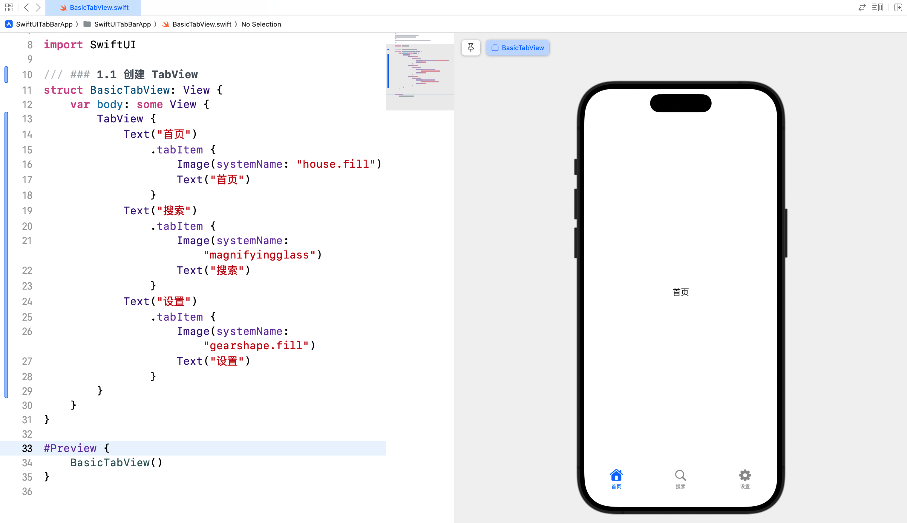
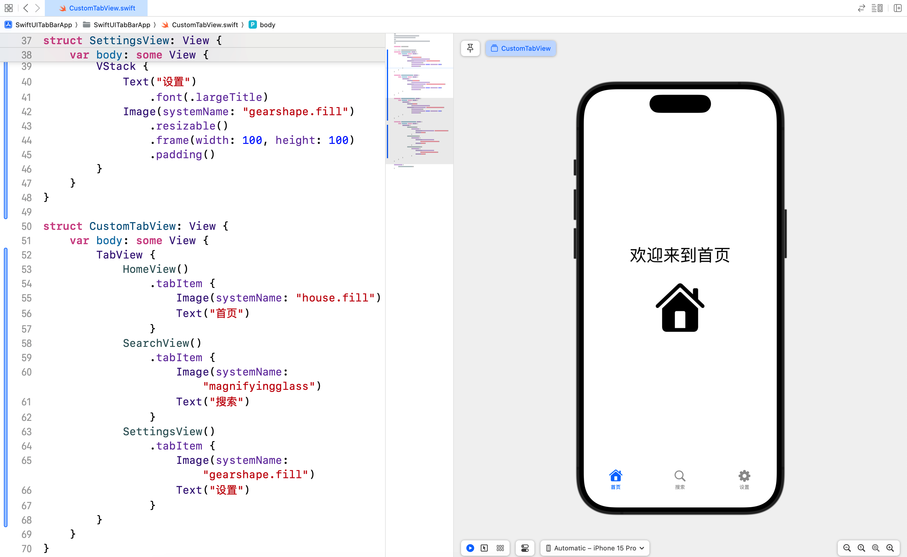
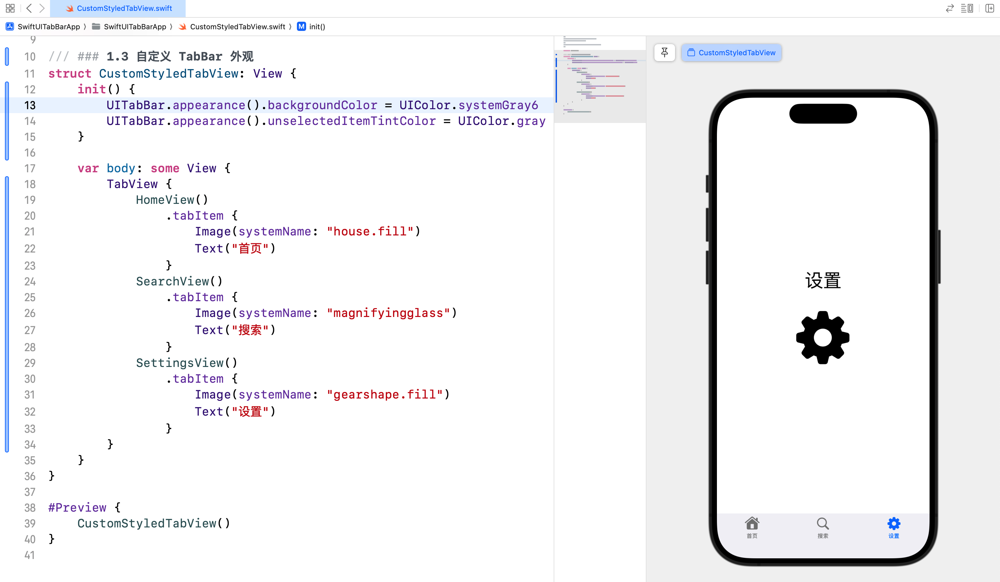
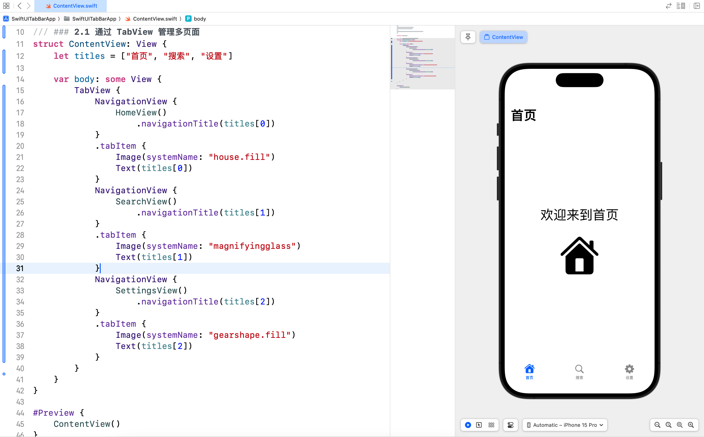
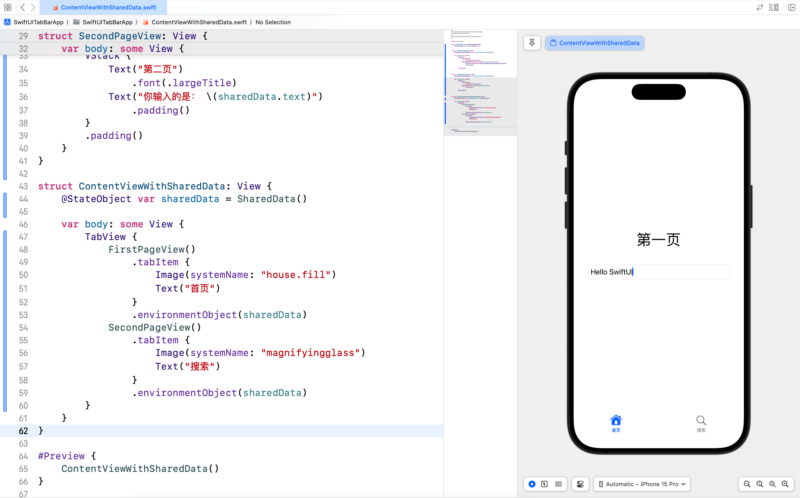
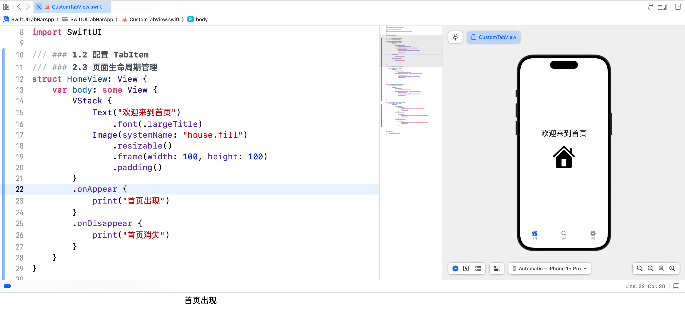
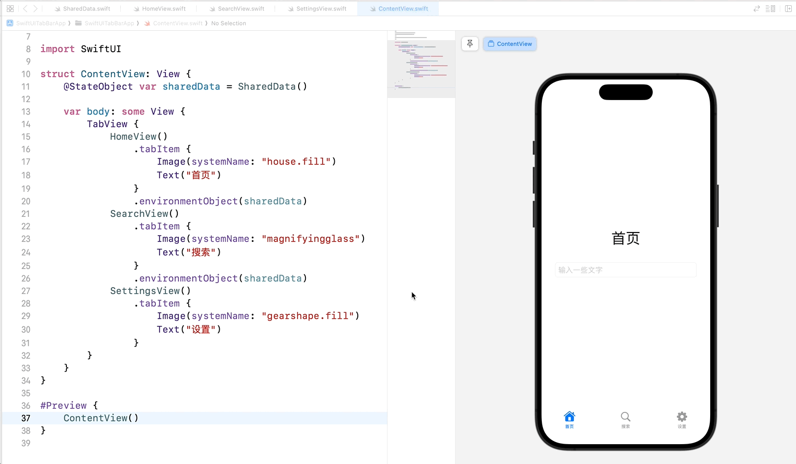

# SwiftUI 学习日志（7）：TabBar 与多页面应用

在本篇文章中，咱们将探讨 SwiftUI 中的**TabBar** 和**多页面应用**。通过使用 TabBar，咱们可以轻松地在应用程序中创建多个页面，并在这些页面之间进行切换。

## 1. TabView 的使用

### 1.1 创建 TabView

`TabView` 是 SwiftUI 中用于创建 TabBar 的视图容器。我们可以将多个视图放入 `TabView` 中，并为每个视图指定一个标签和图标。

```swift
struct BasicTabView: View {
    var body: some View {
        TabView {
            Text("首页")
                .tabItem {
                    Image(systemName: "house.fill")
                    Text("首页")
                }
            Text("搜索")
                .tabItem {
                    Image(systemName: "magnifyingglass")
                    Text("搜索")
                }
            Text("设置")
                .tabItem {
                    Image(systemName: "gearshape.fill")
                    Text("设置")
                }
        }
    }
}

#Preview {
    BasicTabView()
}
```



### 1.2 配置 TabItem

我们可以在 `TabView` 中使用自定义视图，并为每个视图设置自定义的标签和图标。

```swift
struct HomeView: View {
    var body: some View {
        VStack {
            Text("欢迎来到首页")
                .font(.largeTitle)
            Image(systemName: "house.fill")
                .resizable()
                .frame(width: 100, height: 100)
                .padding()
        }
    }
}

struct SearchView: View {
    var body: some View {
        VStack {
            Text("搜索内容")
                .font(.largeTitle)
            Image(systemName: "magnifyingglass")
                .resizable()
                .frame(width: 100, height: 100)
                .padding()
        }
    }
}

struct SettingsView: View {
    var body: some View {
        VStack {
            Text("设置")
                .font(.largeTitle)
            Image(systemName: "gearshape.fill")
                .resizable()
                .frame(width: 100, height: 100)
                .padding()
        }
    }
}

struct CustomTabView: View {
    var body: some View {
        TabView {
            HomeView()
                .tabItem {
                    Image(systemName: "house.fill")
                    Text("首页")
                }
            SearchView()
                .tabItem {
                    Image(systemName: "magnifyingglass")
                    Text("搜索")
                }
            SettingsView()
                .tabItem {
                    Image(systemName: "gearshape.fill")
                    Text("设置")
                }
        }
    }
}

#Preview {
    CustomTabView()
}
```



### 1.3 自定义 TabBar 外观

通过 `tabBar` 修饰符，我们可以自定义 TabBar 的外观。例如，设置背景颜色和选中的图标颜色。

```swift
struct CustomStyledTabView: View {
    init() {
        UITabBar.appearance().backgroundColor = UIColor.systemGray6
        UITabBar.appearance().unselectedItemTintColor = UIColor.gray
    }

    var body: some View {
        TabView {
            HomeView()
                .tabItem {
                    Image(systemName: "house.fill")
                    Text("首页")
                }
            SearchView()
                .tabItem {
                    Image(systemName: "magnifyingglass")
                    Text("搜索")
                }
            SettingsView()
                .tabItem {
                    Image(systemName: "gearshape.fill")
                    Text("设置")
                }
        }
    }
}

#Preview {
    CustomStyledTabView()
}
```



## 2. 多页面应用架构

### 2.1 通过 TabView 管理多页面

通过 `TabView`，我们可以轻松地在应用程序中管理多个页面。每个页面都是一个独立的视图，可以包含不同的内容和功能。

```swift
struct ContentView: View {
    let titles = ["首页", "搜索", "设置"]
    
    var body: some View {
        TabView {
            NavigationView {
                HomeView()
                    .navigationTitle(titles[0])
            }
            .tabItem {
                Image(systemName: "house.fill")
                Text(titles[0])
            }
            NavigationView {
                SearchView()
                    .navigationTitle(titles[1])
            }
            .tabItem {
                Image(systemName: "magnifyingglass")
                Text(titles[1])
            }
            NavigationView {
                SettingsView()
                    .navigationTitle(titles[2])
            }
            .tabItem {
                Image(systemName: "gearshape.fill")
                Text(titles[2])
            }
        }
    }
}

#Preview {
    ContentView()
}
```



### 2.2 页面之间的数据传递与共享

通过 `@State`、`@Binding`、`@ObservedObject` 和 `@StateObject` 等属性包装器，我们可以在不同页面之间传递和共享数据。

```swift
class SharedData: ObservableObject {
    @Published var text: String = ""
}

struct FirstPageView: View {
    @EnvironmentObject var sharedData: SharedData
    
    var body: some View {
        VStack {
            Text("第一页")
                .font(.largeTitle)
            TextField("输入一些文字", text: $sharedData.text)
                .textFieldStyle(RoundedBorderTextFieldStyle())
                .padding()
        }
        .padding()
    }
}

struct SecondPageView: View {
    @EnvironmentObject var sharedData: SharedData
    
    var body: some View {
        VStack {
            Text("第二页")
                .font(.largeTitle)
            Text("你输入的是： \(sharedData.text)")
                .padding()
        }
        .padding()
    }
}

struct ContentViewWithSharedData: View {
    @StateObject var sharedData = SharedData()

    var body: some View {
        TabView {
            FirstPageView()
                .tabItem {
                    Image(systemName: "house.fill")
                    Text("首页")
                }
                .environmentObject(sharedData)
            SecondPageView()
                .tabItem {
                    Image(systemName: "magnifyingglass")
                    Text("搜索")
                }
                .environmentObject(sharedData)
        }
    }
}

#Preview {
    ContentViewWithSharedData()
}
```



### 2.3 页面生命周期管理

我们可以通过 `onAppear` 和 `onDisappear` 修饰符来管理页面的生命周期事件。

```swift
struct HomeView: View {
    var body: some View {
        VStack {
            Text("欢迎来到首页")
                .font(.largeTitle)
            Image(systemName: "house.fill")
                .resizable()
                .frame(width: 100, height: 100)
                .padding()
        }
        .onAppear {
            print("首页出现")
        }
        .onDisappear {
            print("首页消失")
        }
    }
}

#Preview {
    HomeView()
}
```



## 3. 综合案例：TabBar 和多页面应用

### 3.1 案例简介

咱们将创建一个包含三个页面的应用程序，通过 `TabView` 来管理多个页面，并实现页面之间的数据共享和生命周期管理。

### 3.2 实现步骤

1. **定义共享数据模型**：定义一个 `SharedData` 类，用于在不同页面之间共享数据。
2. **创建三个独立页面**：分别创建 `HomeView`、`SearchView` 和 `SettingsView`。
3. **使用 `TabView` 管理多页面**：通过 `TabView` 将三个页面组合在一起，并实现数据共享和生命周期管理。

### 3.3 案例实现

#### 3.3.1 定义共享数据模型

新建 `SharedData.swift` 并输入以下代码：

```swift
import SwiftUI

class SharedData: ObservableObject {
    @Published var text: String = ""
}
```

#### 3.3.2 创建三个独立页面

新建 `HomeView.swift` 并输入以下代码：

```swift
import SwiftUI

struct HomeView: View {
    @EnvironmentObject var sharedData: SharedData
    
    var body: some View {
        VStack {
            Text("首页")
                .font(.largeTitle)
            TextField("输入一些文字", text: $sharedData.text)
                .textFieldStyle(RoundedBorderTextFieldStyle())
                .padding()
        }
        .padding()
        .onAppear {
            print("首页出现")
        }
        .onDisappear {
            print("首页消失")
        }
    }
}

#Preview {
    HomeView()
        .environmentObject(SharedData())
}
```

新建 `SearchView.swift` 并输入以下代码：

```swift
import SwiftUI

struct SearchView: View {
    @EnvironmentObject var sharedData: SharedData
    
    var body: some View {
        VStack {
            Text("搜索")
                .font(.largeTitle)
            Text("你输入的是： \(sharedData.text)")
                .padding()
        }
        .padding()
        .onAppear {
            print("搜索页面出现")
        }
        .onDisappear {
            print("搜索页面消失")
        }
    }
}

#Preview {
    SearchView()
        .environmentObject(SharedData())
}
```

新建 `SettingsView.swift` 并输入以下代码：

```swift
import SwiftUI

struct SettingsView: View {
    var body: some View {
        VStack {
            Text("设置")
                .font(.largeTitle)
        }
        .padding()
        .onAppear {
            print("设置页面出现")
        }
        .onDisappear {
            print("设置页面消失")
        }
    }
}

#Preview {
    SettingsView()
}
```

#### 3.3.3 使用 TabView 管理多页面

修改 `ContentView.swift` 并输入以下代码：

```swift
import SwiftUI

struct ContentView: View {
    @StateObject var sharedData = SharedData()
    
    var body: some View {
        TabView {
            HomeView()
                .tabItem {
                    Image(systemName: "house.fill")
                    Text("首页")
                }
                .environmentObject(sharedData)
            SearchView()
                .tabItem {
                    Image(systemName: "magnifyingglass")
                    Text("搜索")
                }
                .environmentObject(sharedData)
            SettingsView()
                .tabItem {
                    Image(systemName: "gearshape.fill")
                    Text("设置")
                }
        }
    }
}

#Preview {
    ContentView()
}
```



在这个综合案例中，我们创建了一个包含三个页面的应用程序，通过 `TabView` 来管理多个页面，并实现了页面之间的数据共享和生命周期管理。

## 结语

在这篇文章中，我们深入探讨了 SwiftUI 的**TabBar** 和**多页面应用**，并通过多个案例展示了如何使用 TabView 来管理多页面应用，以及实现页面之间的数据传递与共享。希望你对 SwiftUI 的 TabBar 和多页面应用有了更深入的理解。下一篇文章将进一步探讨 SwiftUI 的表单和用户输入，敬请期待。

> 本专栏文档及配套代码的 GitHub 地址：[壹刀流的技术人生](https://github.com/IdEvEbI/idevebi.github.io)。
