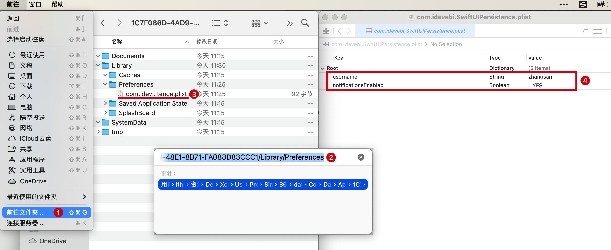

# SwiftUI 学习日志（8）：数据持久化

欢迎来到《SwiftUI 学习日志》的第 8 篇文章。在本篇文章中，我们将深入探讨如何在 SwiftUI 中实现**数据持久化**。数据持久化是指将数据存储在设备上，以便在应用关闭后再次打开时能够恢复数据。通过学习如何使用 **UserDefaults**、**文件系统** 和 **SQLite** 进行数据持久化，您将能够构建出更加可靠和用户友好的应用程序。

## 1. 数据持久化简介

### 1.1 什么是数据持久化

**数据持久化**是指将数据存储在设备上，以便在**应用关闭后再次打开时能够恢复数据**。数据持久化在应用开发中是一个重要的功能，它可以确保用户的数据**不会因应用的关闭或设备的重启而丢失**。

### 1.2 数据持久化的作用

数据持久化在应用开发中具有以下重要作用：

- **保存用户设置和偏好**：确保用户的配置在应用重启后仍然有效。
- **缓存数据**：减少网络请求次数，提高应用响应速度。
- **存储大数据**：管理和查询大量数据，提高应用的功能性。
- **数据恢复**：在应用崩溃或设备重启后，能够恢复之前的工作状态。

### 1.3 数据持久化的方式

在 iOS 开发中，有多种方式可以实现数据持久化，包括：

1. **UserDefaults**：适用于存储简单的键值对数据，如用户设置和偏好。
2. **文件系统**：适用于存储文件和较大的数据，如图片和文档。
3. **SQLite**：适用于需要存储复杂的数据模型和关系，且需要精细控制数据库的场景。
4. **Core Data**：苹果官方提供的复杂数据模型和关系存储解决方案，适合高级数据管理。
5. **SwiftData**：苹果官方提供的简化版 Core Data，适合简单关系数据模型。

本文将重点讲解如何使用 **UserDefaults**、**文件系统** 和 **SQLite** 进行数据持久化。如果您对 **Core Data** 或 **SwiftData** 感兴趣，可以在评论区或私信告诉我，我们后续有机会再针对这两个知识点做深入的交流。

## 2. 沙盒目录介绍

在 iOS 中，应用程序运行在一个称为“**沙盒**”的隔离环境中。沙盒包含多个目录，用于存储应用程序不同类型的数据。了解这些目录及其最佳实践有助于我们更好地进行数据持久化。

### 2.1 沙盒目录保存文件及最佳实践

- **Documents**：适合存储用户生成的文件，**iTunes 备份时会包括该目录**。常用于保存应用需要持久化的数据，如文档、配置文件等。
- **Library**：包含两个子目录：
  - **Library/Caches**：适合存储缓存文件，系统可能会在空间不足时清理该目录。常用于存储可再生的数据，如图片缓存、网络请求缓存等。
  - **Library/Preferences**：适合存储用户偏好设置，**`UserDefaults` 的数据保存在此目录**。
- **tmp**：适合存储临时文件，**系统可能会在应用不运行时删除这些文件**。常用于存储短期使用的数据，如下载中的文件、临时生成的文件等。

在实际开发中，选择适合的目录存储文件非常重要。以下是一些**最佳实践**：

- **用户生成的数据**：存储在 **Documents** 目录中。
- **可再生的数据**：存储在 **Library/Caches** 目录中。
- **用户偏好设置**：使用 **UserDefaults**，存储在 **Library/Preferences** 目录中。
- **临时数据**：存储在 **tmp** 目录中。

## 3. 使用 UserDefaults 进行数据持久化

### 3.1 UserDefaults 简介

**`UserDefaults`** 是一个简单的**键值对**存储系统，适用于**存储用户设置和偏好**。它提供了快速和轻量级的存储方式，可以在应用中轻松实现数据持久化。

### 3.2 示例代码

以下示例展示了如何使用 `UserDefaults` 存储和读取用户的设置。

```swift
/// ### 3.2 使用 UserDefaults 进行数据持久化
struct UserDefaultsExampleView: View {
    // 从 UserDefaults 加载 username，否则使用 ""
    @State private var username: String = UserDefaults.standard.string(forKey: "username") ?? ""
    // 从 UserDefaults 加载 notificationsEnabled，否则默认为 false
    @State private var notificationsEnabled: Bool = UserDefaults.standard.bool(forKey: "notificationsEnabled")
    
    var body: some View {
        VStack {
            TextField("用户名", text: $username)
                .padding()
                .border(Color.gray)
            Toggle("启用通知", isOn: $notificationsEnabled)
                .padding()
            Button("保存设置") {
                saveSettings()
            }
            .padding()
        }
        .padding()
    }
    
    /// 保存设置
    func saveSettings() {
        UserDefaults.standard.set(username, forKey: "username")
        UserDefaults.standard.set(notificationsEnabled, forKey: "notificationsEnabled")
        
        // 输出沙盒目录
        print(userDefaultsDirectory)
    }
    
    /// UserDefaults 数据存储目录
    var userDefaultsDirectory: String {
        let userDefaultsPath = NSSearchPathForDirectoriesInDomains(.libraryDirectory, .userDomainMask, true).first!
        let preferencesPath = (userDefaultsPath as NSString).appendingPathComponent("Preferences")
        
        return preferencesPath
    }
}

#Preview {
    UserDefaultsExampleView()
}
```


### 3.3 在沙盒中查看被持久化的数据

在实际开发中，可以通过以下步骤查看 `UserDefaults` 存储的数据：

1. 打开 **Finder** 并按 `Cmd+Shift+G`，**粘贴**从控制台**复制**的路径。
2. 进入 `Library/Preferences` 目录，找到以应用 `Bundle Identifier` 命名的 `plist` 文件，双击使用 **Xcode** 打开查看 `UserDefaults` 存储的数据。



## 4. 使用文件系统进行数据持久化

### 4.1 文件系统简介

**文件系统** 适用于存储**较大的数据**和**文件**，如**图片**、**文档**等。iOS 要求应用程序的所有文件都保存在沙盒目录中。

### 4.2 常规文件读写示例

以下示例展示了如何使用文件系统存储和读取用户数据。

```swift
/// ### 4.2 使用文件系统进行数据持久化
struct FileSystemExampleView: View {
    @State private var username: String = ""
    @State private var savedUsername: String = ""
    
    /// 文档目录路径
    var documentsDirectory: URL {
        let paths = FileManager.default.urls(for: .documentDirectory, in: .userDomainMask)
        return paths[0]
    }
    
    var body: some View {
        VStack {
            TextField("用户名", text: $username)
                .padding()
                .border(Color.gray)
            Button("保存用户名") {
                saveUsernameToFile(username)
            }
            .padding()
            Button("读取用户名") {
                savedUsername = readUsernameFromFile() ?? "未找到用户名"
            }
            .padding()
            Text(savedUsername)
        }
        .padding()
    }
    
    /// 保存用户名到文件
    func saveUsernameToFile(_ username: String) {
        let fileURL = documentsDirectory.appendingPathComponent("username.txt")
        do {
            try username.write(to: fileURL, atomically: true, encoding: .utf8)
        } catch {
            print("保存用户名失败：\(error.localizedDescription)")
        }
    }
    
    /// 从文件读取用户名
    func readUsernameFromFile() -> String? {
        let fileURL = documentsDirectory.appendingPathComponent("username.txt")
        do {
            return try String(contentsOf: fileURL, encoding: .utf8)
        } catch {
            print("读取用户名失败：\(error.localizedDescription)")
            return nil
        }
    }
}

#Preview {
    FileSystemExampleView()
}
```


### 4.3 对象的序列化和反序列化

为了**存储复杂对象**，我们可以将对象**序列化为 JSON 数据**，并将其写入文件。在需要时再将其反序列化为对象。

```swift
/// ### 4.3 对象的序列化和反序列化
/// 用户模型
struct User: Codable {
    var username: String
    var age: Int
}

struct ObjectSerializationExampleView: View {
    @State private var user = User(username: "壹刀流", age: 30)
    @State private var savedUser: User?
    
    /// 文档目录路径
    var documentsDirectory: URL {
        let paths = FileManager.default.urls(for: .documentDirectory, in: .userDomainMask)
        return paths[0]
    }

    var body: some View {
        VStack {
            Text("用户名: \(user.username)")
            Text("年龄: \(user.age)")
            Button("保存用户") {
                saveUserToFile(user)
            }
            .padding()
            Button("读取用户") {
                savedUser = readUserFromFile()
            }
            .padding()
            if let savedUser = savedUser {
                Text("读取到的用户名: \(savedUser.username)")
                Text("读取到的年龄: \(savedUser.age)")
            }
        }
        .padding()
    }
    

    func saveUserToFile(_ user: User) {
        let fileURL = documentsDirectory.appendingPathComponent("user.json")
        do {
            let data = try JSONEncoder().encode(user)
            try data.write(to: fileURL)
        } catch {
            print("保存用户失败：\(error.localizedDescription)")
        }
    }

    func readUserFromFile() -> User? {
        let fileURL = documentsDirectory.appendingPathComponent("user.json")
        do {
            let data = try Data(contentsOf: fileURL)
            return try JSONDecoder().decode(User.self, from: data)
        } catch {
            print("读取用户失败：\(error.localizedDescription)")
            return nil
        }
    }
}

#Preview {
    ObjectSerializationExampleView()
}
```


## 5. 使用 SQLite 进行数据持久化

### 5.1 SQLite 简介

**SQLite** 是一个**轻量级的关系数据库管理系统**，适用于嵌入式数据库应用。它提供了强大的数据管理和查询功能，适合存储复杂的数据模型和高频读写操作。

### 5.2 SQLite 第三方框架

在 Swift 中使用 SQLite，我们可以借助第三方框架来简化开发过程。常用的 SQLite 框架有 [SQLite.swift](https://github.com/stephencelis/SQLite.swift) 和 [GRDB.swift](https://github.com/groue/GRDB.swift)。本文将使用 **SQLite.swift** 框架进行演示。

- 选择 `File` -> `Add Package Dependencies...`。
- 输入并搜索 <https://github.com/stephencelis/SQLite.swift>。
- 点击 `Add Package` 按钮添加依赖包。


### 5.3 示例代码（使用第三方框架）

以下示例展示了如何使用 SQLite.swift 进行数据持久化。

```swift
import SwiftUI
import SQLite

/// ### 5.3 使用 SQLite 进行数据持久化
struct SQLiteExampleView: SwiftUI.View {
    @State private var username: String = ""
    @State private var savedUsername: String = ""
    
    /// 数据库连接对象
    private var db: Connection?
    /// 用户表
    private var usersTable = Table("users")
    /// ID 列
    private var idColumn = Expression<Int64>("id")
    /// 用户名列
    private var usernameColumn = Expression<String>("username")
    
    /// 文档目录路径
    var documentsDirectory: URL {
        let paths = FileManager.default.urls(for: .documentDirectory, in: .userDomainMask)
        return paths[0]
    }
    
    init() {
        do {
            // 连接到数据库
            db = try Connection(documentsDirectory.appendingPathComponent("users.sqlite3").path)
            // 如果不存在用户表，则创建
            try db?.run(
                usersTable.create(ifNotExists: true) { t in
                    t.column(idColumn, primaryKey: .autoincrement)
                    t.column(usernameColumn)
                })
        } catch {
            print("数据库连接失败：\(error.localizedDescription)")
        }
    }
    
    var body: some SwiftUI.View {
        VStack {
            TextField("用户名", text: $username)
                .padding()
                .border(Color.gray)
            Button("保存用户名") {
                saveUsernameToDatabase(username)
            }
            .padding()
            Button("读取用户名") {
                savedUsername = readUsernameFromDatabase() ?? "未找到用户名"
            }
            .padding()
            Text(savedUsername)
        }
        .padding()
    }
    
    /// 将用户名保存至数据库
    func saveUsernameToDatabase(_ username: String) {
        guard let db = db else { return }
        do {
            try db.run(usersTable.insert(usernameColumn <- username))
        } catch {
            print("保存用户名失败：\(error.localizedDescription)")
        }
    }
    
    /// 从数据库读取用户名
    func readUsernameFromDatabase() -> String? {
        guard let db = db else { return nil }
        do {
            if let user = try db.pluck(usersTable) {
                return user[usernameColumn]
            }
        } catch {
            print("读取用户名失败：\(error.localizedDescription)")
        }
        return nil
    }
}

#Preview {
    SQLiteExampleView()
}
```


**提示**：在使用 `SQLite.swift` 框架操作 `SQLite` 数据库时，需要解决 **`View` 的歧义问题**。这种歧义通常是因为有**多个库或者框架定义了相同的类型名称**。在这种情况下，你需要明确地指定类型的完全限定名称，如：`SwiftUI.View`。

## 6. 综合案例：新闻应用缓存

### 6.1 案例简介

在这个综合案例中，我们将创建一个简单的新闻应用，展示如何结合**网络请求**和**数据持久化**来实现新闻数据的缓存。我们将使用 SQLite 存储新闻数据，并实现以下功能：

1. **下拉刷新最新新闻**：从服务器获取最新新闻数据并更新本地缓存。
2. **定时刷新加载最新新闻**：每隔一段时间自动刷新新闻数据。

### 6.2 数据模型

首先，我们定义新闻数据模型，以便于解析和存储。

```swift
import Foundation

/// ### 6.2 新闻数据模型
struct Article: Identifiable, Codable {
    /// 新闻 ID
    var id: UUID
    /// 新闻标题
    var title: String
    /// 新闻内容
    var content: String
    /// 发布时间
    var publishedAt: String
    /// 是否多图
    var isMultiImage: Bool
    /// 图像 URL 字符串数组（可选）
    var images: [String]?
    /// 新闻作者
    var author: Author
    
    struct Author: Codable {
        /// 作者姓名
        var name: String
        /// 用户头像 URL 字符串
        var profileImageURL: String
    }
}

/// 新闻响应模型，返回新闻数据数组
struct NewsResponse: Codable {
    var articles: [Article]
}
```

### 6.3 使用 Mock 数据与 SQLite 结合进行数据持久化

以下是新闻视图的实现，包含了使用 Mock 数据和 SQLite 进行数据持久化的示例代码。

#### 6.3.1 新闻视图展示

```swift
import SwiftUI
import SQLite

/// ### 6.3.1 新闻视图展示
struct NewsView: SwiftUI.View {
    /// 新闻列表数组
    @State private var articles: [Article] = []
    /// 定时器
    @State private var timer: Timer?
    /// 默认新闻页面
    @State private var page: Int = 1
    
    /// 数据库连接对象
    private var db: Connection?
    /// 数据表及数据列定义
    private var articlesTable = Table("articles")
    private var idColumn = Expression<String>("id")
    private var titleColumn = Expression<String>("title")
    private var contentColumn = Expression<String>("content")
    private var publishedAtColumn = Expression<String>("publishedAt")
    private var isMultiImageColumn = Expression<Bool>("isMultiImage")
    private var imagesColumn = Expression<String>("images")
    private var authorNameColumn = Expression<String>("authorName")
    private var authorProfileImageURLColumn = Expression<String>("authorProfileImageURL")
    
    /// 文档目录路径
    var documentsDirectory: URL {
        let paths = FileManager.default.urls(for: .documentDirectory, in: .userDomainMask)
        return paths[0]
    }
    
    init() { 
        setupDatabase()
        // 获取缓存新闻
        fetchCachedArticles()
        // 启动始终定时刷新
        startTimer()
    }
    
    var body: some SwiftUI.View {
        NavigationView {
            List {
                ForEach(articles) { article in
                    VStack(alignment: .leading) {
                        Text(article.title)
                            .font(.headline)
                        Text("作者: \(article.author.name)")
                            .font(.subheadline)
                        Text(article.content)
                            .font(.body)
                    }
                }
                .onAppear {
                    // 加载更多新闻
                    loadMoreArticles()
                }
                if articles.isEmpty {
                    Text("加载中...")
                        .onAppear {
                            // 获取新闻
                            fetchArticles()
                        }
                }
            }
            .refreshable {
                // 获取新闻
                fetchArticles()
            }
            .navigationTitle("新闻列表")
        }
    }
    
    /// 设置数据库
    mutating func setupDatabase() {
        do {
            db = try Connection(documentsDirectory.appendingPathComponent("news.sqlite3").path)
            try db?.run(articlesTable.create(ifNotExists: true) { t in
                t.column(idColumn, primaryKey: true)
                t.column(titleColumn)
                t.column(contentColumn)
                t.column(publishedAtColumn)
                t.column(isMultiImageColumn)
                t.column(imagesColumn)
                t.column(authorNameColumn)
                t.column(authorProfileImageURLColumn)
            })
        } catch {
            print("数据库连接失败：\(error.localizedDescription)")
        }
    }
}
```

#### 6.3.2 Mock 数据和新闻缓存

```swift
/// ### 6.3.2 Mock 数据和新闻缓存
extension NewsView {
    /// 从服务器获取新闻数据
    func fetchArticles() {
        print("从服务器获取新闻数据")
        
        let mockData = """
        {
            "articles": [
                {
                    "id": "b1b1b1b1-b1b1-b1b1-b1b1-b1b1b1b1b1b1",
                    "title": "新闻标题 1",
                    "content": "新闻内容 1",
                    "publishedAt": "2024-06-01",
                    "isMultiImage": false,
                    "images": [],
                    "author": {
                        "name": "作者 1",
                        "profileImageURL": "https://example.com/avatar1.jpg"
                    }
                },
                {
                    "id": "c1c1c1c1-c1c1-c1c1-c1c1-c1c1c1c1c1c1",
                    "title": "新闻标题 2",
                    "content": "新闻内容 2",
                    "publishedAt": "2024-06-02",
                    "isMultiImage": true,
                    "images": ["https://example.com/image1.jpg", "https://example.com/image2.jpg"],
                    "author": {
                        "name": "作者 2",
                        "profileImageURL": "https://example.com/avatar2.jpg"
                    }
                }
            ]
        }
        """
        
        if let data = mockData.data(using: .utf8) {
            let decoder = JSONDecoder()
            do {
                let response = try decoder.decode(NewsResponse.self, from: data)
                if page == 1 {
                    articles = response.articles
                } else {
                    articles.append(contentsOf: response.articles)
                }
                saveArticlesToCache(response.articles)
                page += 1
            } catch {
                print("解析 Mock 数据失败：\(error.localizedDescription)")
            }
        }
    }
    
    /// 从缓存获取新闻数据
    func fetchCachedArticles() {
        guard let db = db else { return }
        do {
            let cachedArticles = try db.prepare(articlesTable)
            articles = cachedArticles.map { row in
                Article(
                    id: UUID(uuidString: row[idColumn])!,
                    title: row[titleColumn],
                    content: row[contentColumn],
                    publishedAt: row[publishedAtColumn],
                    isMultiImage: row[isMultiImageColumn],
                    images: row[imagesColumn].components(separatedBy: ","),
                    author: Article.Author(
                        name: row[authorNameColumn],
                        profileImageURL: row[authorProfileImageURLColumn]
                    )
                )
            }
        } catch {
            print("获取缓存数据失败：\(error.localizedDescription)")
        }
    }
    
    /// 保存新闻数据到缓存
    func saveArticlesToCache(_ articles: [Article]) {
        guard let db = db else { return }
        do {
            for article in articles {
                try db.run(articlesTable.insert(
                    or: .replace,
                    idColumn <- article.id.uuidString,
                    titleColumn <- article.title,
                    contentColumn <- article.content,
                    publishedAtColumn <- article.publishedAt,
                    isMultiImageColumn <- article.isMultiImage,
                    imagesColumn <- article.images?.joined(separator: ",") ?? "",
                    authorNameColumn <- article.author.name,
                    authorProfileImageURLColumn <- article.author.profileImageURL
                ))
            }
        } catch {
            print("保存缓存数据失败：\(error.localizedDescription)")
        }
    }
    
    /// 加载更多新闻
    func loadMoreArticles() {
        fetchArticles()
    }
    
    /// 启动定时器
    func startTimer() {
        timer = Timer.scheduledTimer(withTimeInterval: 60 * 60, repeats: true) { _ in
            page = 1
            fetchArticles()
        }
    }
}

#Preview {
    NewsView()
}
```


### 6.4 案例小结

在这个案例中，我们展示了如何使用 Mock 数据和 SQLite 结合实现新闻数据的持久化。通过这种方式，我们**可以在开发初期使用 Mock 数据进行测试，确保功能实现没有问题。在前后端联调时，可以方便地切换到使用 Alamofire 进行网络请求，从而获取真实的新闻数据**。

在实际开发中，Mock 数据和 Alamofire 的最佳实践如下：

- **开发初期**：使用 Mock 数据进行功能测试，确保界面和逻辑正确。
- **前后端联调**：切换到使用 Alamofire 进行网络请求，获取真实数据进行测试。

通过这种方式，我们可以在开发的不同阶段灵活应对不同的需求，提高开发效率和代码质量。

## 7. 数据持久化的最佳实践和开发建议

### 7.1 UserDefaults

**UserDefaults** 适用于存储**简单的键值对数据**，如**用户设置和偏好**。使用时需要注意以下几点：

- **数据量**：尽量存储小数据量，避免性能问题。
- **敏感数据**：**不要存储敏感数据，如密码等，建议使用钥匙串（Keychain）存储**。

### 7.2 文件系统

**文件系统** 适用于存储文件和较大的数据，如图片和文档。使用时需要注意以下几点：

- **目录选择**：根据数据类型选择适当的目录，如 Documents、Caches 等。
- **数据备份**：**重要数据应定期备份，避免数据丢失**。

### 7.3 SQLite

**SQLite** 适用于需要存储**复杂的数据模型和关系**，且需要精细控制数据库的场景。使用时需要注意以下几点：

- **数据结构**：设计合理的数据表结构，提高查询效率。
- **事务管理**：**使用事务管理保证数据一致性**。

### 7.4 技术选型建议

在实际开发中，应根据数据特性和应用需求选择合适的数据持久化方式：

- **简单配置**：使用 UserDefaults。
- **文件存储**：使用文件系统。
- **复杂数据**：使用 SQLite。

通过合理选择数据持久化方式，您可以构建出更加可靠和高效的应用程序。

## 8. 结语

在本篇文章中，我们深入探讨了 SwiftUI 中的**数据持久化**，包括使用 **UserDefaults**、**文件系统** 和 **SQLite** 进行数据存储和管理。通过综合案例，我们展示了如何结合这些技术实现**数据的缓存**和**定期更新**。希望您对 SwiftUI 的数据持久化有了更深入的理解。下一篇文章将进一步探讨 **SwiftUI 的列表和导航**，敬请期待。

> - 本专栏文档及配套代码的 GitHub 地址：[壹刀流的技术人生](https://github.com/IdEvEbI/idevebi.github.io)。
> - 本文档配套项目名称：`SwiftUIPersistence`。
