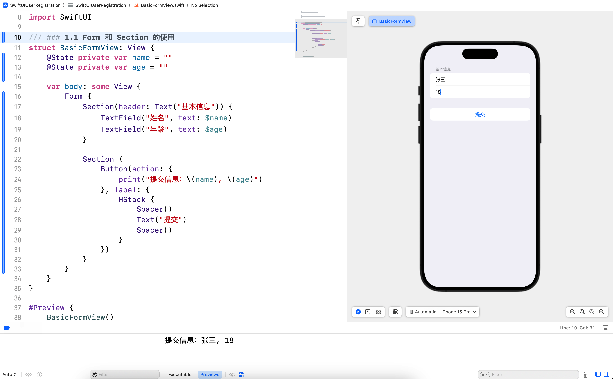
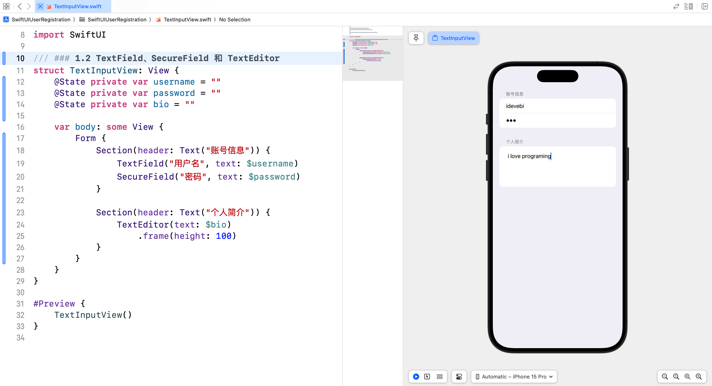
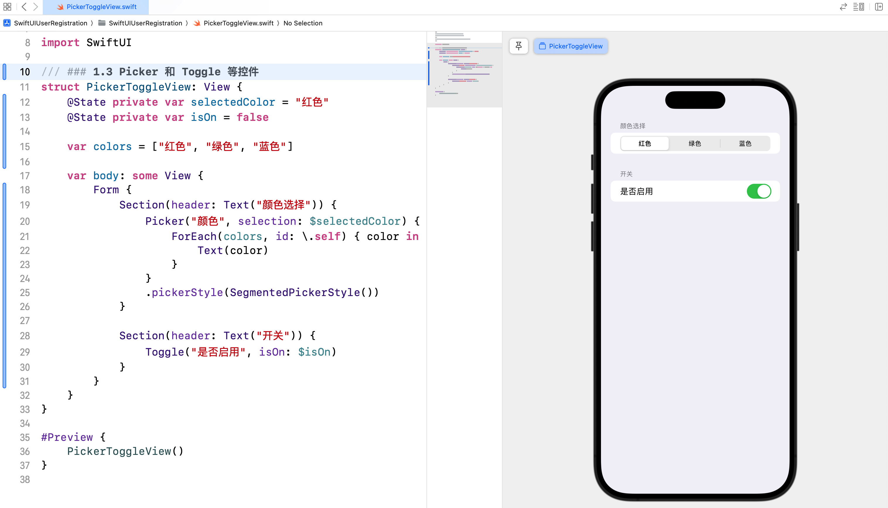
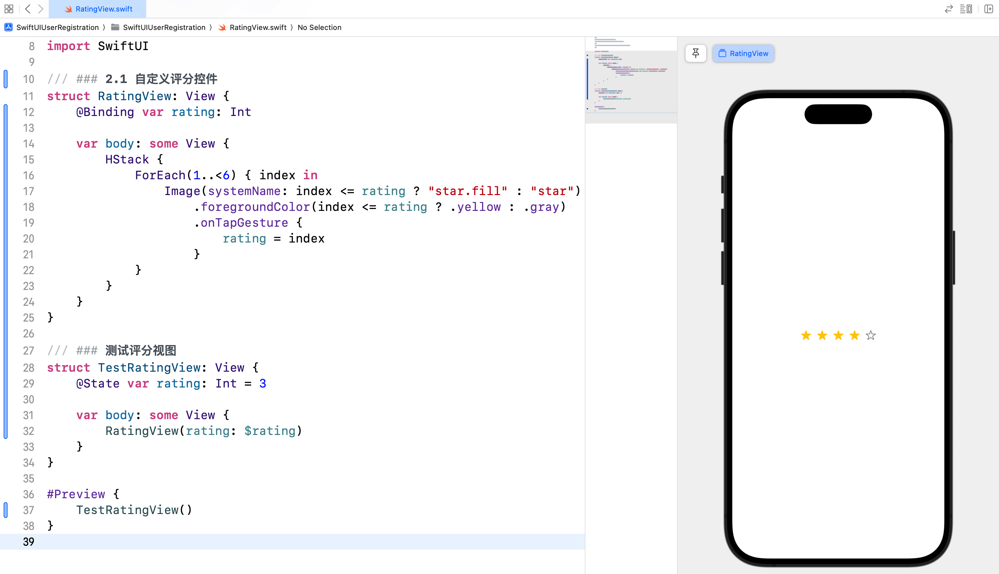
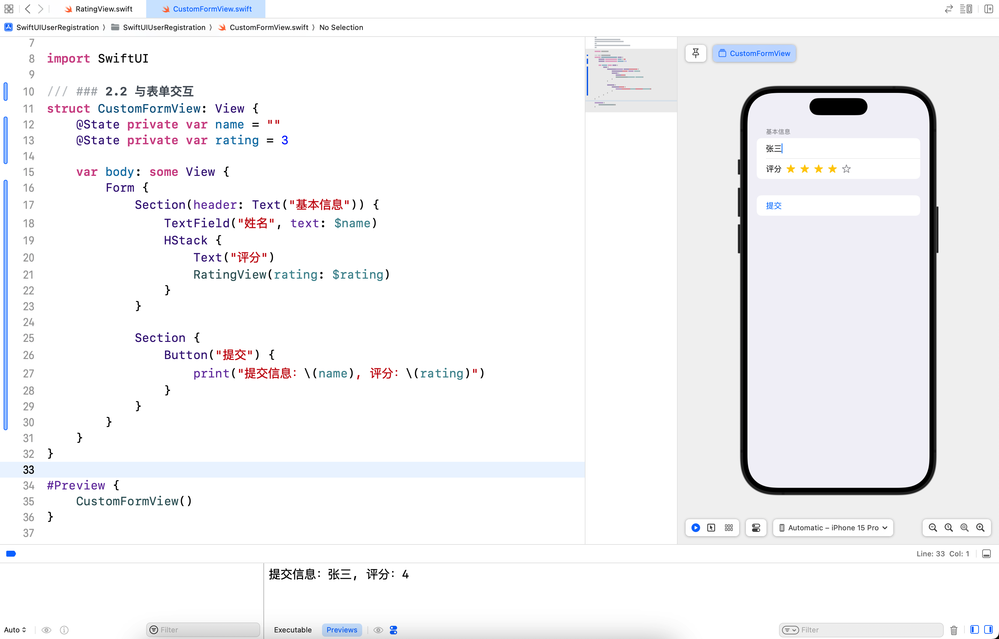

# SwiftUI 学习日志（8）：表单和用户输入

在本篇文章中，咱们将探讨 SwiftUI 中的**表单**和**用户输入**。表单是应用程序中常见的组件，用于收集用户输入。SwiftUI 提供了多种控件，帮助我们轻松创建和管理表单。

## 1. 表单

### 1.1 Form 和 Section 的使用

`Form` 是 SwiftUI 中用于创建表单的容器视图，`Section` 用于对表单内容进行分组。

```swift
struct BasicFormView: View {
    @State private var name = ""
    @State private var age = ""
    
    var body: some View {
        Form {
            Section(header: Text("基本信息")) {
                TextField("姓名", text: $name)
                TextField("年龄", text: $age)
            }
            
            Section {
                Button(action: {
                    print("提交信息：\(name), \(age)")
                }, label: {
                    HStack {
                        Spacer()
                        Text("提交")
                        Spacer()
                    }
                })
            }
        }
    }
}

#Preview {
    BasicFormView()
}
```



### 1.2 TextField、SecureField 和 TextEditor

`TextField`、`SecureField` 和 `TextEditor` 是用于文本输入的控件。

```swift
struct TextInputView: View {
    @State private var username = ""
    @State private var password = ""
    @State private var bio = ""
    
    var body: some View {
        Form {
            Section(header: Text("账号信息")) {
                TextField("用户名", text: $username)
                SecureField("密码", text: $password)
            }
            
            Section(header: Text("个人简介")) {
                TextEditor(text: $bio)
                    .frame(height: 100)
            }
        }
    }
}

#Preview {
    TextInputView()
}
```



### 1.3 Picker 和 Toggle 等控件

`Picker` 和 `Toggle` 是用于选择和开关的控件。

```swift
struct PickerToggleView: View {
    @State private var selectedColor = "红色"
    @State private var isOn = false
    
    var colors = ["红色", "绿色", "蓝色"]
    
    var body: some View {
        Form {
            Section(header: Text("颜色选择")) {
                Picker("颜色", selection: $selectedColor) {
                    ForEach(colors, id: \.self) { color in
                        Text(color)
                    }
                }
                .pickerStyle(SegmentedPickerStyle())
            }
            
            Section(header: Text("开关")) {
                Toggle("是否启用", isOn: $isOn)
            }
        }
    }
}

#Preview {
    PickerToggleView()
}
```



## 2. 自定义输入控件

### 2.1 自定义控件的实现

我们可以通过组合现有的 SwiftUI 控件来自定义输入控件。例如，创建一个**自定义的评分控件**。

```swift
struct RatingView: View {
    @Binding var rating: Int
    
    var body: some View {
        HStack {
            ForEach(1..<6) { index in
                Image(systemName: index <= rating ? "star.fill" : "star")
                    .foregroundColor(index <= rating ? .yellow : .gray)
                    .onTapGesture {
                        rating = index
                    }
            }
        }
    }
}

/// ### 测试评分视图
struct TestRatingView: View {
    @State var rating: Int = 3
    
    var body: some View {
        RatingView(rating: $rating)
    }
}

#Preview {
    TestRatingView()
}
```



### 2.2 与表单交互

将自定义控件集成到表单中，并与其他输入控件交互。

```swift
struct CustomFormView: View {
    @State private var name = ""
    @State private var rating = 3
    
    var body: some View {
        Form {
            Section(header: Text("基本信息")) {
                TextField("姓名", text: $name)
                HStack {
                    Text("评分")
                    RatingView(rating: $rating)
                }
            }
            
            Section {
                Button("提交") {
                    print("提交信息：\(name), 评分：\(rating)")
                }
            }
        }
    }
}

#Preview {
    CustomFormView()
}
```



## 3. 综合案例：用户注册表单

### 3.1 案例简介

咱们将创建一个用户注册表单，包含多个输入控件和自定义控件，展示如何收集和处理用户输入。

### 3.2 实现步骤

1. **定义用户数据模型**：定义一个 `User` 结构体，包含用户的基本信息。
2. **创建注册表单视图**：创建一个视图，用于显示注册表单并收集用户输入。
3. **处理表单提交**：实现表单提交功能，验证并处理用户输入的数据。

### 3.3 案例实现

#### 3.3.1 定义用户数据模型

新建 `User.swift` 并输入以下代码：

```swift
import Foundation

struct User {
    var username: String    // 用户名
    var password: String    // 密码
    var email: String       // 电子邮件
    var bio: String         // 简介
    var rating: Int         // 评分
}
```

#### 3.3.2 创建注册表单视图

新建 `RegistrationView.swift` 并输入以下代码：

```swift
import SwiftUI

struct RegistrationView: View {
    @State private var username = ""
    @State private var password = ""
    @State private var email = ""
    @State private var bio = ""
    @State private var rating = 3
    @State private var isRegistered = false
    
    var body: some View {
        NavigationView {
            Form {
                Section(header: Text("账号信息")) {
                    TextField("用户名", text: $username)
                    SecureField("密码", text: $password)
                    TextField("邮箱", text: $email)
                }
                
                Section(header: Text("个人简介")) {
                    TextEditor(text: $bio)
                        .frame(height: 100)
                }
                
                Section(header: Text("评分")) {
                    HStack {
                        Text("评分")
                        RatingView(rating: $rating)
                    }
                }
                
                Section {
                    Button("注册") {
                        registerUser()
                    }
                }
            }
            .navigationTitle("用户注册")
            .alert(isPresented: $isRegistered) {
                Alert(
                    title: Text("注册成功"),
                    message: Text("欢迎，\(username)！"),
                    dismissButton: .default(Text("确定"))
                )
            }
        }
    }
    
    func registerUser() {
        let user = User(username: username, password: password, email: email, bio: bio, rating: rating)
        print("注册用户信息：\(user)")
        isRegistered = true
    }
}

#Preview {
    RegistrationView()
}
```


在这个综合案例中，我们创建了一个**用户注册表单**，展示了如何通过多个输入控件和自定义控件收集和处理用户输入。

## 4. 结语

在这篇文章中，我们深入探讨了 SwiftUI 的**表单**和**用户输入**，并通过一个用户注册表单的综合案例将所学知识应用到实践中。希望你对 SwiftUI 的表单和用户输入有了更深入的理解。下一篇文章将进一步探讨 SwiftUI 的网络请求与数据处理，敬请期待。

> 本专栏文档及配套代码的 GitHub 地址：[壹刀流的技术人生](https://github.com/IdEvEbI/idevebi.github.io)。
