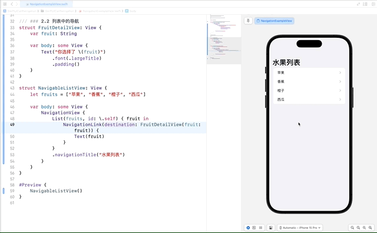

# SwiftUI 学习日志（9）：列表和导航

欢迎来到《SwiftUI 学习日志》的第 9 篇文章。在本篇文章中，我们将深入探讨如何在 SwiftUI 中实现**列表**和**导航**。通过学习如何创建**简单列表**、**自定义列表单元格**，以及**在列表中实现导航**，您将能够构建出更加功能完善和用户友好的应用程序。

## 1. 列表

### 1.1 创建简单列表

在 SwiftUI 中，`List` 视图用于**创建和显示列表**，我们可以使用 `List` 来**展示一组数据**。`List` 视图的**初始化方法**之一是 `List(_:id:content:)`，它接受一个标识符参数 `id`，用于**唯一标识列表中的每个元素**。

```swift
/// ### 1.1 创建简单列表
struct SimpleListView: View {
    let items = ["苹果", "香蕉", "橙子", "西瓜"]
    
    var body: some View {
        List(items, id: \.self) { item in
            Text(item)
        }
    }
}

#Preview {
    SimpleListView()
}
```


#### `id: \.self` 的作用

1. **唯一标识符**：在列表中，**每个元素需要有一个唯一标识符**，以便 SwiftUI 能够有效地识别和管理每个视图。当你提供 `id: \.self` 时，SwiftUI 使用每个字符串值（例如 `"苹果"`、`"香蕉"` 等）作为唯一标识符。这是有效的，因为在这个列表中，每个字符串都是唯一的。
2. **确保高效更新**：如果列表中的数据发生变化，SwiftUI **可以通过这些唯一标识符有效地更新视图**，而无需重新加载整个列表。

### 1.2 自定义列表单元格

在实际应用中，我们经常需要展示更复杂的列表项。**通过自定义列表单元格，您可以将多种视图组合在一起，以显示更加丰富的信息**。例如，可以添加图标、图片、标题、描述等。

```swift
/// ### 1.2 自定义列表单元格
struct CustomListView: View {
    let items = ["苹果", "香蕉", "橙子", "西瓜"]
    
    var body: some View {
        List(items, id: \.self) { item in
            HStack {
                Image(systemName: "star.fill")
                    .foregroundColor(.yellow)
                Text(item)
                    .font(.headline)
            }
        }
    }
}

#Preview {
    CustomListView()
}
```


在这个示例中，我们使用 `HStack` 将一个图标和一个文本并排显示。`Image(systemName:)` 创建了一个系统图标，`Text(item)` 显示了列表项的文本内容。

### 1.3 动态列表

**动态列表可以随着数据的变化而自动更新**。在 SwiftUI 中，您可以使用 `ForEach` 和自定义的数据模型来创建动态列表。动态列表**通常用于显示从网络请求或数据库中获取的数据**。

```swift
/// ### 1.3 动态列表
struct Fruit: Identifiable {
    /// ID 唯一标识符
    var id = UUID()
    /// 名称
    var name: String
}

struct DynamicListView: View {
    @State private var fruits = [
        Fruit(name: "苹果"),
        Fruit(name: "香蕉"),
        Fruit(name: "橙子"),
        Fruit(name: "西瓜")
    ]
    @State private var newFruitName = ""
    
    var body: some View {
        VStack {
            HStack {
                TextField("输入水果名称", text: $newFruitName)
                    .textFieldStyle(RoundedBorderTextFieldStyle())
                    .padding()
                Button("添加") {
                    addFruit()
                }
                .padding()
            }
            List(fruits) { fruit in
                Text(fruit.name)
                    .font(.headline)
            }
        }
        .padding()
    }
    
    /// 添加水果
    private func addFruit() {
        // 判断内容是否为空
        guard !newFruitName.isEmpty else { return }
        // 新建水果对象
        let newFruit = Fruit(name: newFruitName)
        // 添加到 fruits 数组
        fruits.append(newFruit)
        // 清空 newFruitName 达到清空文本框的效果
        newFruitName = ""
    }
}

#Preview {
    DynamicListView()
}
```


在这个示例中，我们定义了一个 `Fruit` 数据模型，它遵循 `Identifiable` 协议，这样 SwiftUI 可以识别每个水果项。然后，我们创建一个 `List`，使用 `ForEach` 遍历 `fruits` 数组，并为每个水果项创建一个 `Text` 视图。

同时我们在列表上方增加了一个**输入框**和**添加按钮**，用户输入的新的水果会被添加到 `fruits` 数组，同时随着数组内容的变化，列表显示可以自动更新。

### 1.4 Section 和 GroupedListStyle

`Section` 允许我们将列表分组，并使用 `GroupedListStyle` 设置列表的样式。这样可以**更好地组织和显示数据**。

```swift
/// ### 1.4 Section 和 GroupedListStyle
struct SectionedListView: View {
    var body: some View {
        List {
            Section(header: Text("水果")) {
                Text("苹果")
                Text("香蕉")
            }
            Section(header: Text("蔬菜")) {
                Text("西红柿")
                Text("黄瓜")
            }
        }
        .listStyle(GroupedListStyle())
    }
}

#Preview {
    SectionedListView()
}
```


在这个示例中，我们使用 `Section` 将列表分成两部分：**水果**和**蔬菜**。每个 `Section` 有一个头部标题，并包含相关的列表项。`GroupedListStyle` 使列表看起来更加分组和有组织。

### 1.5 动态列表和静态列表

在一个列表中，我们可以同时使用**动态和静态数据**。通过这种方式，可以展示一些固定的和动态变化的数据。

```swift
/// ### 1.5 动态列表和静态列表
struct MixedListView: View {
    let dynamicItems = ["苹果", "香蕉", "橙子"]
    
    var body: some View {
        List {
            Section(header: Text("动态列表")) {
                ForEach(dynamicItems, id: \.self) { item in
                    Text(item)
                }
            }
            Section(header: Text("静态列表")) {
                Text("西瓜")
                Text("梨")
            }
        }
        .listStyle(GroupedListStyle())
    }
}

#Preview {
    MixedListView()
}
```


在这个示例中，我们创建了一个混合列表，其中一部分是动态数据（使用 `ForEach`），另一部分是静态数据（直接在列表中定义）。这种组合使用可以让我们**在一个列表中展示多种类型的数据**。

### 1.6 复杂单元格的定制

对于需要展示复杂信息的列表项，我们可以**自定义列表单元格**，以包含多种视图和布局。

```swift
/// ### 1.6 复杂单元格的定制
struct ComplexItemView: View {
    var title: String
    var subtitle: String
    var images: [String]
    
    var body: some View {
        VStack(alignment: .leading) {
            Text(title)
                .font(.headline)
            Text(subtitle)
                .font(.subheadline)
                .foregroundColor(.gray)
            HStack {
                ForEach(images, id: \.self) { image in
                    Image(systemName: image)
                        .resizable()
                        .frame(width: 50, height: 50)
                        .cornerRadius(10)
                }
            }
        }
        .padding()
    }
}

struct ComplexListView: View {
    let items = [
        ("新闻标题1", "发布时间：2024-01-01", ["photo", "globe", "heart", "house", "gear"]),
        ("新闻标题2", "发布时间：2024-01-02", ["cart", "bell", "camera", "book"]),
        ("新闻标题3", "发布时间：2024-01-03", [])
    ]
    
    var body: some View {
        List(items, id: \.0) { item in
            ComplexItemView(title: item.0, subtitle: item.1, images: item.2)
        }
    }
}

#Preview {
    ComplexListView()
}
```


在这个示例中，`ComplexItemView` 显示了新闻的标题、发布时间和图片。通过 `VStack` 和 `HStack`，我们可以轻松地组织和排列这些视图。

## 2. 导航

### 2.1 使用 NavigationView 和 NavigationLink

**NavigationView** 是创建导航界面的基础，它可以容纳一个或多个 `NavigationLink`，用于在视图之间导航。`NavigationLink` 用于创建可导航的链接。

```swift
/// ### 2.1 使用 NavigationView 和 NavigationLink
struct NavigationExampleView: View {
    var body: some View {
        NavigationView {
            VStack {
                NavigationLink(destination: Text("这是第二个视图")) {
                    Text("点击导航到第二个视图")
                        .padding()
                        .background(.blue)
                        .foregroundColor(.white)
                        .cornerRadius(10)
                }
            }
            .navigationTitle("导航示例")
        }
    }
}

#Preview {
    NavigationExampleView()
}
```


在这个示例中，`NavigationLink` 用于创建一个从当前视图到第二个视图的链接。当用户点击 `Text` 视图时，应用会导航到目标视图。

### 2.2 列表中的导航

在列表中使用 `NavigationLink` 可以实现从列表项到详细视图的导航。这使得我们可以点击列表中的项，进入到更详细的视图。

```swift
/// ### 2.2 列表中的导航
struct FruitDetailView: View {
    var fruit: String
    
    var body: some View {
        Text("你选择了 \(fruit)")
            .font(.largeTitle)
            .padding()
    }
}

struct NavigableListView: View {
    let fruits = ["苹果", "香蕉", "橙子", "西瓜"]
    
    var body: some View {
        NavigationView {
            List(fruits, id: \.self) { fruit in
                NavigationLink(destination: FruitDetailView(fruit: fruit)) {
                    Text(fruit)
                }
            }
            .navigationTitle("水果列表")
        }
    }
}

#Preview {
    NavigableListView()
}
```



在这个示例中，每个列表项都包含一个 `NavigationLink`，它指向 `FruitDetailView`。当用户点击某个水果时，应用会导航到显示该水果详情的视图。

### 2.3 视图间的导航和传递数据

通过 `NavigationLink` 传递数据，实现**视图间的导航和数据传递**。这个功能非常适合在不同的视图之间传递复杂的数据模型。

```swift
/// ### 2.3 视图间的导航和传递数据
struct Item: Identifiable {
    var id = UUID()
    var name: String
    var description: String
}

struct ItemDetailView: View {
    var item: Item
    
    var body: some View {
        VStack {
            Text(item.name)
                .font(.largeTitle)
                .padding()
            Text(item.description)
                .padding()
            Spacer()
        }
        .navigationTitle("详细信息")
    }
}

struct ItemListView: View {
    let items = [
        Item(name: "苹果", description: "一种美味的水果"),
        Item(name: "香蕉", description: "富含钾的水果"),
        Item(name: "橙子", description: "富含维生素C的水果")
    ]
    
    var body: some View {
        NavigationView {
            List(items) { item in
                NavigationLink(destination: ItemDetailView(item: item)) {
                    Text(item.name)
                }
            }
            .navigationTitle("水果列表")
        }
    }
}

#Preview {
    ItemListView()
}
```


在这个示例中，我们定义了一个 `Item` 数据模型，并创建了 `ItemDetailView` 来显示每个项的详细信息。在 `ItemListView` 中，我们使用 `NavigationLink` 将每个列表项链接到对应的 `ItemDetailView`。

### 2.4 模态视图和全屏视图

通过 `sheet` 和 `fullScreenCover` 可以实现**模态视图**和**全屏视图**的展示效果。

```swift
/// ### 2.4 模态视图和全屏视图
struct ModalExampleView: View {
    @State private var showModal = false
    @State private var showFullScreen = false
    
    var body: some View {
        VStack {
            Button("显示模态视图") {
                showModal.toggle()
            }
            .padding()
            .sheet(isPresented: $showModal) {
                ModalContentView(isPresented: $showModal)
            }
            
            Button("显示全屏视图") {
                showFullScreen.toggle()
            }
            .padding()
            .fullScreenCover(isPresented: $showFullScreen) {
                FullScreenContentView(isPresented: $showFullScreen)
            }
        }
    }
}

struct ModalContentView: View {
    @Binding var isPresented: Bool
    
    var body: some View {
        VStack {
            Text("这是一个模态视图")
                .font(.largeTitle)
                .padding()
            Button("关闭") {
                isPresented = false
            }
            .padding()
            .background(.red)
            .foregroundColor(.white)
            .cornerRadius(10)
        }
    }
}

struct FullScreenContentView: View {
    @Binding var isPresented: Bool
    
    var body: some View {
        VStack {
            Text("这是一个全屏视图")
                .font(.largeTitle)
                .padding()
            Button("关闭") {
                isPresented = false
            }
            .padding()
            .background(.red)
            .foregroundColor(.white)
            .cornerRadius(10)
        }
    }
}

#Preview {
    ModalExampleView()
}
```


在这个示例中，`ModalContentView` 和 `FullScreenContentView` 都使用了一个 `@Binding var isPresented: Bool` 来接收绑定的状态，并在关闭按钮的点击事件中将其设置为 `false`，以**关闭模态窗口或全屏视图**。

## 3. 综合案例：购物车案例

### 3.1 案例简介

在这个综合案例中，我们将创建一个购物车应用，展示如何使用**列表展示商品信息**，并通过导航实现**商品详情查看**和**购物车管理**。我们将使用**自定义单元格**展示商品信息，并通过**导航视图**实现商品详情页面和购物车页面之间的导航。

### 3.2 商品数据模型

首先，我们定义**商品数据模型** `Product`，包括**商品名称**、**价格**、**描述**和**图像**。

```swift
/// 商品数据模型
struct Product: Identifiable {
    /// 唯一标识
    var id = UUID()
    /// 商品名称
    var name: String
    /// 价格
    var price: Double
    /// 商品描述
    var description: String
    /// 图像名称
    var imageName: String
}
```

### 3.3 商品详情视图

**商品详情视图** `ProductDetailView` 显示了商品的详细信息，并提供一个按钮将商品添加到购物车。

```swift
/// 商品详情视图
struct ProductDetailView: View {
    var product: Product
    @Binding var cart: [Product]
    
    var body: some View {
        VStack {
            Image(systemName: product.imageName)
                .resizable()
                .frame(width: 100, height: 100)
                .clipShape(Circle())
                .padding()
            Text(product.name)
                .font(.largeTitle)
                .padding()
            Text("\(product.price, specifier: "%.2f") 元")
                .font(.title)
                .padding()
            Text(product.description)
                .padding()
            Button("加入购物车") {
                cart.append(product)
            }
            .padding()
            .background(.blue)
            .foregroundColor(.white)
            .cornerRadius(10)
        }
        .navigationTitle(product.name)
    }
}

#Preview {
    ProductDetailView(product: Product(name: "商品1",
                                       price: 10.0,
                                       description: "这是商品1的描述",
                                       imageName: "photo"),
                      cart: .constant([]))
}
```


### 3.4 购物车视图

**购物车视图** `CartView` 展示了购物车中的商品，并提供了删除商品的功能。

```swift
/// 购物车视图
struct CartView: View {
    @Binding var cart: [Product]
    @State private var isEditing = false
    
    var body: some View {
        List {
            ForEach(cart) { product in
                HStack {
                    Image(systemName: product.imageName)
                        .resizable()
                        .frame(width: 50, height: 50)
                        .cornerRadius(10)
                    VStack(alignment: .leading) {
                        Text(product.name)
                            .font(.headline)
                        Text("\(product.price, specifier: "%.2f") 元")
                            .font(.subheadline)
                    }
                }
            }
            .onDelete(perform: removeProducts)
        }
        .navigationTitle("购物车")
        .navigationBarItems(trailing: Button(action: {
            isEditing.toggle()
        }) {
            Text(isEditing ? "完成" : "编辑")
                .foregroundColor(.blue)
                .font(.headline)
        })
        .environment(\.editMode, isEditing ? .constant(.active) : .constant(.inactive))
    }
    
    private func removeProducts(at offsets: IndexSet) {
        cart.remove(atOffsets: offsets)
    }
}

#Preview {
    NavigationView {
        CartView(cart: .constant([
            Product(name: "商品1",
                    price: 10.0,
                    description: "这是商品1的描述",
                    imageName: "photo"),
            Product(name: "商品2",
                    price: 20.0,
                    description: "这是商品2的描述",
                    imageName: "book")
        ]))
    }
}
```


在这个视图中，我们展示了购物车中的商品，并提供了删除商品的功能。用户可以通过点击 `EditButton` 进入编辑模式，然后删除不需要的商品。

### 3.5 商品列表视图

在 `ProductListView` 中，我们展示了一个商品列表，每个商品项包括**名称**、**价格**和**图像**，并通过 `NavigationLink` 实现导航到商品详情页面。

```swift
/// 商品列表视图
struct ProductListView: View {
    @State private var products = [
        Product(name: "商品1",
                price: 10.0,
                description: "这是商品1的描述",
                imageName: "book"),
        Product(name: "商品2",
                price: 20.0,
                description: "这是商品2的描述",
                imageName: "cart"),
        Product(name: "商品3",
                price: 30.0,
                description: "这是商品3的描述",
                imageName: "camera")
    ]
    @State private var cart = [Product]()
    
    var body: some View {
        NavigationView {
            List(products) { product in
                NavigationLink(destination: ProductDetailView(product: product, cart: $cart)) {
                    HStack {
                        Image(systemName: product.imageName)
                            .resizable()
                            .frame(width: 50, height: 50)
                            .cornerRadius(10)
                        VStack(alignment: .leading) {
                            Text(product.name)
                                .font(.headline)
                            Text("\(product.price, specifier: "%.2f") 元")
                                .font(.subheadline)
                        }
                    }
                }
            }
            .navigationTitle("商品列表")
            .navigationBarItems(trailing: NavigationLink(destination: CartView(cart: $cart)) {
                Text("购物车(\(cart.count))")
            })
        }
    }
}

#Preview {
    ProductListView()
}
```


### 3.6 案例总结

在这个购物车案例中，我们应用了以下技术点和注意事项：

1. **数据模型**：使用 `Product` 结构体定义商品数据模型，包含商品的基本信息。
2. **自定义列表单元格**：通过 `HStack` 和 `VStack` 组合视图元素，展示商品信息，包括名称、价格和图像。
3. **导航**：使用 `NavigationLink` 实现视图之间的导航，包括商品列表到商品详情、商品列表到购物车的导航。
4. **数据传递**：通过 `@Binding` 属性将购物车数据传递给子视图，实现商品添加到购物车的功能。
5. **编辑模式**：使用自定义的按钮实现购物车视图的编辑模式，用户可以删除购物车中的商品。

## 4. 结语

在本篇文章中，我们深入探讨了 SwiftUI 中的**列表**和**导航**，并通过一个综合的购物车案例将所学知识应用到实践中。通过学习如何创建和自定义列表，如何在列表中实现导航，以及如何在不同视图之间传递数据，您将能够构建出更加功能强大和用户友好的应用程序。下一篇文章将进一步探讨 **SwiftUI 的 TabBar 与多页面应用**，敬请期待。

> - 本专栏文档及配套代码的 GitHub 地址：[壹刀流的技术人生](https://github.com/IdEvEbI/idevebi.github.io)。
> - 本文档配套项目名称：`SwiftUICartNavigation`。
